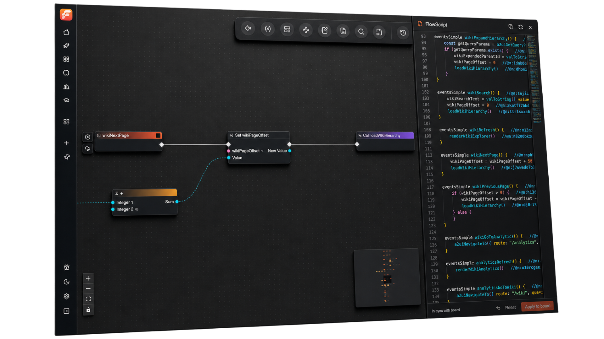
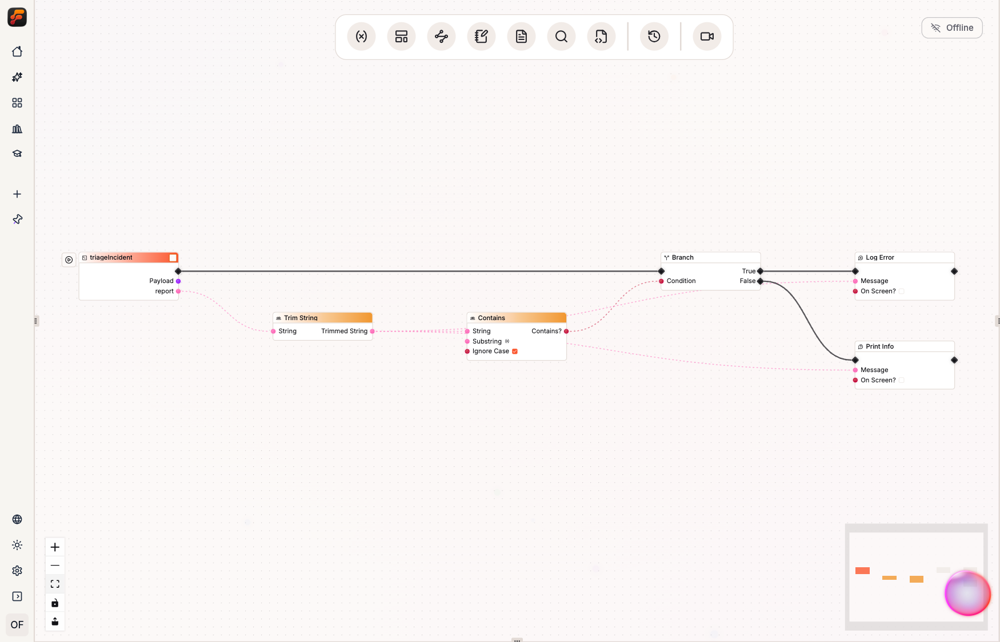
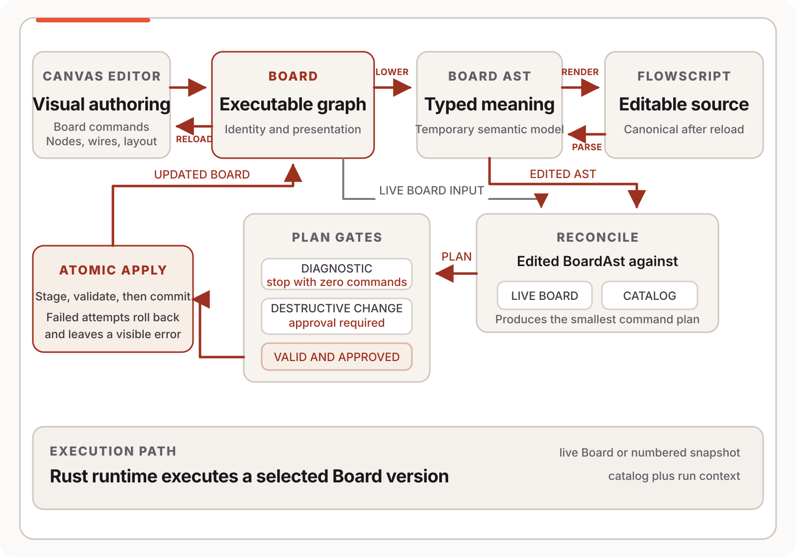
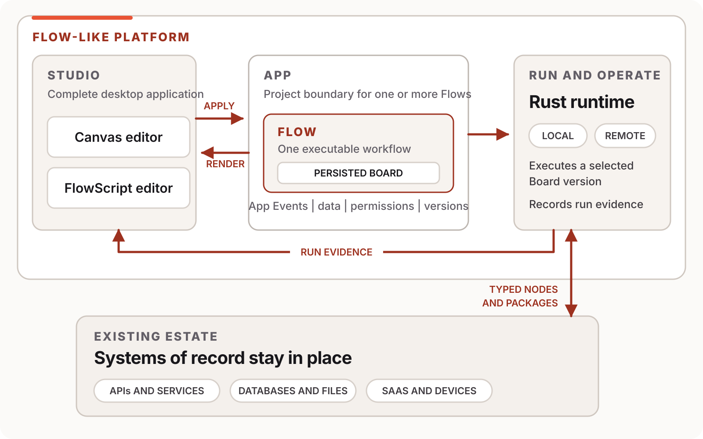

<p align="center">
  <a href="https://flow-like.com">
    
  </a>
</p>

<h1 align="center">Flow-Like</h1>

<p align="center">
  <strong>Edit the same executable Flow in typed FlowScript or on a live canvas.</strong><br/>
  Flow-Like records where each entry runs and what its nodes need from the runtime.
</p>

<p align="center">
  <a href="https://flow-like.com"></a>
  <a href="https://docs.flow-like.com"></a>
  <a href="https://discord.com/invite/mdBA9kMjFJ"></a>
  <a href="./LICENSE"></a>
  
</p>

<p align="center">
  <a href="https://app.flow-like.com">Try online</a> ·
  <a href="https://flow-like.com/download">Download Studio</a> ·
  <a href="https://docs.flow-like.com">Documentation</a> ·
  <a href="https://book.flow-like.com">FlowBook</a> ·
  <a href="https://discord.com/invite/mdBA9kMjFJ">Discord</a>
</p>

---

Most software work starts in the middle. The database already exists. The API has quirks that
never made it into the docs. A useful change still has to fit that system and remain understandable
after it ships.

Flow-Like is a developer platform for typed application logic. A **Flow** is one executable process,
and its persisted graph is the **Board** that the Rust runtime executes locally or in a configured
remote environment. An **App** groups the Flows that ship together and records how callers reach
them.

<p align="center">
  
</p>

## Text and canvas edit the same Flow

FlowScript is the typed text form of a Flow. The canvas shows the same Flow as nodes, pins, and
connections. Edits from either view update its Board.

This entry receives an incident report and chooses the log path:

```ts
use log::*

eventsGeneric triageIncident(payload: Struct, report: string) {
    const normalized = report.trim()
    if (normalized.contains({ substring: "production is on hold", ignoreCase: true })) {
        error({ message: normalized, toast: false })
    } else {
        info({ message: normalized, toast: false })
    }
}
```

<p align="center">
  <a href="./apps/book/src/assets/workflows/incident-triage.webp">
    
  </a>
</p>
<p align="center"><sub>Generated from the <a href="./apps/book/examples/incident-triage/triage.flow">checked-in FlowScript</a> with the real reconciler and Studio auto-layout.</sub></p>

The canvas exposes the same rule as six nodes. The `trim` and `contains` calls resolve to catalog
nodes, and their values travel over typed wires into a Branch node. FlowScript earns its keep
during broad edits and code review. Open the canvas to trace a branch or inspect a failed run.

Studio renders the current Board as canonical FlowScript. When you apply a source edit, Studio
parses it, checks it against the node catalog, and writes the change back as Board commands. The
Rust runtime executes that Board.

<details>
<summary>See how a source edit becomes Board commands</summary>
<br/>
<p align="center">
  
</p>
</details>

Read [FlowBook](https://book.flow-like.com) for the language concepts, worked examples, and current
round-trip boundaries.

## Run Flow-Like

| Online | Desktop | Source |
| --- | --- | --- |
| [Open the web app](https://app.flow-like.com) | [Download Studio](https://flow-like.com/download) for macOS, Windows, or Linux | Build the current `dev` branch with the steps below |

### Build from source

Install Git, [mise](https://mise.jdx.dev/), [Tauri 2 system
dependencies](https://v2.tauri.app/start/prerequisites/), `protoc`, and a C/C++ toolchain.
Run these commands from the repository root:

```bash
git clone --branch dev https://github.com/Rheosoph/flow-like.git
cd flow-like
mise trust
mise install
bun install
cp apps/desktop/.env.example apps/desktop/.env
mise run dev:desktop
```

`mise install` supplies the toolchain declared in [`mise.toml`](./mise.toml).
`mise run dev:desktop` detects the current platform and starts Studio.

Useful tasks:

```bash
mise tasks
mise run dev:web
mise run dev:docs
mise run dev:book
mise run check
mise run fix
```

The detailed setup guide lives at
[docs.flow-like.com/dev/build](https://docs.flow-like.com/dev/build/).

## Runtime requirements stay with the Flow

Before a run starts, Flow-Like checks the complete Flow against its execution target.

| Runtime question | Where the answer lives |
| --- | --- |
| Where does this entry run? | An App Event selects Local or Remote execution. |
| Which logic is live? | The Event points to a Board entry and version. |
| What changes by environment? | Runtime values and Event overrides provide configured input. |
| What may the code access? | Nodes and packages declare capabilities; credentials are scoped separately. |

If any node, including one inside a nested layer, requires local access, the Flow requires local
execution. A single run remains in one environment. Device-local secret values stay outside the
Board and are omitted from remote execution payloads.

A Board can run in Studio or on a remote runtime when that environment provides every required
capability. This repository includes deployments for local development, Docker Compose,
Kubernetes, AWS, Azure, and GCP.

## Start with the system you have

Typed catalog nodes connect Flows to the services and data already in use, including local files
and devices. Reusable packages put a domain operation behind declared inputs and outputs. The
current system can keep owning its data while a Flow validates input or coordinates calls.

Start with the integration that costs the team the most time. If it fails, run evidence points
back to a node on the Board. Capability declarations show what that operation needs from the host.

<p align="center">
  
</p>

## A Flow is one part of an App

An App is the unit a team owns and ships. Several Flows can share its storage, interfaces,
packages, and release settings.

Pages and APIs can reuse the same Flow logic. Model calls use typed nodes, so their inputs and
outputs remain in the graph and run evidence is attributed to the node that executed them.
Supported models can run locally when their runtime and files are installed, or through a
configured provider.

## Find your way around the repository

| Area | Start here |
| --- | --- |
| FlowScript model, parser, renderer, and linting | [`packages/ast`](./packages/ast/) |
| Lowering, reconciliation, and guarded Apply | [`packages/core/src/flow/ast`](./packages/core/src/flow/ast/) |
| Canvas and FlowScript editor | [`packages/ui/components/flow`](./packages/ui/components/flow/) |
| Studio desktop application | [`apps/desktop`](./apps/desktop/) |
| Rust runtime and execution | [`packages/core`](./packages/core/), [`packages/executor`](./packages/executor/) |
| Built-in capabilities and integrations | [`packages/catalog`](./packages/catalog/) |
| Local and hosted deployment shapes | [`apps/backend`](./apps/backend/) |

Flow-Like is a Rust and TypeScript monorepo. Bun manages the JavaScript workspace, Tauri hosts the
desktop client, and the runtime and core application model live in Rust.

## Extend the platform

The catalog turns each supported operation into a node with typed pins. For domain-specific work,
add a native node or package the operation as a WebAssembly component with declared host
capabilities. The [templates](./templates/) cover fifteen source languages; host API support
varies by language and template maturity.

Applications can also control the platform through the
[TypeScript SDK](https://www.npmjs.com/package/@flow-like/sdk) and
[Python SDK](https://pypi.org/project/flow-like/).

## License

Flow-Like is source-available under the [Business Source License 1.1](./LICENSE). The Additional
Use Grant permits use that does not compete with Flow-Like or substantially similar Rheosoph
products. Entities with more than 2,000 employees or more than €300 million in annual revenue
need a commercial license. For each version, MPL 2.0 takes effect on the earlier of the stated
eight-year Change Date or the fourth anniversary of that version's first public distribution.

## Contributing

Code and documentation contributions are welcome.

- Browse [good first issues](https://github.com/Rheosoph/flow-like/issues?q=is%3Aissue+is%3Aopen+label%3A%22good+first+issue%22).
- Open pull requests against `dev` and run the checks relevant to your change.
- Use [GitHub Discussions](https://github.com/Rheosoph/flow-like/discussions) or
  [Discord](https://discord.com/invite/mdBA9kMjFJ) when you want to talk through an approach.

<a href="https://github.com/Rheosoph/flow-like/graphs/contributors">
  
</a>

---

<p align="center">
  <a href="https://flow-like.com">Website</a> ·
  <a href="https://docs.flow-like.com">Documentation</a> ·
  <a href="https://book.flow-like.com">FlowBook</a> ·
  <a href="./LICENSE">License</a> ·
  <a href="./CODE_OF_CONDUCT.md">Code of Conduct</a> ·
  <a href="./SECURITY.md">Security</a>
</p>

<p align="center"><sub>Built in Munich, Germany.</sub></p>
