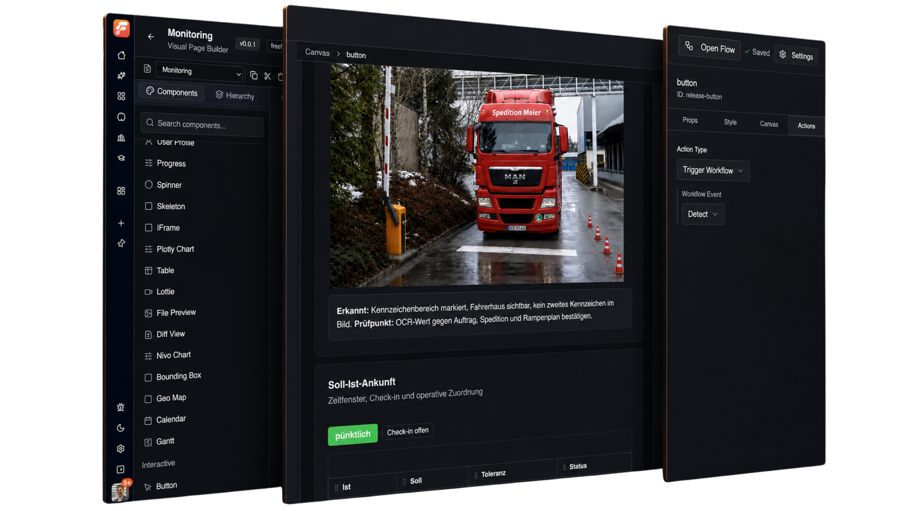
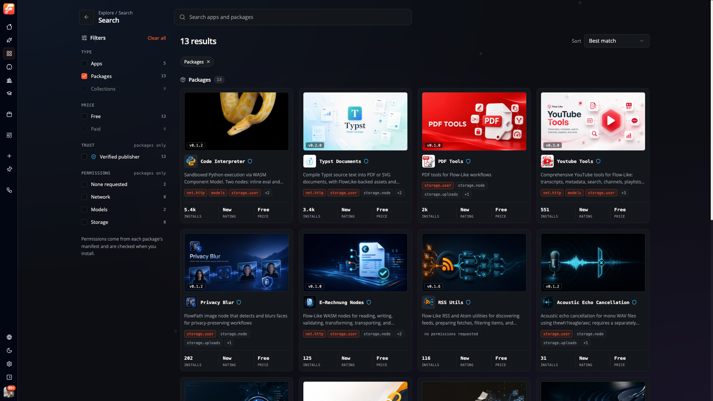
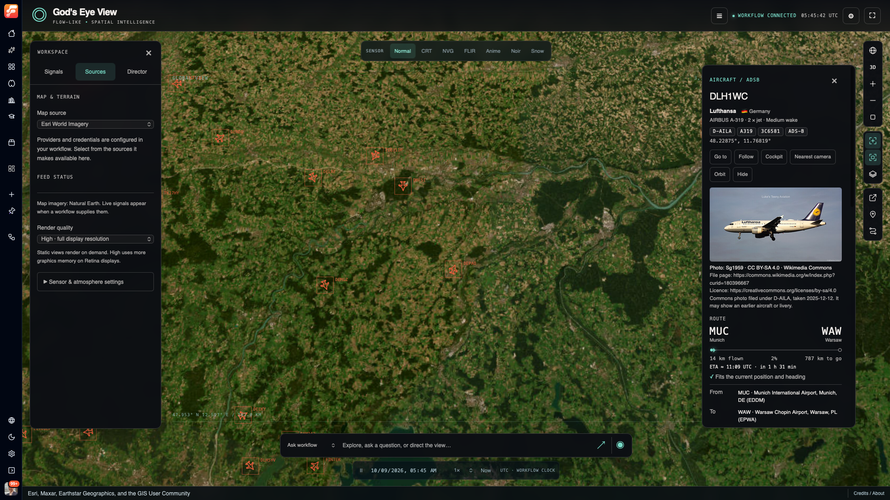
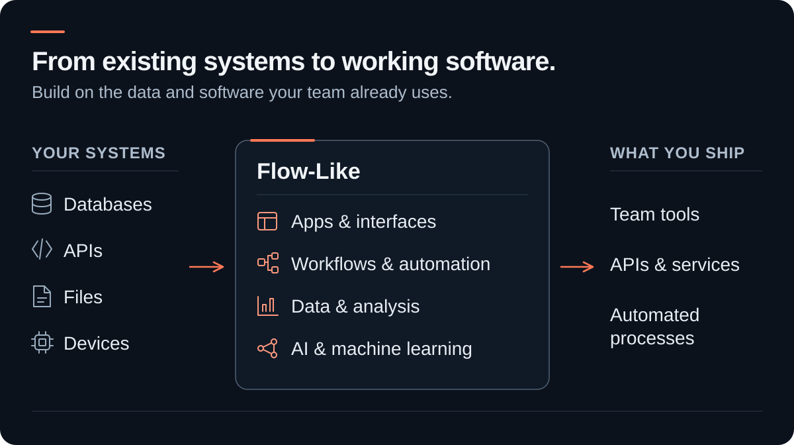
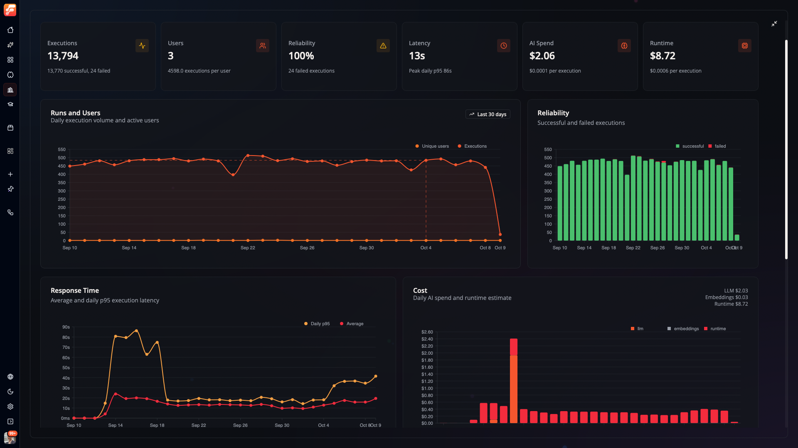
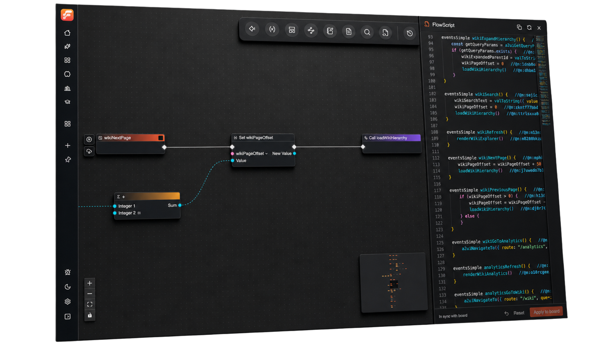
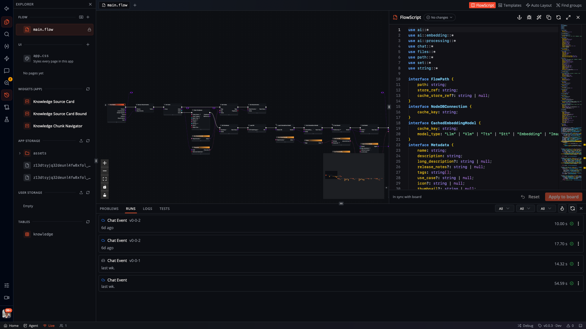
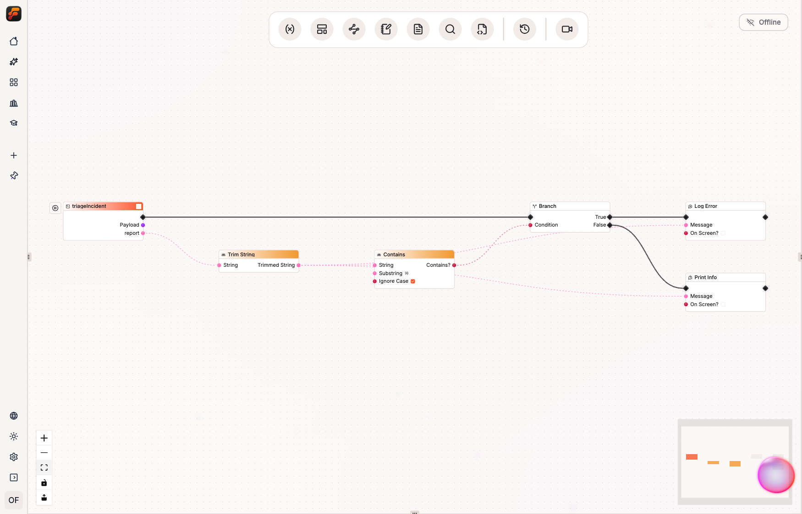
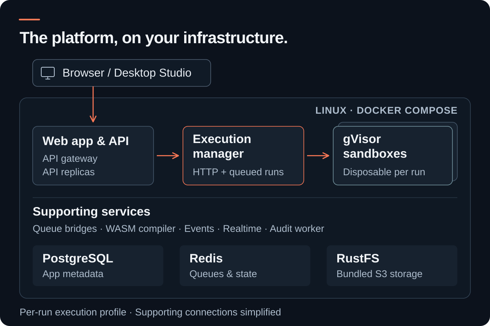

<p align="center">
  <a href="https://flow-like.com">
    
  </a>
</p>

<h1 align="center">Flow-Like</h1>

<p align="center">
  <strong>Build the software your business runs on.</strong><br/>
  A self-hostable development platform for apps, automation, data, and AI.
</p>

<p align="center">
  <a href="https://github.com/Rheosoph/flow-like"></a>
  <a href="./LICENSE"></a>
  <a href="https://docs.flow-like.com"></a>
  <a href="https://discord.com/invite/mdBA9kMjFJ"></a>
</p>

<p align="center">
  <a href="https://flow-like.com/download"><strong>Download Studio</strong></a> ·
  <a href="#try-it-locally">First workflow</a> ·
  <a href="#nodes-and-packages">Nodes &amp; packages</a> ·
  <a href="https://app.flow-like.com">Try online</a> ·
  <a href="#run-it-your-way">Self-host</a> ·
  <a href="https://docs.flow-like.com">Documentation</a>
</p>

---

**Turn the systems you already have into software your team can use.** Build interfaces around
connected data, then reuse the operations behind them through APIs, schedules, and agents.

Build with **[1,900+ built-in nodes](#nodes-and-packages)**, typed building blocks for your
workflows. **Packages** add reusable custom nodes and interface widgets across projects.

Built for developers and technical teams, Flow-Like keeps interfaces, workflows, and data together
as an application grows. **Studio**, the desktop app, runs work locally. A shared backend supports
team projects, while device services run near your files, internal networks, and equipment.

<p align="center">
  <a href="./apps/website/src/images/parallax/ui-builder.png">
    
  </a>
</p>

<p align="center"><sub>Build the interface and connect its actions to workflows. Shown here: a monitoring page in the visual frontend builder. Click any image for the full-size view.</sub></p>

## Try it locally

**[Download Studio](https://flow-like.com/download) and [run your first workflow](https://docs.flow-like.com/start/getting-started/)
without an account, API key, or AI model.** Available for macOS, Windows, and Linux.

<details>
<summary><strong>Local setup and first run</strong></summary>

1. Open Studio, choose a starter Profile during onboarding, then enable **Developer Mode**
   in Settings. Any onboarding model downloads can continue in the background; this workflow
   does not use them.
2. Open **My Apps → Create Flow** (or **Create Your First App** in an empty library). Choose
   **Offline - Local only**, enter `Hello Flow` as the **Project Name**, and select **Create Project**.
3. Right-click the canvas to find and add **Simple Event** and **Print Info**. Reuse an existing
   Simple Event if present. Connect its execution output to Print Info's **Input**, set
   **Message** to `Hello Flow`, and enable **On Screen?**.
4. Select **Execute locally** beside the event and confirm any run dialog. Look for the
   `Hello Flow` notification, then open **Runs**, select the new run, and inspect **Logs**.

The log entry should show `Hello Flow` and identify Print Info as its source. The
[first-workflow guide](https://docs.flow-like.com/start/getting-started/) includes screenshots
and troubleshooting.

</details>

Prefer the browser? [Open the web app](https://app.flow-like.com) with an online account and an
available execution server. To work on Flow-Like itself, [build from source](#build-from-source).

<a id="nodes-and-packages"></a>

## 1,900+ nodes and reusable packages

The [node catalog](https://docs.flow-like.com/nodes/overview/) covers SQL and databases, APIs,
documents, media, UI, desktop automation, AI, and machine learning. Each node reference shows
its inputs and outputs, so you can check the operation you need before building around it.
Available nodes depend on the execution environment and enabled integrations.

**Package your own capabilities for others to use.** A package can bundle custom nodes and
UI widgets together. [Explore packages](https://docs.flow-like.com/start/packages-store/),
inspect their nodes and permissions, then install and link a version to an **App**, your
Flow-Like project. Use the [package workspace](https://docs.flow-like.com/start/packages-library/)
to develop, test, and publish your own. Each App records its package dependencies and versions.

<p align="center">
  <a href="./assets/packages.png">
    
  </a>
</p>

<p align="center"><sub>Discover packages for code execution, documents, media, and more. Review their versions and requested permissions before installing.</sub></p>

The [Sales Insights example](./examples/sales-insights/) combines Rust WebAssembly nodes with
a React chart and filter panel in one package. Its guide shows how to build it and wire widget
events to workflows that update the chart.

<details>
<summary><strong>Build your own nodes and widgets</strong></summary>

Add a [native Rust node](https://docs.flow-like.com/dev/writing-nodes/) to the built-in catalog,
or create a package with the [WebAssembly templates](./templates/) for fifteen source languages.
WebAssembly extensions are in beta; host API support varies by language and template maturity.

Bring a custom interface through [package widgets](https://docs.flow-like.com/dev/package-widgets/overview/).
Start with the [TypeScript counter tutorial](https://docs.flow-like.com/dev/package-widgets/overview/#prepare-a-counter-package),
which includes a browser preview and input, event, and query inspection. Framework templates
are available for [React](./templates/widget-react/), [Vue](./templates/widget-vue/),
[Svelte](./templates/widget-svelte/), and [other supported options](./templates/).

</details>

## What you can build

Consider an order desk: look up a customer, check stock through an API, show exceptions for an
operator to review, and submit the approved order. A scheduled job or an assistant can reuse
the underlying operation.

| Build | Connect the pieces | Start here |
| --- | --- | --- |
| **An operations console** | Combine dashboards, forms, and record views with workflows that update the systems behind them. | [Internal tools](https://docs.flow-like.com/topics/internal-tools/overview/) |
| **A data explorer with actions** | Query files and databases with SQL, map records to business objects, and run operations on selected objects. | [Data pipelines](https://docs.flow-like.com/topics/data-pipelines/overview/) · [Knowledge graphs](https://docs.flow-like.com/topics/ontology/overview/) |
| **Document intake and review** | Extract information from PDFs and spreadsheets, validate fields, and send exceptions to a review interface. | [Document processing](https://docs.flow-like.com/topics/document-processing/overview/) |
| **An assistant that can act** | Retrieve knowledge, call tools, and return results through chat or an application using configured local or hosted models. | [AI and agents](https://docs.flow-like.com/topics/genai/overview/) |
| **A predictive application** | Prepare datasets, train and evaluate models, then use their predictions in a workflow or interface. | [Data science](https://docs.flow-like.com/topics/datascience/overview/) |
| **Equipment and desktop automation** | Read equipment through OPC UA, Modbus, or MQTT; automate browser and desktop tasks on a compatible machine. | [Industrial protocols](https://docs.flow-like.com/topics/api-integrations/industrial-protocols/) · [Desktop automation](https://docs.flow-like.com/topics/desktop-automation/overview/) |

Hardware access and model execution depend on the selected runtime, installed dependencies,
and configured providers; the guides cover those requirements.

<details>
<summary><strong>See a ported application: God's Eye View</strong></summary>

<p align="center">
  <a href="./assets/complex.png">
    
  </a>
</p>

God's Eye View, ported to Flow-Like: a spatial interface with map layers, aircraft details,
and workflow controls.

</details>

<details>
<summary><strong>How the platform fits together</strong></summary>

<p align="center">
  <a href="./assets/readme-platform.svg">
    
  </a>
</p>

</details>

## Built for developers

Flow-Like combines a **Rust execution engine** with a **Tauri desktop client** and a
**TypeScript/React interface**. An **App** is the project that holds its workflows, pages, data,
and access settings. The [repository map](#repository-map) shows where these parts live.

- **Reuse an operation across interfaces.** An [App Event](https://docs.flow-like.com/apps/events/)
  is a configured entry point into a workflow. Pages, APIs, schedules, and chats can call
  reusable logic through the entry points they support.
- **Follow a result back to its source.** Typed inputs and outputs make connections explicit.
  [Run logs](https://docs.flow-like.com/studio/logging/) identify the nodes that produced them;
  [version-pinned entry points](https://docs.flow-like.com/apps/event-releases/) let you keep a
  published workflow in use while you edit the next draft.
- **Use your own code where it matters.** Add native Rust nodes, WebAssembly packages, or custom
  interface widgets. Call the platform from existing applications through the
  [TypeScript](https://docs.flow-like.com/dev/sdks/nodejs/) and
  [Python](https://docs.flow-like.com/dev/sdks/python/) SDKs.
- **Run where the work is.** Use local execution for device access, a shared backend for team
  applications, or [device services](https://docs.flow-like.com/devices/) that keep running after
  Studio closes. A run stays in one environment; offline work requires local dependencies.

<details>
<summary><strong>See execution analytics</strong></summary>

<p align="center">
  <a href="./assets/analytics.png">
    
  </a>
</p>

Inspect execution volume, failures, latency, AI spend, and estimated runtime costs.

</details>

### Edit the same workflow visually or in text

A **Flow** is an executable workflow. Its canvas and **FlowScript**, the typed text form, edit
the same saved graph, called a **Board**. Use the canvas to follow a branch; use text for broad
edits and code review. [FlowPilot](https://docs.flow-like.com/studio/flowpilot/) can help create
and edit workflows, interfaces, and data from a conversation.

<p align="center">
  <a href="./apps/website/src/images/parallax/workflow-core.png">
    
  </a>
</p>

<p align="center"><sub>Edit workflow logic on the canvas or in FlowScript.</sub></p>

<details>
<summary><strong>See the full Studio workspace</strong></summary>

<p align="center">
  <a href="./assets/flowscript.png">
    
  </a>
</p>

<p align="center"><sub>The workflow canvas and FlowScript editor share a workspace with project assets and recorded runs.</sub></p>

</details>

<details>
<summary><strong>Walk through a FlowScript example</strong></summary>

This entry receives an incident report and chooses the log path:

```ts
use log::*

eventsGeneric triageIncident(payload: Struct, report: string) {
    const normalized = report.trim()
    if (normalized.contains({ substring: "production is on hold", ignoreCase: true })) {
        error({ message: normalized, toast: false })
    } else {
        info({ message: normalized, toast: false })
    }
}
```

<p align="center">
  <a href="./apps/book/src/assets/workflows/incident-triage.webp">
    
  </a>
</p>

The image is generated from the [checked-in example](./apps/book/examples/incident-triage/triage.flow)
with the real reconciler and Studio auto-layout. When you apply a text edit, Studio checks it
against the node catalog and updates the Board. The Rust runtime executes that Board.

Read [FlowBook](https://book.flow-like.com) for worked examples and current round-trip boundaries.

</details>

## Run it your way

Use Studio on your own machine or host a shared backend for your team. The maintained
self-hosting paths are [Docker Compose](https://docs.flow-like.com/self-hosting/docker-compose/installation/)
and [Kubernetes](https://docs.flow-like.com/self-hosting/kubernetes/installation/).

To share a local project, [create an online copy](https://docs.flow-like.com/apps/offline-online/)
and configure its credentials and execution settings. Online Apps provide web access and team
roles; local-only Apps remain on the device.

The Compose stack includes the browser app, API, execution manager, disposable gVisor sandboxes,
and supporting services. PostgreSQL, Redis, and RustFS object storage are bundled. Studio can
connect to that backend.

<p align="center">
  <a href="./assets/readme-deployment.svg">
    
  </a>
</p>

<details>
<summary><strong>Docker Compose setup</strong></summary>

Complete the [Linux, Docker, and gVisor prerequisites](https://docs.flow-like.com/self-hosting/docker-compose/prerequisites/)
first. For a new installation:

```bash
git clone --branch dev https://github.com/Rheosoph/flow-like.git
cd flow-like/apps/backend/docker-compose
python3 scripts/setup-env.py
cp flow-like.config.example.json flow-like.config.json
```

Replace the OIDC and domain placeholders in `flow-like.config.json`, and set
`FLOW_LIKE_RUNTIME_CONFIG_FILE=./flow-like.config.json` in `.env`. The setup script generates
signing keys and service credentials. Then pin the published images and start the stack:

```bash
python3 scripts/pull-images.py
python3 scripts/preflight.py
python3 scripts/up.py
docker compose ps --all
```

The default per-run isolation mode requires immutable image references, so image pinning is
required on this path. Long-running services should become healthy; initialization services
should exit successfully. Follow the [installation guide](https://docs.flow-like.com/self-hosting/docker-compose/installation/)
for identity configuration, readiness checks, public hosting, and upgrades. The optional
`monitoring` profile adds Prometheus, Grafana, Tempo, and exporters.

The [Compose directory](./apps/backend/docker-compose/) contains the service definitions,
configuration examples, and scripts. To build unpublished code, use `scripts/prepare-images.py`
and `scripts/up.py --build` as described in the guide.

</details>

<details>
<summary><strong>Kubernetes and execution boundaries</strong></summary>

The [Helm chart](./apps/backend/kubernetes/helm/) deploys the backend across a cluster.
Use the [Kubernetes installation guide](https://docs.flow-like.com/self-hosting/kubernetes/installation/)
for gVisor and Cilium prerequisites, image digest pinning, and configuration. Backend directories
also contain AWS, Azure, and GCP deployment work; check each target's status before relying on it.

An App Event selects a Flow entry, version, and Local or Remote execution. A single run stays in
one environment. Pre-run analysis reports required runtime values, OAuth access, WebAssembly
permissions, and local-only nodes, including those inside nested layers. The current dispatcher
does not yet reject every incompatible remote selection from the aggregate local-only flag.
Device-local secret values stay outside the Board and remote payloads.

</details>

## Build from source

Install Git, [mise](https://mise.jdx.dev/), [Tauri 2 system dependencies](https://v2.tauri.app/start/prerequisites/),
`protoc`, and a C/C++ toolchain. Then run:

```bash
git clone --branch dev https://github.com/Rheosoph/flow-like.git
cd flow-like
mise trust
mise install
bun install
cp apps/desktop/.env.example apps/desktop/.env
mise run dev:desktop
```

`mise install` supplies the toolchain in [`mise.toml`](./mise.toml), and `dev:desktop` detects
your platform and starts Studio. Use `mise tasks` to list development commands, or read the
[build guide](https://docs.flow-like.com/dev/build/) for the full setup.

<a id="repository-map"></a>

<details>
<summary><strong>Repository map</strong></summary>

Flow-Like is a Rust and TypeScript monorepo. Bun manages the JavaScript workspace, Tauri hosts
the desktop client, and the runtime and core application model live in Rust.

| Area | Start here |
| --- | --- |
| Studio desktop application | [`apps/desktop`](./apps/desktop/) |
| Browser application | [`apps/web`](./apps/web/) |
| Interface builder and workflow editors | [`packages/ui`](./packages/ui/) |
| Runtime and execution | [`packages/core`](./packages/core/), [`packages/executor`](./packages/executor/) |
| Built-in capabilities and integrations | [`packages/catalog`](./packages/catalog/) |
| FlowScript model, parser, and renderer | [`packages/ast`](./packages/ast/) |
| FlowScript reconciliation | [`packages/core/editor/src/flow/ast`](./packages/core/editor/src/flow/ast/) |
| Self-hosting and deployment | [`apps/backend`](./apps/backend/) |

[](https://deepwiki.com/Rheosoph/flow-like)

</details>

## Help shape the project

We want the next useful tool to build on the last: reuse its data, share an operation, or add
an interface for another team. If that is software you want to help build,
**[give Flow-Like a star](https://github.com/Rheosoph/flow-like)** and follow its development.
Try it on a real task, tell us where it falls short, or contribute the integration you need.

- Find a [good first issue](https://github.com/Rheosoph/flow-like/issues?q=is%3Aissue+is%3Aopen+label%3A%22good+first+issue%22),
  improve a guide, or share an example.
- Open pull requests against `dev` and run the checks relevant to your change.
- Discuss ideas in [GitHub Discussions](https://github.com/Rheosoph/flow-like/discussions) or
  meet other builders on [Discord](https://discord.com/invite/mdBA9kMjFJ).

<a href="https://github.com/Rheosoph/flow-like/graphs/contributors">
  
</a>

## License

Flow-Like is source-available under the [Business Source License 1.1](./LICENSE). The Additional
Use Grant permits use that does not compete with Flow-Like or substantially similar Rheosoph
products. Entities with more than 2,000 employees or more than €300 million in annual revenue
need a commercial license. For each version, MPL 2.0 takes effect on the earlier of the stated
eight-year Change Date or the fourth anniversary of that version's first public distribution.

---

<p align="center">
  <a href="https://flow-like.com">Website</a> ·
  <a href="https://docs.flow-like.com">Documentation</a> ·
  <a href="https://book.flow-like.com">FlowBook</a> ·
  <a href="./CODE_OF_CONDUCT.md">Code of Conduct</a> ·
  <a href="./SECURITY.md">Security</a>
</p>

<p align="center"><sub>Built in Munich, Germany.</sub></p>
