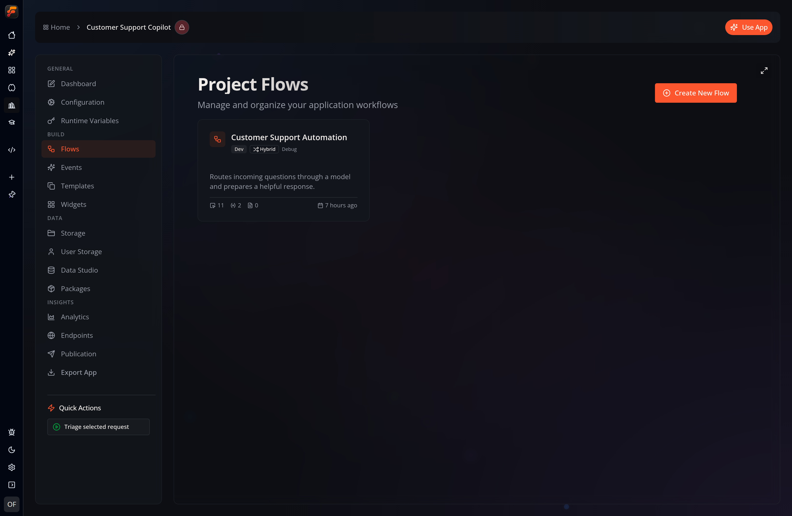

In your app’s **Flows** section, the **Project Flows** screen lets you create
and manage application workflows.

Each card represents one **Flow**, which is stored internally as a board. It
summarizes the Flow’s stage, execution mode, log level, nodes, variables, and
pages.

An app can contain any number of Flows. Open an existing one, such as
**Customer Support Automation** in the example below, or select **Create New
Flow** to start another in the [Studio](/studio/overview/) builder.

