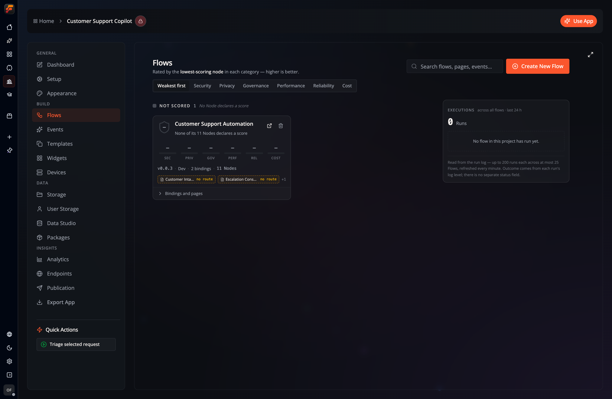

Open an App's **Flows** workspace to find its workflows and see how they are
used. Enable [Developer Mode](/start/developer-mode/) if Flows is absent from
the navigation. Your role also needs permission to read the App's Flows.

## Find or create a Flow

Search by Flow, Page, or Event name, then use the sort controls to order the
results. Open a Flow to edit its graph in [Studio](/studio/overview/). Use the
new-Flow action to create another workflow; creation and deletion require
write permission.

Each card combines several kinds of information:

| Area | What to inspect |
| --- | --- |
| **Identity and stage** | Which workflow this is and its development stage. A stage label does not publish a snapshot by itself. |
| **Scores** | Catalog-derived assessments across Security, Privacy, Governance, Performance, Reliability, and Cost. |
| **Bindings and pages** | Events and Pages using the Flow, including pinned/latest targets, paused entry points, and available activity. |
| **Composition** | The node families and building blocks present in the workflow. |
| **Coverage** | How much of the graph has the metadata needed for the displayed assessment. |

Use the scores to decide where to inspect next. A high score does not establish
that the assembled workflow meets your own security, cost, or reliability
requirements. Missing metadata produces an unscored state; it should not be
read as a zero-risk workflow. The overview's security/governance summary uses
the lowest available scores so a weak part remains visible.

## Follow a binding

A Flow can have several configured [Events](/apps/events/). Check whether each
uses **Latest** or a numbered version before editing a workflow used by others.
Latest follows draft changes; a pinned target keeps its selected snapshot.
Open the binding to inspect the Event's configuration, or open a linked Page
to work on its interface.

The [versioning guide](/studio/versioning/) explains snapshots. Use
[Event releases](/apps/event-releases/) when testing and changing a live target.

## Inspect execution activity

The **Executions** rail shows recent runs available to your account. Select an
entry to locate its Flow card, then open the Flow and its Runs panel to inspect
logs. Empty activity, unavailable data, and missing permissions need different
responses: an unavailable list is not proof that a Flow has never run.

For a step-by-step failed-run exercise, see [Logging and debugging](/studio/logging/).
