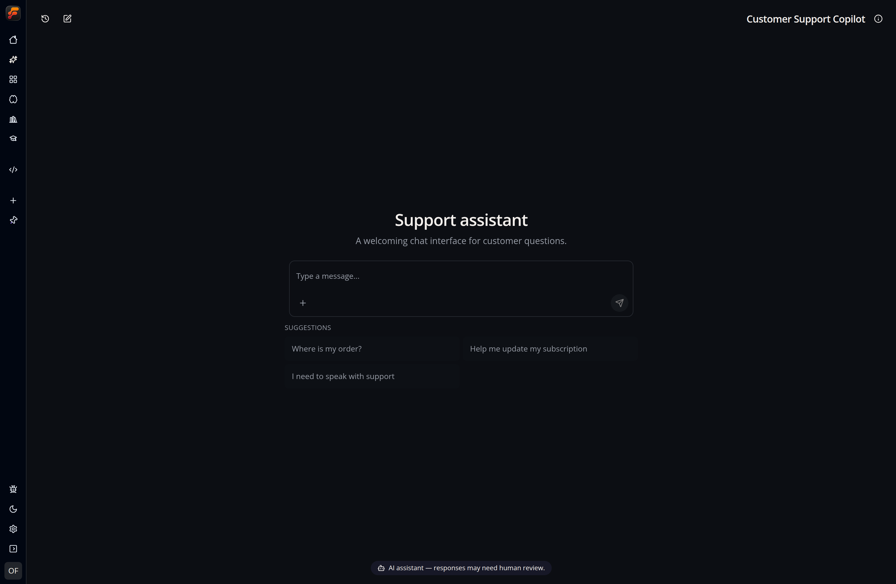

Add a **Chat UI** event to an app to expose its flow as a chat interface. See [Events](/apps/events/) for event setup.



## Appearance

The event configuration provides:

- **Background image** selected from app storage or provided as an external URL.
- **20 theme presets** ranging from professional layouts to Cyberpunk, Typewriter, Neon Grid, and animated Aurora Glass styles. Presets follow the app's current light or dark mode.
- **Custom CSS**, edited with the built-in Monaco editor.
- **AI disclosure text** that is always visible so people know they are chatting with AI. Keep it direct, or give it some personality—for example, “AI on duty: clever, quick, and occasionally confidently weird.”

Selecting a theme copies its complete CSS into the editor. Change any part of
that CSS and the theme selector immediately changes to **Custom**. Selecting a
preset again replaces the editor contents with that preset's canonical source.

The built-in set includes Flow Like, Executive, Editorial, Typewriter, Neon
Grid, Aurora Glass, Green Screen, Blueprint, Swiss, Nordic, Brutalist, Art Deco,
Solarpunk, Noir Cinema, Pixel Arcade, Cyberpunk, Synthwave Sunset, Oceanic,
Candy Pop, and Zen Garden.

When you select a background from app storage, the event keeps its stable
storage path. Chat UI requests a temporary signed URL when it loads, so signed
credentials are never saved in the event configuration.

## Custom CSS

Custom CSS is sanitized and scoped to this Chat UI. Use `:root` for chat-wide variables; here, `:root` means **this chat only**, not the app or document root.

```css
:root {
  --primary: #7c3aed;
  --fl-chat-content-width: 52rem;
  --fl-chat-message-radius: 1.25rem;
  --fl-chat-background-overlay: rgb(0 0 0 / 35%);
}

[data-fl-chat-message="assistant"] {
  border: 1px solid var(--border);
}
```

### CSS variables

| Variable | Controls |
| --- | --- |
| `--background` | Base chat background color |
| `--foreground` | Default text color |
| `--primary` | Primary/accent color |
| `--primary-foreground` | Text and icons on the primary color |
| `--muted` | Muted surface color |
| `--muted-foreground` | Text and icons on muted surfaces |
| `--border` | Default border color |
| `--fl-chat-content-width` | Maximum width of chat content |
| `--fl-chat-message-radius` | Message bubble corner radius |
| `--fl-chat-surface-background` | Welcome and conversation surface background |
| `--fl-chat-composer-background` | Composer background color |
| `--fl-chat-user-message-background` | User message background color |
| `--fl-chat-user-message-foreground` | User message text color |
| `--fl-chat-ai-message-background` | Assistant message background color |
| `--fl-chat-ai-message-foreground` | Assistant message text color |
| `--fl-chat-disclosure-background` | AI disclosure background color |
| `--fl-chat-disclosure-foreground` | AI disclosure text color |
| `--fl-chat-background-overlay` | Overlay rendered over the background image |
| `--fl-chat-background-overlay-strong` | Stronger overlay toward the lower page |
| `--fl-chat-background-size` | Background image sizing, such as `cover` or `contain` |
| `--fl-chat-background-position` | Background image position |
| `--fl-chat-pad-bottom` | Extra space below the chat content |

### Stable selectors

Use these stable hooks for more targeted styling:

- `[data-fl-chat-surface]`
- `[data-fl-chat-welcome]`
- `[data-fl-chat-welcome-panel]`
- `[data-fl-chat-suggestion]`
- `[data-fl-chat-messages]`
- `[data-fl-chat-message="user"]`
- `[data-fl-chat-message="assistant"]`
- `[data-fl-chat-composer]`
- `[data-fl-chat-ai-disclosure]`
