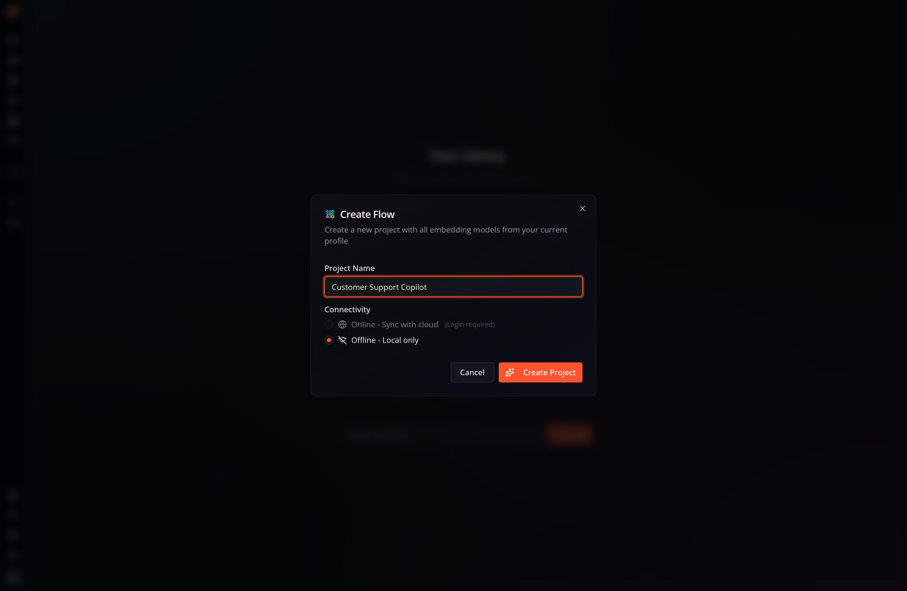

Open the **Library** in the desktop app and select **Create Flow**. If your
library is empty, select **Create Your First App** instead; both actions open
the same dialog:

## Project Name
Enter a name for the project. You can edit the app details after creation.

## Connectivity
Choose whether the project should be **Online — Sync with cloud** or
**Offline — Local only**. An offline project is a good choice when you want to
keep the app and its execution on this machine.

Creating an online project requires that you
[log in with your Flow-Like account](/start/login/).

More information about online apps and cloud connectivity is available in the [Offline vs. Online](/apps/offline-online/) section.

## Templates and Models
The project starts with the embedding models already included in your current
profile. You can manage profile models in the [Model Catalog](/start/models/)
and work with reusable [templates](/apps/templates/) after creating the
project.

Select **Create Project** to add the app to your Library and open its initial
Flow.
