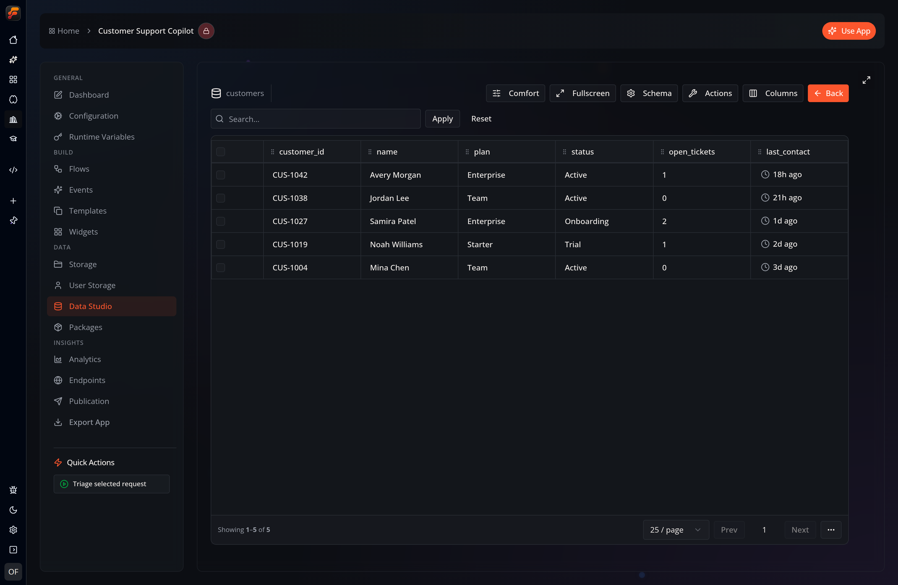

**Data Studio** is an app's home for structured data: the native tables your flows create, and the [ontology](/topics/ontology/overview/) — a semantic layer of object types, relationships, and governed actions — you build on top of them. Open it from an app's **Data → Data Studio** view.

## Tabs

| Tab | What it's for |
|-----|---------------|
| **Overview** | At-a-glance counts (ontologies, object types, actions, shared) and shortcuts into the other tabs |
| **Explore** | Browse objects of each type in a preview table and open an object's inspector — its views and available actions |
| **Model** | Create, rename, and delete ontologies; review object types and relationships; open the data graph |
| **Actions** | Define governed operations that run on an object type |
| **Sharing** | Expose ontologies to connected projects, and install ontologies published by others |
| **Sources** | Inspect the native tables the ontology is built on |

## Native tables

The **Sources** tab lists every relational table created and populated by your flows (for example, to store processed data in a structured way). Open a source to inspect its rows, schema, and indexes:

## The ontology layer

On top of those tables you can define an **ontology**: object types, link types, object views, and governed actions — a knowledge graph you can search, traverse, visualize, and act on without moving any data.

- [Ontology & Knowledge Graph](/topics/ontology/overview/) — object types, link types, the graph explorer, and actions.
- [Shared & Remote Ontologies](/topics/ontology/remote/) — expose an ontology to connected projects and install ontologies published by others.

## Ask FlowPilot (Data Studio agent)

FlowPilot can do the data work for you. Ask the assistant in plain language and it delegates to a **Data Studio agent** — a specialist with direct access to your app's data:

- **Set up and update databases**: create or alter tables, build indexes, insert rows.
- **Create and edit ontologies**: add object types and relationships, adjust an overlay's mappings.
- **Query and analyze**: write and optimize Cypher or SQL, run neighbor/subgraph/path traversals and graph analytics.
- **Add graph elements**: upsert nodes and edges into an overlay.
- **Run actions**: list, describe, and execute governed ontology actions on selected objects.
- **Visualize**: return the answer as an interactive chart.

Every reply is transparent: the agent shows the **query it ran** (in a collapsible block), a **step log** of what happened, links, and — when it helps — an inline chart.

When you have a Data Studio page open, the agent defaults to **that app and ontology** automatically. You can also ask about a different project's data in the same conversation; it will target the other app when you name it (subject to that project's sharing settings).

> The Data Studio agent runs on a tool-capable FlowPilot model (Claude Code, Codex, or GitHub Copilot). Mutating steps — creating tables or overlays, adding elements, executing actions — ask for your approval before they run.
