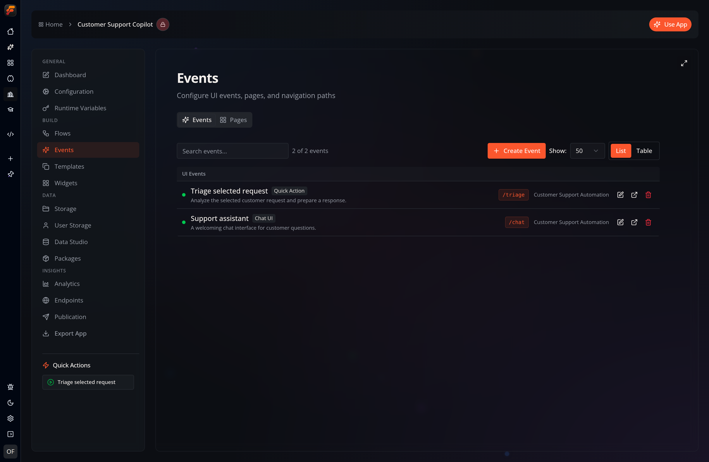
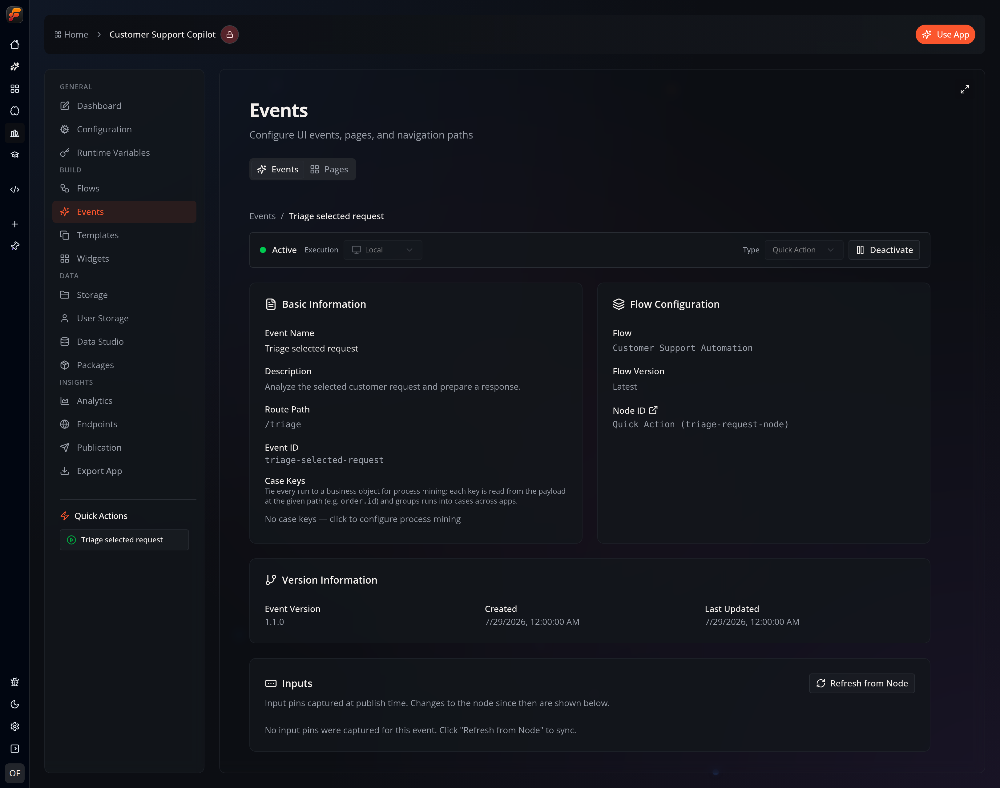

With **Events**, you can connect your **Flows** to app interfaces and external
systems. The Events workspace also includes a **Pages** tab for managing visual
interfaces and their navigation paths.

Creating a workflow-backed **Event** requires at least one existing **Flow** in
your app that includes an *event node*. You can create and manage them in your
app’s [**Flows** section](/apps/boards/).

Most workflow-backed Events target a specific *event node* within a particular
Flow. You can create multiple Events that reference the same event node and
differentiate them by their payloads and configurations. Page-target Events can
instead open a visual page directly.

## Event Types

The list groups Events into **UI Events**, which expose an app interface and a
route path, and **Backend-only Events**, which run without a built-in app
interface.

### Quick Action
A **Quick Action** is essentially a button that manually triggers a *Flow*. You can define additional variables to pass custom data to the triggered *Flow*.

### Chat UI
A **Chat UI** Event invokes a Flow through the built-in
[chat interface](/apps/chat-ui/). It passes the chat context, such as message
history, to the event node and can also accept file attachments, tools, and
default prompts.
