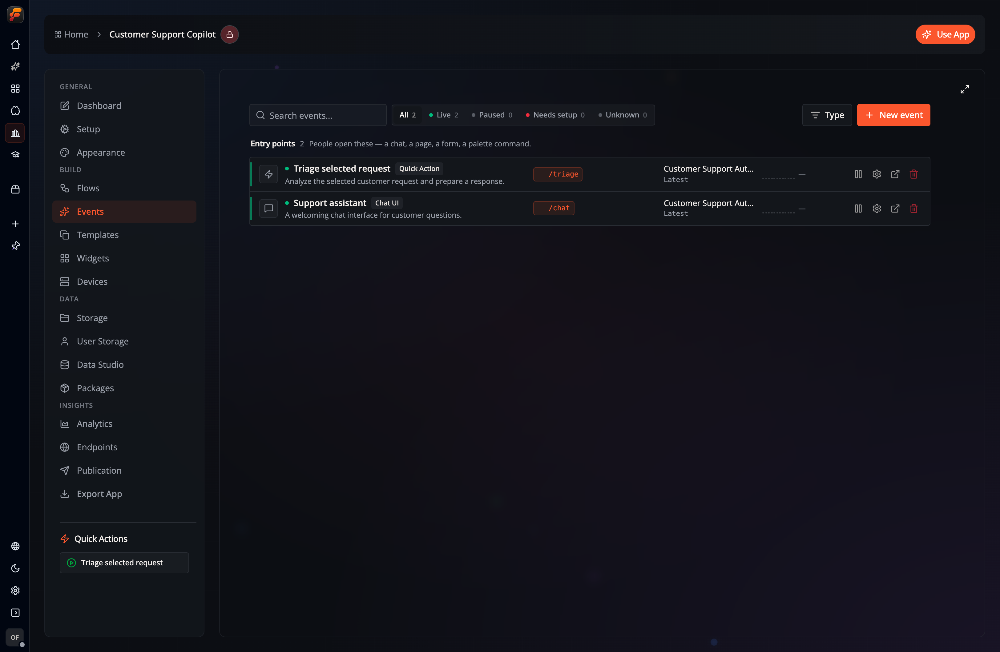
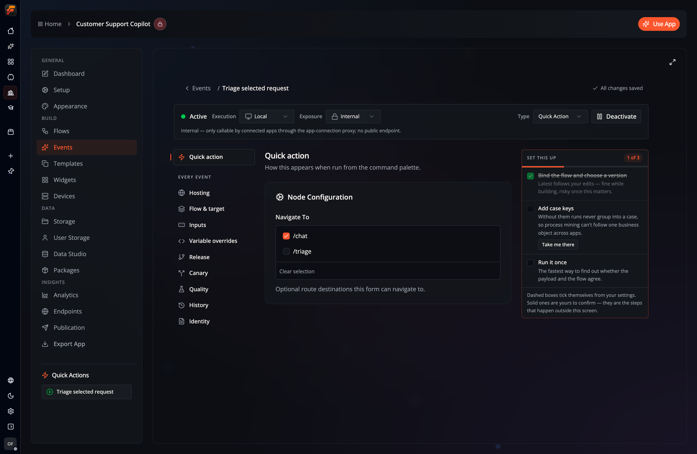

Enable [Developer Mode](/start/developer-mode/) to see this workspace in the App navigation.

With **Events**, you can connect your **Flows** to App interfaces and external
systems. Create Pages in their owning Flow's **Explorer**, then use an Event to
expose each interface. See [Create Pages](/apps/pages/).

Creating a workflow-backed **Event** requires at least one existing **Flow** in
your app that includes an *event node*. You can create and manage them in your
app’s [**Flows** section](/apps/boards/).

Most workflow-backed Events target a specific *event node* within a particular
Flow. You can create multiple Events that reference the same event node and
differentiate them by their payloads and configurations. Page-target Events can
instead open a visual page directly.

## Event Types

The list groups Events into **Entry points**, which people open as an App
interface, and **Triggers**, which receive requests, schedules, messages, or
other background input. UI-capable Events can have a route path.

Which Event types are available depends on the event node in the selected
Flow:

| Flow event node | Available Event types |
| --- | --- |
| **Chat Event** | Chat UI, Discord, Telegram, Teams Bot |
| **Inbound Email Event** | Inbound Email |
| **Mail Event** | Email |
| **Location Event** | Location Region |
| **Generic Event** | Generic Form, API, Deeplink |
| **Simple Event** | Quick Action, API, Cron, Daemon, Deeplink, REST, MCP |

The built-in UI types are **Chat UI**, **Generic Form**, and **Quick Action**.
A Page-target Event is also listed under Entry points because it opens a visual
page directly.

### Quick Action

A **Quick Action** adds a manually invoked action to the App. Its form can
collect exposed Flow variables before triggering the selected event node.

### Chat UI

A **Chat UI** Event invokes a Flow through the built-in
[chat interface](/apps/chat-ui/). It passes the chat context, such as message
history, to the event node and can also accept file attachments, tools, and
default prompts.

### Generic Form

A **Generic Form** creates a route-backed form from the Flow's exposed
variables. Submitting the form invokes the selected Generic Event node.

### External and background Events

- **API** exposes one configured HTTP endpoint.
- **REST** exposes a multi-endpoint REST surface with authentication.
- **MCP** exposes a Model Context Protocol server.
- **Cron** invokes a Flow on a schedule.
- **Daemon** supervises a long-running local Flow and can restart it after a
  failure.
- **Location Region** invokes a Flow when this device enters or leaves a
  configured circular region.
- **Deeplink** invokes a Flow through a Desktop deep link.
- **Discord**, **Telegram**, and **Email** connect their respective services to
  the compatible event node. Email here reads a mailbox through IMAP.
- **Teams Bot** connects a Chat Event to [Microsoft Teams](/topics/api-integrations/teams/).
- **Inbound Email** receives messages at a generated server address. Use an
  Inbound Email Event node and a server with [mail ingress configured](/self-hosting/docker-compose/mail/).

## Local and Remote availability

Event types are constrained by where their sink can run:

| Event type | Availability |
| --- | --- |
| API, Cron | Local or Remote |
| Daemon, Deeplink, Discord, Telegram, Email | Local |
| REST, MCP, Teams Bot, Inbound Email | Remote |
| Location Region | iOS or macOS sensor; Local or Remote workflow |
| Quick Action, Chat UI, Generic Form, Page target | App interface; Remote for hosted frontends |

Choose **Local** or **Remote** in the Event editor where both are supported.
REST and MCP Events can additionally be **Public** or **Internal**. An
Internal endpoint is callable by connected Apps through the App-connection
proxy and does not expose a public endpoint.

### Publish a hosted chat, form or page

An App's chats, forms and pages can open from one link in the existing Flow-Like
web application, including its static export: `/a/<app-id>/<route>`. The route
selects the interface, the same way it does inside the App, so `/a/<app-id>/`
opens the App's default route and `/a/<app-id>/orders` opens the Event whose
route is `/orders`. Workflow execution runs on the Flow-Like server.

Each route is published separately. Hosting starts disabled, and turning it on
requires visitors to sign in by default.

1. Give the Event a **Route Path** under **Identity**. Chat UI, Generic Form,
   Quick Action and Page-target Events have one; the App's default Event
   answers `/`.
2. Select **Hosting** and turn on **Enable static hosting**.
3. To accept anonymous visitors, separately turn on **Allow anonymous access**
   and confirm the warning: anyone with the link can execute workflows, and the
   App owner pays for their usage. Leave this off to require sign-in.
4. Set execution to **Remote**, exposure to **Public**, and activate the Event.
   The Hosting section lists each requirement that is still missing, with a
   button to fix it. If the Flow fixes the execution location, change it in the
   Flow first.
5. Save the Event, then copy **Link to this route**.

The editor includes the API host in the link. With separate API and web hosts,
the API redirects visitors to the same path on the existing web application.
With a shared host, the path opens directly in the web application.

Navigation between pages keeps visitors on the same App link and changes only
the route. A navigation target works when its Event is published too and uses
the same sign-in setting as the current page; otherwise visitors see that the
page has not been published on this link.

When sign-in is required, a visitor follows the installation's Flow-Like login
flow and returns to the same frontend. The workflow receives the authenticated
user's identity. **Public** exposure allows the hosted route to exist;
**Allow anonymous access** separately controls anonymous use.
Disabling hosting, removing the route, deactivating the Event or changing it to
Local or Internal removes hosted access for that route. Disabling hosting also clears the anonymous choice in
the editor, so enabling it again starts with sign-in required. Save the Event
to apply these changes.

Self-hosted installations use their existing web deployment and login callback.
See [Host chat, form and page frontends](/self-hosting/containers/#host-chat-form-and-page-frontends)
for static route and API redirect configuration.

### Quick actions and forms on a device

A Quick Action or Generic Form Event without a default Page can be deployed to a
device as part of a service. People start it there from **Devices** with
**Run now…**; nothing on the device runs it by itself. Deploying it moves
nothing away from the App: the App, the desktop app and every device it is
deployed to can offer it at the same time, and **Whole app** in the deploy
wizard includes it. An Event with a default Page is deployed as that Page.

- **Who may run it.** Everyone who may start the service may run its quick
  actions and forms, with inputs of their choice. App roles are not checked on
  the device. For an online App the run acts as the person who approved the
  service's cloud access, not as the person who pressed **Run**; for an offline
  App, as the device's local user.
- **The form comes from the device.** Its fields are the outputs of the Event's
  node in the Flow version the service runs, so a service that is not running
  shows no form. After the service is updated, an open form must be reloaded
  before it can run. File fields cannot be filled from **Devices**.
- **Limits.** The inputs of one run are at most 64 fields and 12 KiB. A service
  runs four of these runs at once and keeps eight more waiting; beyond that it
  answers that it is busy. A run that no instance of the service picks up
  within 30 seconds does not start. A run is stopped at the service's request
  time limit, or after one hour when the service has no web endpoint.
  **Stop this run** cancels it.
- **The result.** The device returns the Flow's result only to the person who
  started the run, shortened beyond 8 KiB, and keeps it for at most 24 hours and
  only until the device agent restarts. A failed run reports a fixed reason; the
  service's log has the details. A Flow that asks a question is stopped, because
  nobody can answer it on a device.
- **What is recorded.** The device's operation journal records who ran which
  Event and when, never the inputs or the result. The run itself records its
  input in the service's run history on the device, as every run does,
  including fields marked sensitive.
- **Spending.** Hosted models a run uses count against the service's spending
  limit.

A service that holds only quick actions and forms has no web endpoint and runs
one instance.

When the service also serves a Page, a chat or an Endpoint, its quick actions
and forms are on the service's page as well, where file fields can be filled.
That page runs them with `POST /run/{event id}` on the service's address, so
everyone who holds the service's access token can run them. These runs are not
in the operation journal; they count in the service's runs and its usage like
every other request.

### Location Regions

Add a **Location Event** node to a Flow, then create a **Location Region** Event
from it. Choose a Geometry Point center in longitude-latitude order, a radius
in meters, and entering, leaving, or both transitions. Save and activate the
Event to register the region on this device. For a Remote Event, this device
sends the configured center, radius, and transition to the server workflow.

**While the app is open** stops monitoring when Flow-Like leaves the
foreground. **Also in the background** opts into native region monitoring.
Use the explicit permission buttons in the Event editor to grant location
access. Reading the permission status, editing a region, or activating an
Event never opens a permission prompt. iOS background monitoring requires
Always authorization; the operating system may ask for this in stages.

The editor shows authorization, monitoring errors, and the device's region
count. Up to **20 regions** can be monitored at once. On macOS, Flow-Like must
stay running and the computer must be awake. On iOS, the system schedules
crossing delivery, so callbacks can be delayed or unavailable after
force-quitting the app. Region monitoring does not record a continuous path.

The node's **Region center** Geometry output is the monitored center. It is not a
measurement of the device's position. Use **Get Current Location** separately
while the app is open when the workflow needs a fresh fix and its accuracy.

Pending crossings use an at-least-once queue, capped at 128 transitions and
one hour. A retry can deliver the same crossing again. Use **Transition ID**
to deduplicate workflow side effects. Disabling the Event or changing account
invalidates its pending crossings.

## Select the Flow implementation

An Event targets an event node in a Flow and can use:

- **Latest**, which follows the editable Flow draft; or
- a numbered, immutable Flow version.

Pin externally consumed or production-facing Events when draft changes should
not alter live behavior. See [Versioning](/studio/versioning/) and
[Release and roll back an Event](/apps/event-releases/) for Quality, Canary,
and Event History.

## Configure and test

1. Create the compatible event node in Studio.
2. In **Events**, create an Event and select the Flow, Flow version, and node.
3. Choose an Event type and execution location supported by that node.
4. Configure its route, schedule, service credentials, or interface options.
5. Activate the Event and test the complete invocation path.

For online and server-side behavior, see
[Offline vs. Online](/apps/offline-online/).

## Siri, Shortcuts, and native widgets

Use [Siri, Shortcuts, and Handoff](/apps/native-integrations/) to launch an
Event, return its result to another Shortcut action, or open a chosen App path.
Use [Native widgets](/apps/native-widgets/) for system launchers, charts, and
cached App Pages on iOS and macOS.
