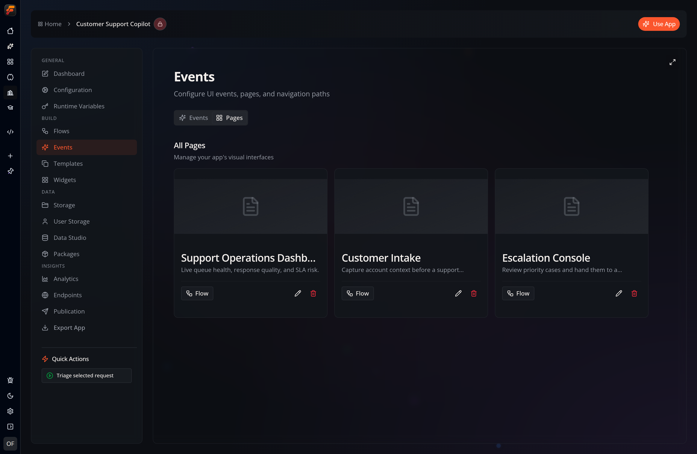

Pages are full-screen interfaces built with Flow-Like's [A2UI component
system](/apps/a2ui/). A Page belongs to a **Flow**, so its interface and
workflow behavior stay together.

Use Pages for dashboards, forms, reports, tools, and other experiences that
need more layout control than a [Chat UI](/apps/chat-ui/).

## Create a Page

1. Open the Flow that will provide the Page's behavior.
2. Open its **Pages** panel.
3. Select **New**, enter a Page name, and select **Create Page**.
4. Flow-Like opens the new Page in the visual builder.

A Flow can own multiple Pages. To see Pages from across the whole app, open the
app's **Events** workspace and select the **Pages** tab. From there, you can
open a Page, jump back to its connected Flow, or delete it.

## Page Builder

The Page Builder is the same component-based editor used for
[Widgets](/apps/widgets/):

- **Components / Hierarchy** — add components or inspect the current component
  tree.
- **Canvas** — arrange and preview the interface.
- **Inspector** — configure the selected component, including its content,
  style, data bindings, and actions.

The toolbar provides copy, cut, paste, and delete controls, plus **Dev Mode**
for the underlying JSON, manual save, and **Preview**. Page changes are also
saved automatically after you stop editing.

Select **Settings** in the Page header for Page-level configuration:

- **General** — Page name, description, ID, and version.
- **Behavior** — Flow events to run on load, unload, or at an interval. A
  cached Page can show its last rendered state while its load event refreshes.
- **Layout** — layout type, background, spacing, and custom canvas styling.
- **SEO** — browser and social metadata.

## Components, data, and actions

A Page is a tree of typed A2UI components. Layout components such as rows,
columns, and grids contain display or interactive components such as text,
cards, tables, charts, inputs, and buttons. You can also place a reusable
[Widget](/apps/widgets/) on a Page.

Bound values let a component read from Page data instead of displaying only a
fixed literal. An interactive component triggers a selected Flow Event through
the fixed `workflow_event` action and its `nodeId`; navigation uses the
dedicated page or external-link actions. Page-level behavior can initialize or
refresh the surface by returning A2UI updates.

See the [A2UI component reference](/reference/a2ui-components/) for the full
catalog and property definitions.

## Make a Page available in the app

A Page is opened through a UI Event. Configure the Event's Page target and give
the Event a unique path such as `/support`. That path becomes the Page's
navigable [route](/apps/routes/).

Use the builder's Preview mode and representative Flow data to test the Page
before publishing or sharing the app.
