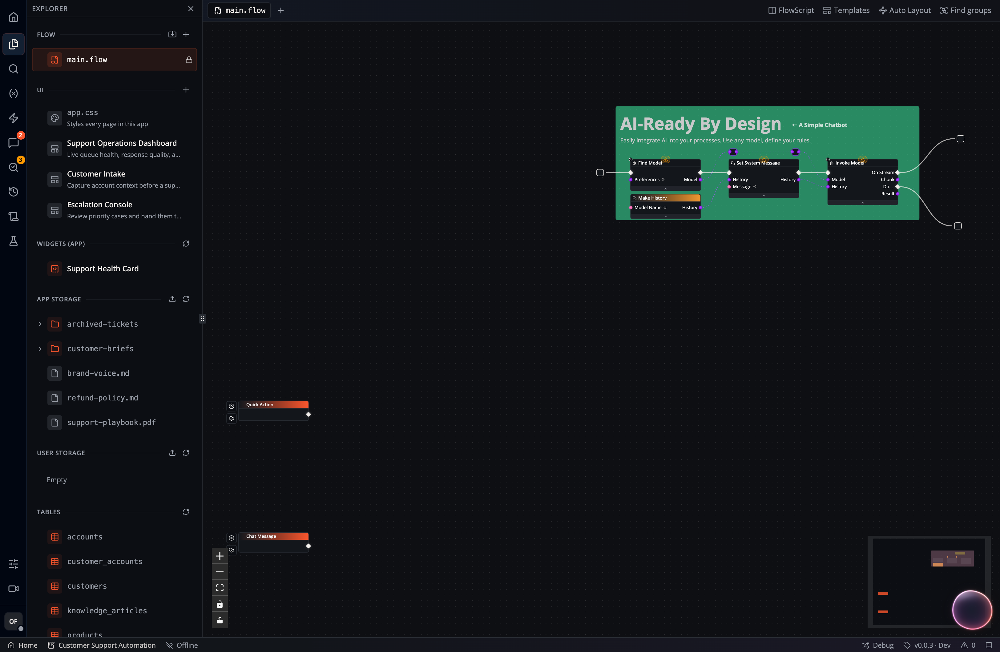
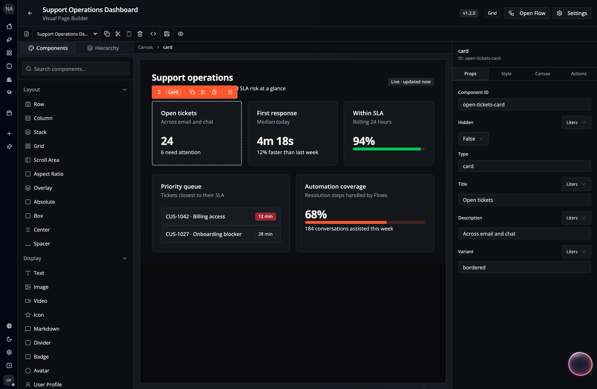

Pages are full-screen interfaces built with Flow-Like's [A2UI component
system](/apps/a2ui/). A Page belongs to a **Flow**, so its interface and
workflow behavior stay together.

Use Pages for dashboards, forms, reports, tools, and other experiences that
need more layout control than a [Chat UI](/apps/chat-ui/).

Enable [Developer Mode](/start/developer-mode/) to open the App's Flows and
Events workspaces. Your role must also allow editing the Flow and its Pages.

## Create a Page

1. Open the Flow that will provide the Page's behavior.
2. Open **Explorer** and find the **UI** section.
3. Select its **Create Page** (+) control. Enter **Page Name** and review the
   suggested route.
4. Select **Create**, then select the new Page in the Explorer to open it in an
   editor tab. The Event route is configured separately when exposing it to users.

A Flow can own multiple Pages. Reopen them from **Explorer → UI** in that
Flow. The Page opens in an editor tab alongside the graph. The App's **Events**
workspace manages the entry points that expose those Pages.

## Page Builder

The Page Builder is the same component-based editor used for
[Widgets](/apps/widgets/):

- **Components / Hierarchy**: add components or inspect the current component
  tree.
- **Canvas**: arrange and preview the interface.
- **Inspector**: configure the selected component, including its content,
  style, data bindings, and actions.

The toolbar provides copy, cut, paste, and delete controls, plus **Dev Mode**
for the underlying JSON, manual save, and **Preview**. Page changes are also
saved automatically after you stop editing.

Select **Settings** in the Page header for Page-level configuration:

- **General**: Page name, description, ID, and version.
- **Behavior**: Flow events to run on load, unload, or at an interval. A
  cached Page can show its last rendered state while its load event refreshes.
- **Layout**: layout type, background, spacing, and custom canvas styling.
- **SEO**: browser and social metadata.

## Components, data, and actions

A Page is a tree of typed A2UI components. Layout components such as rows,
columns, and grids contain display or interactive components such as text,
cards, tables, charts, inputs, and buttons. You can also place a reusable
[Widget](/apps/widgets/) on a Page.

Bound values let a component read from Page data instead of displaying only a
fixed literal. An interactive component triggers a selected Flow Event through
the fixed `workflow_event` action and its `nodeId`; navigation uses the
dedicated page or external-link actions. Page-level behavior can initialize or
refresh the surface by returning A2UI updates.

See the [A2UI component reference](/reference/a2ui-components/) for the full
catalog and property definitions.

## Publish a Page through an Event

To publish a Page for App users, configure an Event with that Page as its target. Give
the Event a unique path such as `/support`. That path becomes the Page's
navigable [route](/apps/routes/).

When creating a [Flow version](/studio/versioning/), Flow-Like also snapshots
its owned Pages. Pin the Page-target Event to that version to keep using the
released Page. The Page Builder continues to edit the latest Page.

Use the builder's Preview mode and representative Flow data to test the Page
before sharing the App. To publish a Page at a browser link, also configure
[Event hosting](/apps/events/#publish-a-hosted-chat-form-or-page).
