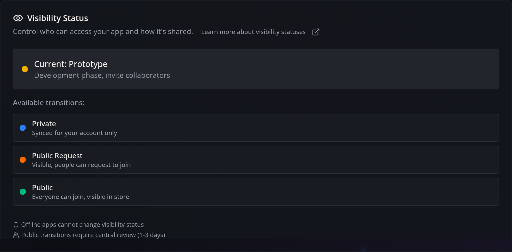
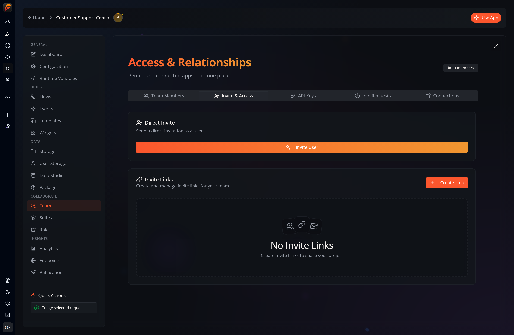
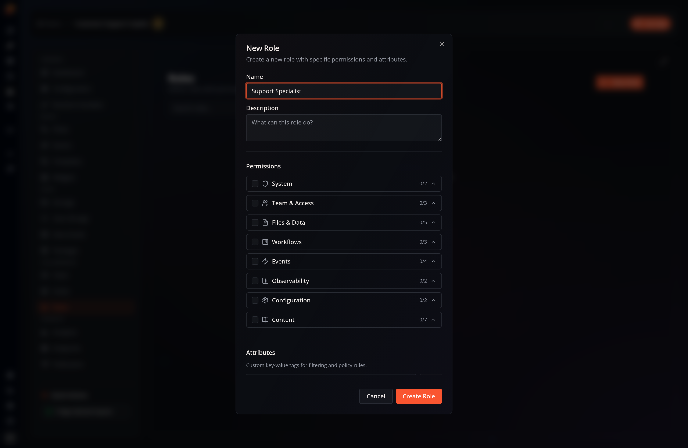

Sharing and visibility features require that you [log in with your Flow-Like account](/start/login/) and set your app to **online** (see [Offline vs. Online](/apps/offline-online/)).

## App Visibility

By default, an online app is **Private**, meaning it is only accessible to your
account. To change this, open the app’s **Dashboard**, select the **Details**
tab, and use the **Visibility Status** section:

The minimum visibility level for sharing your app with others is **Prototype**. This allows you to share your app with other Flow-Like users.

As your app develops, you can increase its visibility to **Public Request** or **Public**, making it available in the **Flow-Like App Store**.

## Sharing Your App

Once your app has at least **Prototype** visibility, **Team** appears in the
app navigation. The Team page is titled **Access & Relationships**.

On that page, open the **Invite & Access** tab to invite Flow-Like users
directly or generate an invite link for your app:

## Rights and Roles

As the app **owner**, you can assign different **roles** to team members. Open
**Roles** in the app navigation to define roles, choose their permissions and
attributes, and set the default role for new members:

