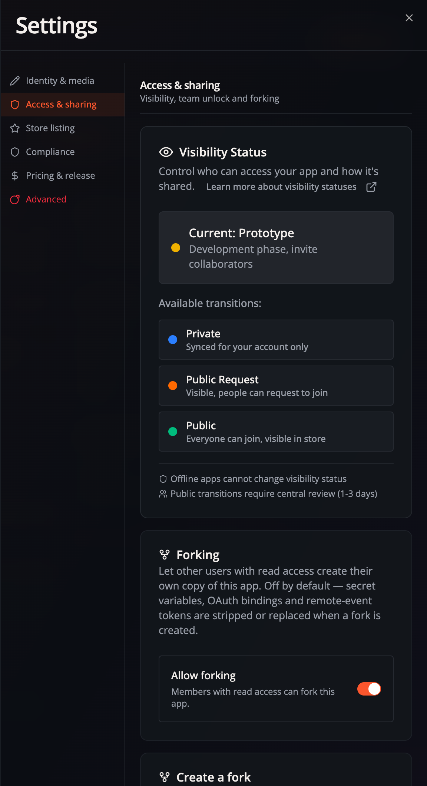
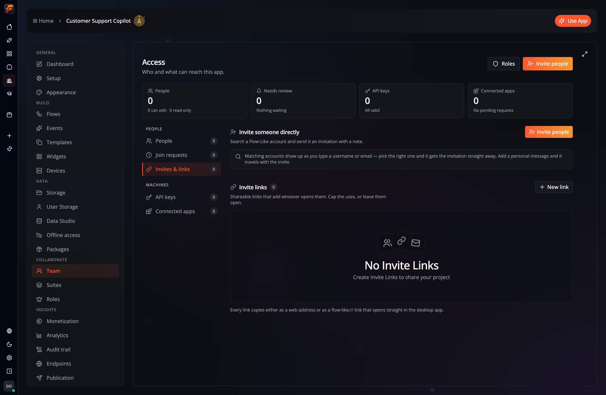
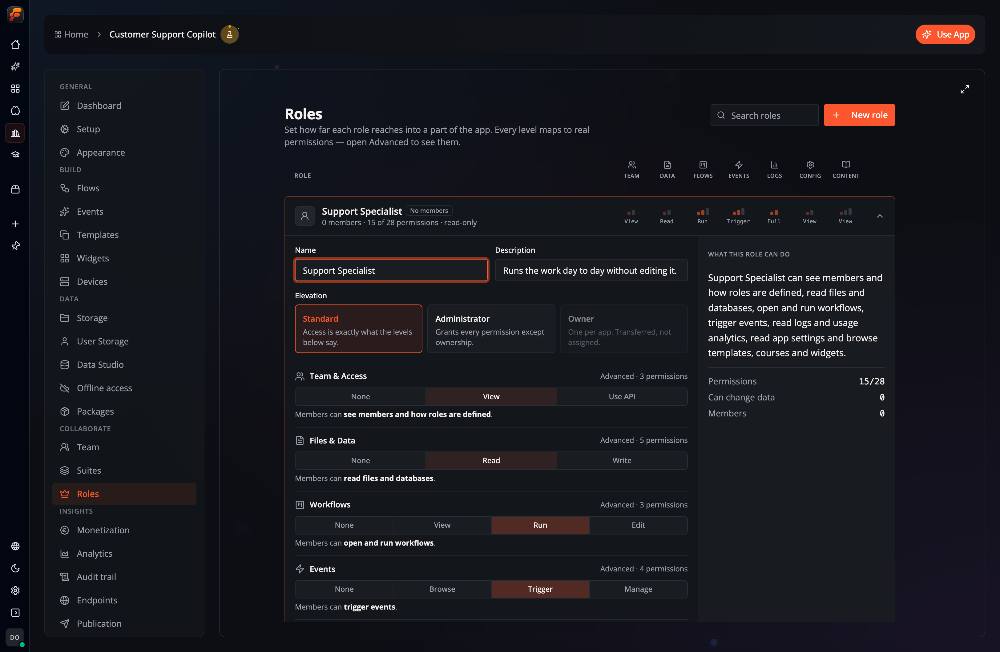

Sharing requires an [online App](/apps/offline-online/) and a signed-in account
with permission to manage its access. Visibility controls how people discover
or request the App; roles control what members can do inside it.

## Change visibility

1. Open the App's **Dashboard**.
2. Open **Access & sharing** in its settings.
3. Choose the visibility appropriate for the App and save the change.

An online App starts **Private**, accessible to its owner. **Prototype**
enables sharing with other Flow-Like users and unlocks the Team area.
**Public Request** and **Public** support the App Store publication path.
Changing visibility does not give every member permission to edit Flows or data.

## Invite people

1. With the App at least **Prototype**, open **Team**. The page is titled
   **Access**.
2. Use **Invite people** for a direct invitation, or open **Invites & links**
   to create and manage invitation links.
3. Choose the intended access and any available limits before sharing a link.
4. Check **People** after the invitation is accepted and review the member's
   assigned role.

The Access sections have different jobs:

| Section | Use it to |
| --- | --- |
| **People** | Inspect current members and their roles. |
| **Join requests** | Review people asking to join; approval uses the default role. |
| **Invites & links** | Invite users and manage reusable invitation links. |
| **API keys** | Issue and manage programmatic App access. |
| **Connected apps** | Review access relationships with other Apps. |

The screen reports when your role cannot read or change a section. Missing
permission is different from an empty list.

## Rights and roles

Enable [Developer Mode](/start/developer-mode/) to see **Roles** in the App
navigation. Open it to create roles, choose permissions and attributes, and set
the default role for new members. Owners and authorized administrators should
review that default before inviting a group.

For example, permission to invoke an Event does not necessarily include
permission to read or edit its Flow. Local execution needs enough access to
load the Flow; see [execution permissions](/apps/offline-online/#permissions-and-local-execution).

## Release an interface

Set the App's display version and changelog under **Dashboard → Pricing &
release**. That version is release metadata. To keep a live interface on tested
logic, [pin its Flow version](/studio/versioning/) and follow the
[Event release walkthrough](/apps/event-releases/).

For a browser link that opens a chat, form, or Page, configure
[Event hosting](/apps/events/#publish-a-hosted-chat-form-or-page). App Store
visibility and anonymous hosted access are separate settings.
