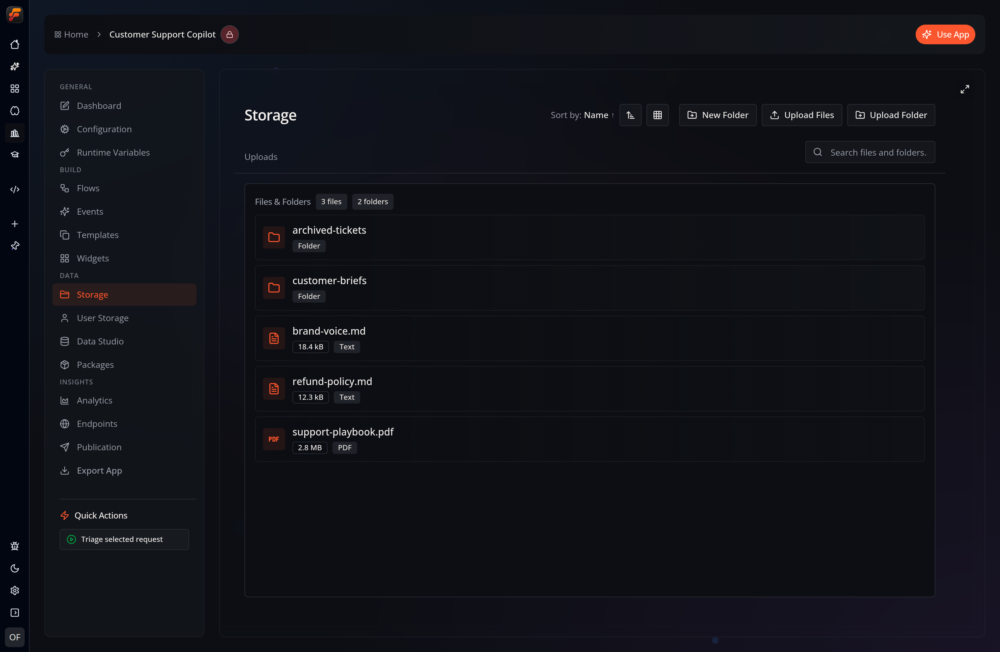

Every Flow-Like app has its own **file storage** for the assets your flows read and write. Two views manage it:

- **Storage** — upload and manage shared files and directories for the app. Select files from your local machine or drag and drop them directly.
- **User Storage** — browse and search your own private, per-user files within the app.

:::tip[Looking for databases?]
Relational tables and the semantic layer built on top of them now live in **[Data Studio](/apps/data-studio/)**.
:::

## Upload Directory
Here you can upload files and entire folders to make them part of your app. For online apps, the files are stored in the cloud and synchronized across all devices where you are logged in with your Flow-Like account:

