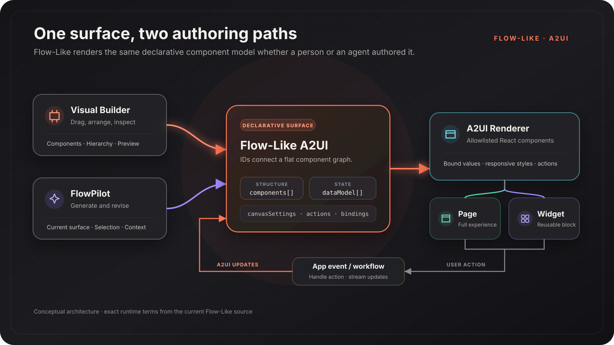

Flow-Like uses an **Agent-to-UI (A2UI)** component model for interfaces that can be authored visually, generated with FlowPilot, rendered safely, and updated by a running workflow.

An A2UI surface is data, not executable frontend code. It contains allowlisted component types, a data model, styling, and actions. The Flow-Like renderer turns that description into native React components.



## Two Ways to Author One Surface

| Authoring path | Best for | What it changes |
| --- | --- | --- |
| **Visual Builder** | Precise composition and inspection | The surface's components, styles, actions, and canvas settings |
| **FlowPilot** | Generating a first draft or revising a selected area | The same surface model used by the builder |
| **Combined** | Fast iteration with human review | FlowPilot proposes changes; you inspect, apply, and refine them |

Because both paths work on the same model, a generated surface can be opened in the builder and a manually authored surface can be given back to FlowPilot as context.

## Runtime Model

A surface has a stable ID, a root component, a flat component graph, and optional data and canvas settings. Parent components refer to their children by ID.

This is a minimal rendering message in the current Flow-Like format:

```json
{
  "type": "beginRendering",
  "surfaceId": "sales-dashboard",
  "rootComponentId": "root",
  "components": [
    {
      "id": "root",
      "component": {
        "type": "column",
        "gap": { "literalString": "16px" },
        "children": { "explicitList": ["title"] }
      }
    },
    {
      "id": "title",
      "component": {
        "type": "text",
        "content": { "literalString": "Revenue" },
        "variant": { "literalString": "heading" }
      }
    }
  ],
  "dataModel": []
}
```

The flat graph matters for both humans and agents:

- A component can be updated by ID without replacing the whole surface.
- Components can arrive incrementally while a workflow is running.
- The hierarchy remains explicit and inspectable.
- Values can be literal or resolved from a data-model path.

### Surface Messages

The renderer handles a broader set of messages, but these are the core surface operations:

| Message | Purpose |
| --- | --- |
| `beginRendering` | Create a surface with its root, components, and initial data |
| `surfaceUpdate` | Add or replace components on an existing surface |
| `dataModelUpdate` | Add or replace data entries |
| `setCanvasSettings` | Update the surface background, padding, or custom CSS |
| `createElement` / `removeElement` | Change the component graph incrementally |
| `deleteSurface` | Remove a surface |

Navigation, dialogs, global/page state, and query-parameter updates are represented as explicit messages too. They are handled by the host rather than executed as arbitrary code.

## Component Catalog

Flow-Like only renders registered component types. The current catalog includes:

| Category | Examples |
| --- | --- |
| **Layout** | Row, Column, Stack, Grid, Scroll Area, Box, Center, Spacer |
| **Display** | Text, Image, Markdown, Table, charts, Calendar, Gantt, Geo Map |
| **Interactive** | Button, Text Field, Select, Checkbox, File Input, Voice Input, Link |
| **Container** | Card, Modal, Tabs, Accordion, Drawer, Tooltip, Popover |
| **Specialized** | File Preview, Diff View, image annotation, 2D and 3D scene components |

The palette in the Visual Builder is the practical reference for the components currently available to authors. The renderer registry is the source of truth for what a client can display.

:::note[Flow-Like extensions]
Flow-Like follows the Agent-to-UI approach and uses declarative surfaces, but its component catalog and runtime messages include Flow-Like-specific capabilities. Do not assume an arbitrary external A2UI payload is portable without mapping its component types and messages to the Flow-Like catalog.
:::

## Pages and Widgets

Pages and Widgets both store A2UI components, but they have different lifecycles.

| Concept | Scope | Runtime role |
| --- | --- | --- |
| **Page** | An app experience, usually connected to a flow | Rendered when an app event targets the page |
| **Widget** | A reusable UI block | Inserted into a Page or another surface as a widget instance |

A Page can also define load, unload, and interval events. A Widget can define
named actions that a host instance maps to workflow bindings.

## Actions and Workflow Updates

The current action handler recognizes exact built-in action names:

| Action | Required context | Behavior |
| --- | --- | --- |
| `workflow_event` | `nodeId`; the builder also stores `appId` and `boardId` | Executes the selected workflow Event |
| `widget_event` | `actionId` | Resolves that Widget action through the instance's workflow binding |
| `navigate_page` | `route`; optional `queryParams` | Navigates within the app |
| `external_link` | `url` | Opens an external URL in a new tab |

`workflow_event` is not an arbitrary event label: `context.nodeId` identifies
the Event node. Likewise, a Widget component always uses the literal
`widget_event` name and selects its declared Widget action through
`context.actionId`.

Unknown action names may be forwarded as a structured `userAction` message to
an optional host callback, including the name, surface/source component IDs,
timestamp, and context. That fallback does not execute a workflow by itself.

For workflow actions, the handler invokes the board with element values,
input values, action context, and navigation state. During the run, Flow-Like
can stream A2UI updates, state changes, navigation, progress, and logs back to
the client.

This keeps the boundary explicit:

1. A component declares one of the supported action contracts.
2. The handler validates its required routing context.
3. Flow-Like resolves the Event or Widget binding and runs it.
4. The workflow returns declarative updates.

## Continue

- [Pages](/dev/a2ui/pages/) — create and configure app Pages
- [Widgets](/dev/a2ui/widgets/) — build reusable UI blocks
- [Visual Builder](/dev/a2ui/visual-builder/) — use the current builder interface
- [Routes](/dev/a2ui/routes/) — map URL paths to app events
