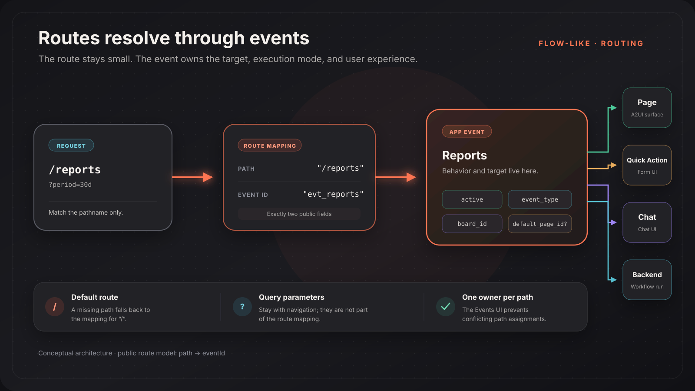
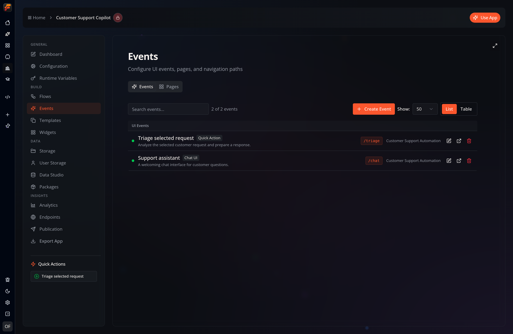
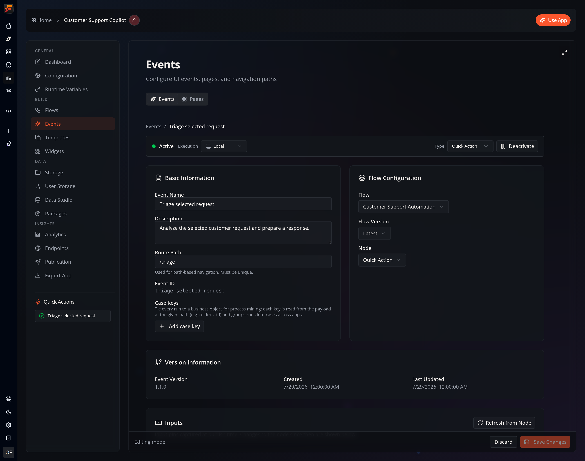

A Flow-Like route is a small mapping from a URL path to an app Event:

```typescript
interface IRouteMapping {
  path: string;
  eventId: string;
}
```

The Event decides what happens next. It can render a Page, open a built-in UI such as Chat or Quick Action, or execute workflow behavior.



## Why Routes Point to Events

Putting the Event between navigation and presentation gives one routing model to every app experience:

- a Page-target Event uses `default_page_id` to select a Page;
- a Chat Event opens the chat interface;
- a Quick Action or Generic Form Event opens its form interface;
- a backend-only Event can run without a UI route.

The route does not store a Page ID, board ID, version, label, icon, priority, timestamps, or target type. Those fields belonged to an older route model and should not be used by new integrations.

## Configure Routes in the UI

Routes are managed with their Events, not in a separate route editor.



For a UI-capable Event:

1. Open the app's **Events** workspace.
2. Create or select the Event.
3. Edit its route badge inline, or open the Event configuration.
4. Enter a unique **Route Path**.
5. Save the Event.



The UI normalizes a route path by:

- trimming whitespace;
- removing a query string before storing the path;
- adding a leading `/` when it is missing;
- using `/` for an empty path.

The Events workspace rejects a path already owned by another Event. Deleting an Event also removes mappings that point to it, and the workspace cleans up mappings whose Event no longer exists.

## Route-State API

The current state interface is:

```typescript
interface IAppRouteState {
  getRoutes(appId: string, force?: boolean): Promise<IRouteMapping[]>;
  getRouteByPath(
    appId: string,
    path: string,
  ): Promise<IRouteMapping | null>;
  getDefaultRoute(appId: string): Promise<IRouteMapping | null>;

  setRoute(
    appId: string,
    path: string,
    eventId: string,
  ): Promise<IRouteMapping>;
  setRoutes(
    appId: string,
    routes: Record<string, string>,
  ): Promise<IRouteMapping[]>;

  deleteRouteByPath(appId: string, path: string): Promise<void>;
  deleteRouteByEvent(appId: string, eventId: string): Promise<void>;
}
```

### Read Routes

```typescript
const routes = await backend.routeState.getRoutes(appId);
const reports = await backend.routeState.getRouteByPath(appId, "/reports");
const home = await backend.routeState.getDefaultRoute(appId);
```

`getDefaultRoute` is a lookup for the path `/`; there is no separate `isDefault` flag.

The browser-backed implementation sorts `getRoutes` results by path. Do not use that order as a navigation priority—the runtime resolves exact configured paths.

### Set a Route

```typescript
const mapping = await backend.routeState.setRoute(
  appId,
  "/reports",
  reportsEventId,
);
```

`setRoute` is an upsert by path. If `/reports` already exists, the method changes its `eventId`; otherwise it creates the mapping.

To set several mappings:

```typescript
await backend.routeState.setRoutes(appId, {
  "/": homeEventId,
  "/reports": reportsEventId,
  "/support": supportEventId,
});
```

`setRoutes` applies the provided entries. It does not delete mappings omitted from the object.

### Delete Routes

Delete one path:

```typescript
await backend.routeState.deleteRouteByPath(appId, "/reports");
```

Delete every path owned by an Event:

```typescript
await backend.routeState.deleteRouteByEvent(appId, eventId);
```

The second form is useful when removing an Event because it prevents orphaned navigation entries.

## Runtime Resolution

The app-use surface reads the current route from the `route` query parameter:

```text
/use?id=<appId>&route=/reports
```

Resolution follows this behavior:

1. Load active Events and all route mappings for the app.
2. Resolve the requested path exactly.
3. If it has no mapping, fall back to the `/` mapping.
4. Load the mapped Event.
5. Render its Page or built-in interface when it has one.

A direct `eventId` can be used when no effective route mapping is active, but user-facing navigation should prefer stable route paths.

## Query Parameters

Query parameters are navigation context, not route identity. For example:

```text
/use?id=<appId>&route=/reports&period=30d&team=sales
```

The stored mapping is still:

```json
{
  "path": "/reports",
  "eventId": "evt_reports"
}
```

A2UI navigation can include parameters in the route string or in the message's `queryParams` object. Flow-Like carries them into the destination URL while resolving only `/reports`.

```json
{
  "type": "navigateTo",
  "route": "/reports",
  "replace": false,
  "queryParams": {
    "period": "30d",
    "team": "sales"
  }
}
```

## Error and Conflict Handling

- Check for `null` when reading a route directly.
- Configure `/` so an unknown path has a useful fallback.
- Verify that the mapped Event exists, is active, and exposes a usable interface before treating a path as user-facing.
- In custom tooling, check for an existing path before assigning it to a different Event if you want the same conflict behavior as the Events UI.
- Use `deleteRouteByEvent` as part of Event deletion.

## Related Guides

- [Pages](/dev/a2ui/pages/) — connect a route Event to a Page
- [Visual Builder](/dev/a2ui/visual-builder/) — author route-aware Page actions
- [A2UI overview](/dev/a2ui/overview/) — understand navigation messages
