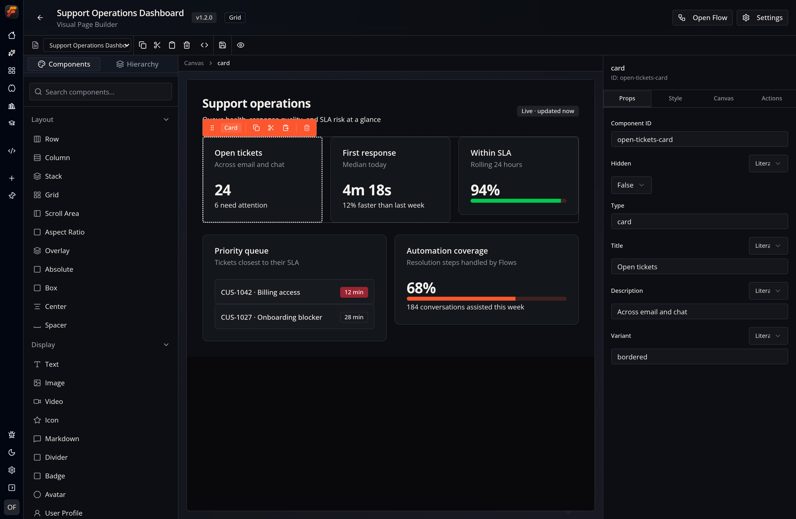
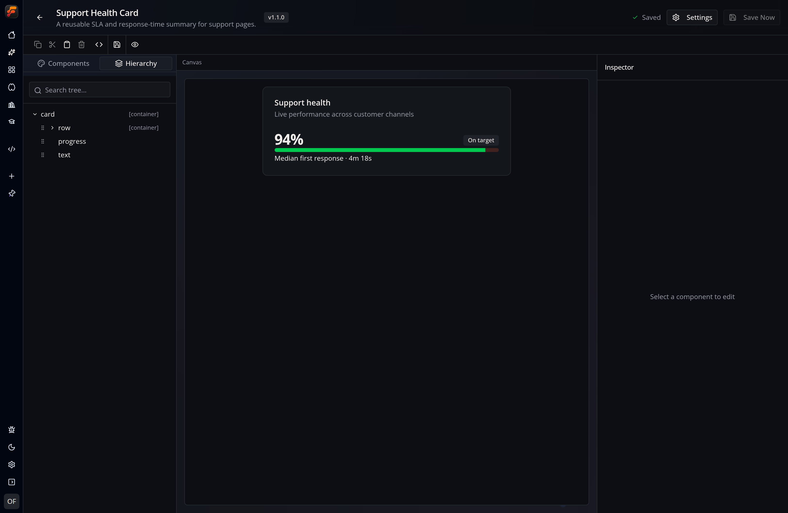

The Visual Builder is the shared editor for Flow-Like Pages and Widgets. It edits the same declarative component graph that the renderer and FlowPilot use.

The builder follows the active Flow-Like theme. The captures below show its dark-mode appearance.

## Page Builder



The Page host adds app and Flow context around the shared editor: Page switching, **Open Flow**, Page settings, lifecycle events, canvas settings, and autosave status.

## Widget Builder



The Widget host adds Widget metadata, named events, version snapshots, autosave status, and a manual **Save Now** action.

## Workspace Anatomy

| Area | Current controls |
| --- | --- |
| **Toolbar** | Page switcher when provided, Copy, Cut, Paste, Delete, Dev Mode, Save, and Preview |
| **Left panel** | Searchable **Components** palette and **Hierarchy** tree |
| **Canvas** | Live A2UI rendering, drag-and-drop targets, selection, zoom, pan, and resize handles |
| **Inspector** | **Props**, **Style**, **Canvas**, and **Actions** for the selected component |
| **Preview** | Responsive device presets, orientation, dimensions, and breakpoint status |

Panels are resizable. The palette groups built-in components by Layout, Display, Interactive, Container, and Game, and can also show reusable Widgets grouped by project.

## Add and Arrange Components

You can add a built-in component in two ways:

1. Drag it from the palette to a compatible container.
2. Double-click it to add it directly to the surface.

The root component is always `root`. Containers such as Row, Column, Stack, Grid, Card, Scroll Area, Tabs, Accordion, and Box can own child IDs. The builder updates the flat graph when components are reordered or nested.

Use **Hierarchy** when the visual layout makes a deeply nested component difficult to select. Multi-select is supported for selection, but the current Inspector only edits one component at a time.

## Inspector

### Props

Props are generated from the selected component's schema. A supported value can be entered literally or bound to a data-model path.

Examples include:

- Text content and visual variant;
- image source and alternative text;
- table or chart data;
- form values and placeholders;
- container children and layout options.

### Style

Style controls include dimensions, spacing, positioning, background, border, shadow, transforms, typography, overflow, and responsive overrides. Prefer semantic theme classes when the interface should work in both light and dark mode.

### Canvas

Canvas settings apply to the whole surface:

```typescript
interface CanvasSettings {
  backgroundColor?: string;
  backgroundImage?: string;
  padding?: string;
  customCss?: string;
}
```

On a Page, these values are also available from **Page Settings → Layout**.

### Actions

Interactive components can declare structured actions. Available targets depend on the context passed by the host:

- Pages offer `navigate_page`, `external_link`, and `workflow_event`; the last
  stores the selected Event in `context.nodeId`.
- Widgets offer their named events through the fixed `widget_event` action
  name and store the selected event ID in `context.actionId`.
- The instance schema and dedicated inspector include workflow and command
  bindings, but the current action handler executes only workflow bindings.
  The Page Builder also does not mount that instance editor. See
  [Widgets](/dev/a2ui/widgets/#insert-a-widget-into-a-page).

The action editor stores data in the surface; it does not embed executable JavaScript.

## Toolbar

### Clipboard and Delete

Copy, Cut, Paste, and Delete operate on the current selection. Pasted components receive new IDs, and the builder updates child references.

### Save

**Save** passes the current component list and Widget references to the host. The Page and Widget hosts also save after a short debounce, so the header's status is the best indicator of pending changes.

### Dev Mode

**Dev Mode** opens the JSON editor for the current surface. It is useful for:

- inspecting exact component IDs and properties;
- pasting a generated component graph;
- debugging a binding or action;
- making a precise bulk edit.

Return to the visual canvas after editing JSON and verify both the hierarchy and Preview. Invalid component types cannot be rendered because the runtime only accepts registered types.

### Preview

Preview hides the editing panels and renders the current surface in a responsive frame.

| Preset | Dimensions |
| --- | --- |
| Desktop | 1440 × 900 |
| Laptop | 1280 × 800 |
| Tablet | 768 × 1024 |
| Mobile | 375 × 812 |
| Mobile Small | 320 × 568 |

You can rotate a preset and see which `sm`, `md`, `lg`, `xl`, or `2xl` breakpoint is active.

## Canvas Navigation

Use the mouse wheel to zoom around the pointer. Pan the canvas when the surface is larger than the workspace.

The implemented zoom shortcuts are:

| Shortcut | Result |
| --- | --- |
| `Ctrl/Cmd + =` | Zoom in |
| `Ctrl/Cmd + -` | Zoom out |
| `Ctrl/Cmd + 0` | Reset zoom and pan |

On a Page with a connected board, `Ctrl/Cmd + Shift + F` opens the Flow.

## FlowPilot

In Desktop, the host provides the global FlowPilot assistant. While the builder is mounted, it publishes:

- the active surface ID and app context;
- the current components;
- selected component IDs;
- a canvas screenshot callback;
- callbacks for generated and applied components.

FlowPilot changes first appear as pending components. Review the canvas and the pending-components bar, then choose **Apply Changes** or **Dismiss**.

When the builder is embedded in a host without the global assistant, it can mount its own FlowPilot panel instead.

## Host-Specific Lifecycle

| Behavior | Page host | Widget host |
| --- | --- | --- |
| Component autosave | Yes | Yes |
| Manual save | Toolbar Save | Toolbar Save and header Save Now |
| Metadata | Page Settings | Widget Settings |
| Page switching | Yes | No |
| Flow shortcut | When `boardId` is present | No |
| Version creation | Display current Page version | Patch, Minor, and Major Widget snapshots |

## Related Guides

- [Pages](/dev/a2ui/pages/) — Page settings and lifecycle
- [Widgets](/dev/a2ui/widgets/) — Widget metadata, events, and versions
- [A2UI overview](/dev/a2ui/overview/) — surface and message model
