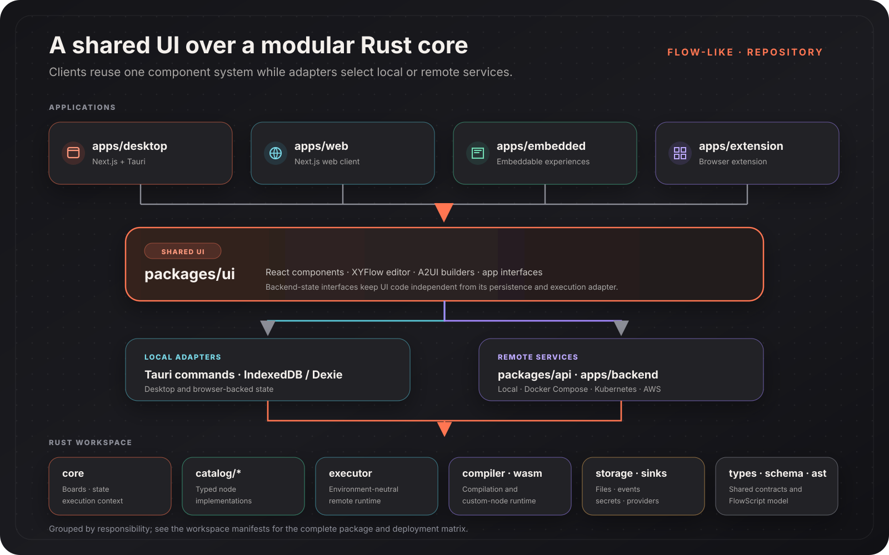
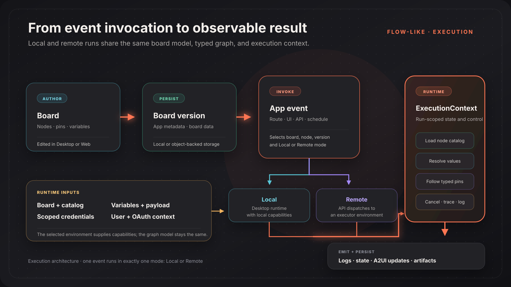

Flow-Like is a monorepo with Next.js/React clients and a modular Rust workspace. The clients share one UI package and a set of backend-state interfaces; adapters connect those interfaces to local browser/Tauri state or remote services.

## Repository Layers

### Applications

| Directory | Responsibility |
| --- | --- |
| `apps/desktop` | Next.js client hosted by Tauri for local and desktop-capable operation |
| `apps/web` | Next.js web client |
| `apps/embedded` | Embeddable app experiences |
| `apps/extension` | Browser extension |
| `apps/backend/local` | Local API and runtime binaries |
| `apps/backend/docker-compose` | Single-stack services, proxy, runtime, compiler, signaling, and monitoring |
| `apps/backend/kubernetes` | API, executor, compiler, sink trigger, Helm chart, and deployment utilities |
| `apps/backend/aws` | AWS API, executor, compiler, event bridge, and supporting functions |
| `apps/backend/signaling` | Shared signaling service |
| `apps/docs` / `apps/website` | Documentation and public website |
| `apps/schema-gen` / `apps/utils` | Schema and repository utilities |

The root Cargo workspace contains the Rust applications and packages. The root Bun workspace contains `apps/*`, `packages/*`, and `libs/*/*`.

### Shared Frontend

`packages/ui` contains the reusable React layer:

- the XYFlow-based visual workflow editor;
- A2UI renderer, Page/Widget builder, and app interfaces;
- settings and library components;
- backend-state contracts and their browser-backed implementations;
- query, assistant, execution-service, and global state integrations.

The state interfaces are the important boundary. A component can request Pages, routes, Events, boards, storage, or executions without hard-coding whether the data comes from IndexedDB, a Tauri command, or an API-backed adapter.

### Core Packages and Contracts

| Package group | Responsibility |
| --- | --- |
| `packages/core` | Boards, nodes, pins, variables, app state, execution context, and Flow-Like domain logic |
| `packages/catalog` and `packages/catalog/*` | Node registration and implementations split by domain |
| `packages/types` / `packages/schema` | Shared contracts and schemas |
| `packages/ast` | FlowScript text-domain model, parsing, rendering, linting, and signatures |
| `packages/storage` | Local, memory, cloud, and generic object-store abstraction |
| `packages/secrets` | Secret-management integrations |
| `packages/sinks` | Event sinks and triggers |
| `packages/api` | Remote API, authentication/authorization boundaries, execution dispatch, and service state |
| `packages/executor` | Environment-neutral remote execution runtime with callback and streaming modes |
| `packages/compiler` / `packages/wasm` | WASM compilation and custom-node runtime |
| `packages/model-provider` | Model-provider and local inference integrations |
| `packages/bits` | Auxiliary Bit workspace crate; the current Bit domain model lives in `packages/core` |
| `packages/catalog-macros` / `packages/catalog-build-helper` | Catalog registration and build support |
| `packages/dexie-tauri-adapter` | Desktop adapter for browser/Dexie-backed data |

The catalog currently includes domain crates for automation, core, data, geo, LLM, media, ML, ONNX, processing, standard nodes, and web operations.

## Client-to-Runtime Boundary

The same frontend package can operate in different environments:

| Environment | Typical path |
| --- | --- |
| **Desktop/local** | React component → backend-state interface → IndexedDB/Dexie or Tauri command → local Rust state/runtime |
| **Remote/web** | React component → backend-state interface → API client → `flow-like-api` → storage, dispatch, or remote executor |
| **Embedded** | Shared use interface with app, route, and Event context supplied by its host |

This split is why a feature should normally be added to the interface first, then implemented by each adapter that supports it.

## Workflow Execution

1. An author edits a Board made of nodes, pins, variables, and connections.
2. Flow-Like persists the Board and its app metadata. Versioned runs can select a specific Board version.
3. An app Event identifies the Board and entry node. Each Event runs in exactly one execution mode: `Local` or `Remote`.
4. The selected environment loads the Board, node catalog, payload, variables, user/OAuth context, and scoped credentials.
5. `ExecutionContext` evaluates data pins and follows execution pins through the connected graph.
6. The run emits logs, progress, state, A2UI messages, and results; artifacts and run data are persisted through the configured stores.

The `packages/executor` crate provides the remote runtime independently of a specific deployment target. It supports streaming responses and callback delivery, while deployment applications provide the surrounding HTTP, queue, container, or function environment.

## Type and Graph Model

Every pin has:

- a direction (`Input` or `Output`);
- a data type, including `Execution`, scalar values, structures, and generic values;
- a value shape such as a normal value, array, or set;
- optional schema and default-value information.

Execution pins control graph traversal. Non-execution pins carry values and are evaluated through the execution context. Struct values can carry schema information, and FlowPilot/FlowScript validation uses the same typed model to reject invalid connections before runtime.

The visual graph uses `@xyflow/react`; Flow-Like adds its typed node, pin, catalog, validation, layout, and execution behavior on top.

## Storage Planes

Flow-Like does not assume one physical storage provider. Its storage and credential layers expose logical stores for different workloads:

| Store | Typical contents |
| --- | --- |
| **Metadata** | App and Board records, configuration, and small frequently read objects |
| **Content** | Uploads, generated files, media, model artifacts, and larger objects |
| **Logs** | Run logs and execution records |

The concrete `FlowLikeStore` supports local, in-memory, AWS/S3-compatible, Azure, Google Cloud Storage, and generic object-store implementations. Remote runtime credentials can scope metadata, content, and log access separately, including mixed-provider deployments.

Deployment-specific configuration may add a CDN store or database services around these core planes. Follow the relevant self-hosting guide instead of copying provider variables from another deployment target.

## Event and UI Architecture

Events are the bridge between external invocation and a Board:

- an Event selects a Board, node, version, and Local/Remote mode;
- UI-capable Event types provide Chat, form, or other built-in interfaces;
- a Page-target Event uses `default_page_id`;
- a route maps only `path → eventId`;
- a running Event can stream A2UI messages to the active surface.

See [A2UI in Flow-Like](/dev/a2ui/overview/) and [Routes](/dev/a2ui/routes/) for those frontend contracts.

## Deployment Shapes

The repository currently contains four backend shapes:

| Shape | Repository location | Intended role |
| --- | --- | --- |
| Local | `apps/backend/local` | Local API/runtime development and desktop-adjacent execution |
| Docker Compose | `apps/backend/docker-compose` | Self-hosted service stack |
| Kubernetes | `apps/backend/kubernetes` | Cluster API, compiler, executor, and sink services |
| AWS | `apps/backend/aws` | AWS-native API, execution, compilation, and event services |

Deployment capabilities are not inferred from package feature names alone. Check each application's manifest and configuration because a provider or runtime may be enabled differently by each target.

## Where to Make a Change

| Change | Start here |
| --- | --- |
| Shared UI or app experience | `packages/ui` |
| Desktop-only capability | `apps/desktop` and its Tauri crate |
| Web-client host behavior | `apps/web` |
| Domain model or local execution | `packages/core` |
| Node implementation | the matching `packages/catalog/*` crate |
| Remote request/authorization path | `packages/api` |
| Remote execution transport | `packages/executor` and the deployment app |
| Storage provider behavior | `packages/storage` plus deployment credentials/config |
| Custom-node compilation/runtime | `packages/compiler` and `packages/wasm` |

## Continue

- [Building from Source](/dev/build/) — run the workspace locally
- [Writing Nodes](/dev/writing-nodes/) — extend the catalog
- [Self-Hosting](/self-hosting/overview/) — select a deployment shape
