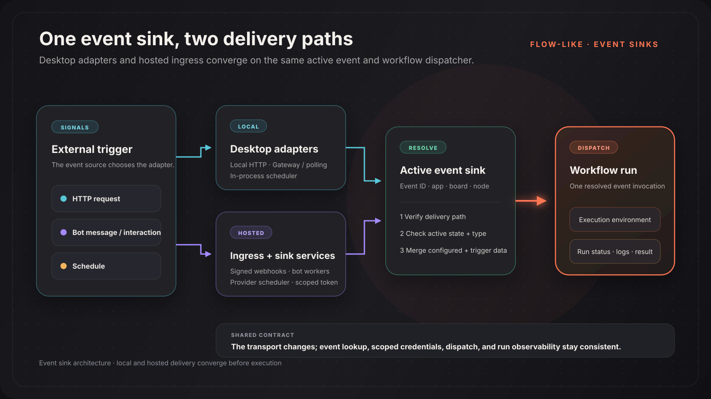

An event sink connects an external signal to an event in a Flow-Like app. The event identifies the board and start node; the sink defines how the signal arrives and whether that event is active.

## Delivery models

The same event can be delivered locally, remotely, or both when the event configuration and hub support it.

| Sink | Desktop delivery | Hosted delivery |
|---|---|---|
| HTTP / API | Local HTTP listener | Public HTTP sink endpoint |
| Telegram | Bot API long polling | Telegram webhook; a self-hosted sink service can also poll |
| Discord | Discord Gateway messages | Interactions webhook; a self-hosted sink service can also use the Gateway |
| Cron | In-process desktop scheduler | Configured server scheduler, such as a sink service, EventBridge Scheduler, or a Kubernetes CronJob |

Flow-Like also has adapters for sources such as email, RSS, files, deep links, and device events. Their availability depends on the current client and the hub's advertised capabilities.



## What happens on a trigger

1. A desktop adapter, public webhook, or trusted sink service receives the signal.
2. Flow-Like verifies the delivery mechanism. For example, an HTTP sink may require a bearer token and a Discord interaction requires a valid signature.
3. The runtime resolves an active sink by event ID and checks that the sink type matches.
4. Configured event data and trigger data are combined where that delivery path supports a payload.
5. Flow-Like creates and dispatches a workflow run, then exposes its status and logs through the normal execution APIs.

The exact payload is sink-specific. Do not assume that local polling, a hosted bot worker, and a public webhook produce identical JSON.

## Local, remote, and hybrid execution

| Target | When to use it | Operational requirement |
|---|---|---|
| **Local** | The flow needs files, applications, or other resources on the user's machine | The desktop app must be running |
| **Remote** | The trigger must be available continuously or from the public internet | The hub and its sink infrastructure must be running |
| **Hybrid** | Both environments should register the event | Design the workflow to tolerate duplicate real-world signals |

The event editor only offers targets that are available in the current environment.

## Hub capabilities

`supported_sinks` tells clients which sink types the hub can execute remotely. It does not start the required worker or configure a third-party webhook by itself.

```json title="flow-like.config.json"
{
  "supported_sinks": {
    "http": true,
    "webhook": true,
    "cron": true,
    "mqtt": false,
    "github": true,
    "rss": true,
    "discord": true,
    "slack": true,
    "telegram": true,
    "email": true
  }
}
```

For the Docker Compose sink service, `cron`, `discord`, and `telegram` also control which long-running workers start. Other sink types are handled by their API route, another service, or a client-side adapter.

## Security boundaries

| Delivery path | Primary check |
|---|---|
| Public HTTP sink | Optional sink bearer token and configured method/path |
| Telegram webhook | Telegram secret token and source-IP validation in hosted mode |
| Discord interactions webhook | Ed25519 signature over the timestamp and request body |
| Internal sink service | Bearer JWT scoped to allowed sink types, with optional app restrictions |
| Local adapter | Local event registration and the desktop execution context |

Store bot tokens, webhook secrets, personal access tokens, and OAuth material through the event or deployment secret mechanisms. Never place them in a board, screenshot, or committed config file.

## Related

- [Cron Sink](/dev/sinks/cron/)
- [Telegram Sink](/dev/sinks/telegram/)
- [Discord Sink](/dev/sinks/discord/)
