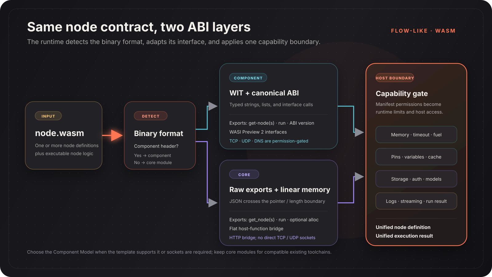

Flow-Like can load custom workflow nodes from WebAssembly binaries. A package may expose one node or a related set of nodes, and the runtime uses the same node definitions and execution result types as the native catalog.

Language support depends on whether a toolchain can produce one of Flow-Like's supported binary interfaces. Start from a repository template instead of assuming that every generic `.wasm` file is compatible.

## Why use a WASM node?

| Benefit | What it means in Flow-Like |
|---|---|
| Language choice | Use one of the maintained Component Model or core-module templates |
| Isolation | Wasmtime applies fuel, timeout, memory, and capability controls |
| Portable package | The same compatible binary format can be loaded by Flow-Like desktop and hosted executors |
| Multiple nodes | One package can return several node definitions through `get-nodes` / `get_nodes` |
| Registry distribution | Published versions can be reviewed, installed, cached, updated, or disabled |

## Package anatomy

A typical template contains:

| Item | Purpose |
|---|---|
| `flow-like.toml` | Package identity, version, metadata, and package-level resource declarations |
| `node.wasm` | Component Model component or core WebAssembly module |
| Language SDK or bindings | Implements the Flow-Like node contract |
| Tests and examples | Validate definitions and execution behavior before publishing |

The publish screen collects manifest fields and uploads the compiled binary. During registry processing, Flow-Like instantiates the binary and extracts its exported node definitions, so the catalog reflects the executable artifact.

## Node contract

Every compatible package provides:

- one node definition or a list of definitions;
- a `run` implementation;
- a numeric ABI version where the template exposes it;
- JSON-compatible inputs and outputs;
- declared node permissions for any protected host capability.

Definitions can include typed pins, defaults, schemas, documentation, icons, quality scores, and permission labels.

### Pin data types

| Data type | Typical JSON value |
|---|---|
| `Execution` | `null` control signal |
| `String` | `"hello"` |
| `Integer` | `42` |
| `Float` | `3.14` |
| `Boolean` | `true` |
| `Date` | ISO 8601 string |
| `PathBuf` | Flow-Like storage path |
| `Struct` | JSON object |
| `Byte` | Byte payload represented by the SDK |
| `Generic` | Any supported JSON-compatible value |

Pins can be normal values, arrays, hash maps, or hash sets. A template's SDK is responsible for mapping its language types to this contract.

## Runtime models

Flow-Like auto-detects two binary formats:

| Model | Interface | Best fit |
|---|---|---|
| **Component Model** | WIT interfaces and the canonical ABI | New packages, typed bindings, or permission-gated WASI sockets |
| **Core module** | Raw exports plus JSON in linear memory | Existing core-module toolchains and compatibility templates |

Both models end at the same Flow-Like node abstraction, but their SDK and networking support differ. See [Component Model vs Core Modules](/dev/wasm-nodes/runtime-models/).

## Maintained templates

### Component Model

| Language | Template |
|---|---|
| Rust | `templates/wasm-node-rust` |
| Go | `templates/wasm-node-go` |
| C++ | `templates/wasm-node-cpp` |
| Zig | `templates/wasm-node-zig` |
| C# | `templates/wasm-node-csharp` |
| Swift | `templates/wasm-node-swift` |
| Python | `templates/wasm-node-python` |
| TypeScript | `templates/wasm-node-typescript` |

### Core modules

| Language | Template |
|---|---|
| AssemblyScript | `templates/wasm-node-assemblyscript` |
| Kotlin | `templates/wasm-node-kotlin` |
| Nim | `templates/wasm-node-nim` |
| Lua | `templates/wasm-node-lua` |
| Java | `templates/wasm-node-java` |
| Grain | `templates/wasm-node-grain` |
| MoonBit | `templates/wasm-node-moonbit` |

The repository's `templates/wasm-capability-matrix.md` is the source of truth for current template format and SDK parity.

## Permissions and resource limits

The runtime converts declared permissions into capabilities. Protected operations return no data or fail when the required capability is absent.

| Capability area | Examples |
|---|---|
| Network | HTTP, WebSocket, TCP, UDP, DNS |
| Flow context | Variables, cache, streaming, A2UI |
| Storage | Scoped reads and writes |
| Authentication | Configured OAuth access |
| Models | Hosted embedding and language-model calls |

Packages also select memory and timeout tiers. Current manifest tiers range from 16 MB to 4 GB and from 5 seconds to 30 minutes; deployment policy can still impose stricter limits.

See [Sandboxing & Permissions](/dev/wasm-nodes/sandboxing/) and [Package Manifest](/dev/wasm-nodes/manifest/) before adding external access.

## Development workflow

1. Copy the closest language template.
2. Change the package identity and node definition.
3. Implement `run` with the template SDK.
4. Declare only the capabilities the node needs.
5. Run the template's tests and build task.
6. Publish the resulting `.wasm` through **Library → Packages → Publish**.
7. Install the approved or private package and test it in a real board.

Installed packages are cached locally. Hosted execution resolves package versions and verified compiled artifacts through the registry.

## Related

- [Component Model vs Core Modules](/dev/wasm-nodes/runtime-models/)
- [Package Registry](/dev/wasm-nodes/registry/)
- [Package Manifest](/dev/wasm-nodes/manifest/)
- [Sandboxing & Permissions](/dev/wasm-nodes/sandboxing/)
