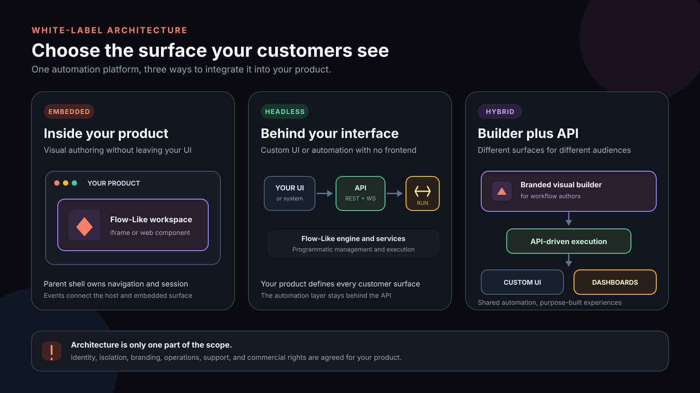

Flow-Like's white-label and OEM program is for teams that want to ship
Flow-Like capabilities as part of their own product and brand. The deployment
architecture, commercial rights, support, and delivered components are defined
in the commercial agreement for your use case.

:::note[Commercial scope]
The source-available license does not automatically grant every white-label,
hosted-service, trademark, or sublicensing right. Review
[Licensing](/enterprise/licensing/) and confirm the intended product and
distribution model before implementation.
:::

## Choose how customers interact

Three common architectures separate the product surface from the execution
layer:

### Embedded

Place the Flow-Like authoring experience inside your existing product through
an iframe or web component. The surrounding product owns navigation and can
pass sessions and events between the parent and embedded surface.

Use this when customers should design Flows without leaving your application.

### Headless

Use the Flow-Like engine and APIs behind an interface you build. A headless
deployment can invoke and manage automation without exposing the Flow-Like
frontend to customers.

Use this when your product needs a purpose-built UI or no customer-facing
authoring UI at all.

### Hybrid

Combine a branded Flow-Like visual editor for builders with API-driven
execution, custom dashboards, or focused end-user experiences.

Use this when different audiences need different surfaces over the same
automation platform.

## Scope the product surface

White-label work commonly covers:

- visual tokens, typography, logos, favicons, and launch assets;
- custom domains and branded customer communications;
- identity integration and session passthrough;
- tenant isolation, deployment topology, and data residency;
- usage metering and integration with your billing or entitlement layer;
- API or SDK access and custom product integrations;
- support, maintenance, and upgrade responsibilities.

Availability and implementation differ by deployment. Treat this as a
discovery checklist, not as a list of entitlements included in every
agreement.

## Prepare an implementation brief

Before requesting a proposal, document:

1. **Audience** — who builds Flows and who only invokes them.
2. **Surface** — Embedded, Headless, Hybrid, or a mix by customer.
3. **Tenancy** — single tenant, multi-tenant, or dedicated deployments.
4. **Identity** — SSO provider, user provisioning, and session handoff.
5. **Execution** — local, hosted, customer-managed, or air-gapped.
6. **Branding** — product name, domains, assets, theme, and communications.
7. **Operations** — expected usage, regions, observability, SLA, and upgrades.
8. **Distribution** — internal use, customer deployment, hosted service, or
   resale.

These choices determine both the technical plan and the commercial license.

## Implementation paths

Teams may implement an agreed scope themselves or include professional
services for branding, integrations, deployment, training, and support.

For the open customization surfaces, see
[Customizing & White-Label](/dev/customizing/). For infrastructure planning,
start with [Self-Hosting](/self-hosting/overview/) and validate the exact
services required by the architecture you select.

## Commercial planning

Pricing and terms depend on the deployment mode, number and shape of
deployments, usage, support level, and custom engineering. Do not assume a
per-seat model, unlimited deployment rights, or sublicensing rights unless
they appear in the proposal.

For a white-label product inquiry, contact
[sales@flow-like.com](mailto:sales@flow-like.com?subject=White-Label%20%26%20OEM%20Inquiry).

For an OEM partnership, contact
[partnerships@flow-like.com](mailto:partnerships@flow-like.com?subject=OEM%20Partnership%20Inquiry).

## Related

- [Customizing & White-Label](/dev/customizing/) — Technical customization guide
- [Licensing](/enterprise/licensing/) — License terms and conditions
- [Self-Hosting](/self-hosting/overview/) — Deployment options
- [Architecture](/dev/architecture/) — Technical architecture overview
