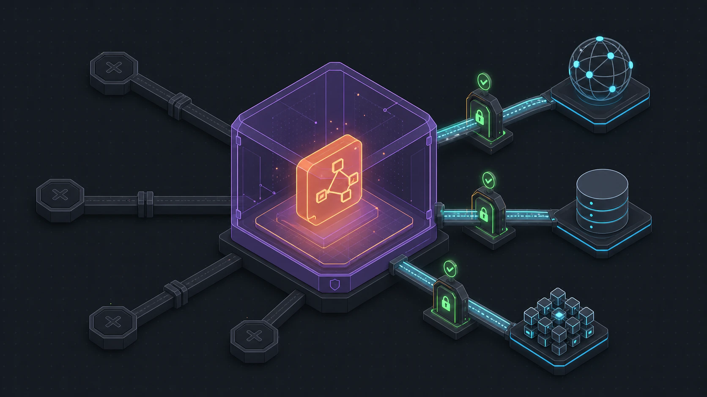

Flow-Like combines a Rust application core, a Wasmtime boundary for external
WASM nodes, authenticated APIs, app-scoped authorization, and deployment-level
controls. These layers reduce risk, but they do not make an untrusted workflow
or an incorrectly exposed deployment safe by themselves.

## Security boundaries

| Boundary | Enforced by | Operator or author responsibility |
| --- | --- | --- |
| External WASM node | Wasmtime memory isolation, fuel, epoch interruption, resource limits, capability-aware host functions | Review requested permissions and package provenance |
| Workflow and app data | Scoped storage paths, runtime credentials, app roles | Configure storage and identities with least privilege |
| Public API | OIDC, API keys, PATs, internal JWTs, route-level permission checks | Protect credentials and expose the API only through an appropriate network boundary |
| Service-to-service calls | Audience-specific ES256 backend JWTs | Share one valid backend keypair across replicas and rotate it deliberately |
| Network transport | Reverse proxy, load balancer, ingress, and network policy | Configure TLS, trusted forwarding, egress, and internal segmentation |
| Third-party services | Explicit network/model/OAuth use by workflows | Understand what data leaves the deployment and which provider receives it |

## WASM execution

Flow-Like uses [Wasmtime](https://wasmtime.dev/) for external WASM nodes. Core
modules and Component Model binaries use different ABI adapters, then converge
on the same Flow-Like capability and resource boundary.

### Isolation and interruption

- Each instance has WebAssembly linear memory separate from host memory.
- WASI is disabled by the normal security configurations unless explicitly
  enabled.
- Host process environment variables are never inherited by WASM guests,
  including permissive and runtime execution profiles. Any guest environment
  value must be supplied individually through explicit guest configuration.
- Fuel metering limits instruction execution.
- Epoch interruption enforces a wall-clock deadline.
- Memory, tables, memories, table elements, instances, and stack depth are
  bounded by the selected `WasmLimits`.
- Host functions check the granted capabilities before performing protected
  work.

These controls limit a module's direct authority. They do not prove that a
permitted HTTP request is trustworthy, that returned data is safe to use, or
that a high resource limit cannot affect overall capacity.

### Resource profiles

There are two related configuration paths:

1. A package manifest selects memory and timeout tiers.
2. Node-level permissions can be converted directly into a security
   configuration that uses the runtime defaults.

Current package-manifest defaults are:

| Setting | Default tier |
| --- | --- |
| Memory | Standard, 64 MiB |
| Timeout | Standard, 30 seconds |

The general `WasmLimits::default()` used by direct node-permission conversion
currently allows 256 MiB, 120 seconds, and 100 billion fuel units. The
restrictive preset uses 16 MiB, 10 seconds, and 1 billion fuel units. Do not
assume one table describes every package: inspect the manifest and the
execution path used by the deployment.

Fuel is an instruction budget, not a portable duration. Its wall-clock cost
depends on the module and host.

### Node permissions

External nodes declare permissions with these serialized names:

| Permission | Capability granted |
| --- | --- |
| `network:http` | Outbound HTTP operations |
| `network:websocket` | WebSocket connections |
| `network:tcp` | TCP sockets |
| `network:udp` | UDP sockets |
| `network:dns` | DNS lookups |
| `storage:read` | Read from the host-provided storage scope |
| `storage:write` | Write and delete within the host-provided storage scope |
| `variables` | Read and write execution variables |
| `cache` | Read and write the execution cache |
| `streaming` | Stream incremental output |
| `models` | Use configured model providers |
| `a2ui` | Use dynamic A2UI operations |
| `oauth` | Access configured OAuth flows |
| `functions` | Call registered functions or subflows |

The node-permission conversion begins with no capabilities and adds the
declared set. Package manifests can also specify network host allowlists and
resource tiers.

:::caution
An empty `allowed_hosts` list means unrestricted hosts when HTTP is enabled in
the package manifest. Use an explicit allowlist when a package only needs known
services.
:::

See [Sandboxing and permissions](/dev/wasm-nodes/sandboxing/) for the author
and user workflow.

## Authentication

The API supports several identities for different callers.

### Interactive users

The deployment delegates interactive authentication to a configured OpenID
Connect provider. Under the API v1 prefix, Flow-Like exposes:

| Endpoint | Behavior |
| --- | --- |
| `/api/v1/auth/openid` | Return the configured OpenID client information |
| `/api/v1/auth/discovery` | Redirect to the provider discovery URL |
| `/api/v1/auth/jwks` | Redirect to the provider JWKS URL |
| `/api/v1/auth/authorize` | Proxy authorization requests |
| `/api/v1/auth/token` | Proxy token exchange |
| `/api/v1/auth/userinfo` | Proxy user-info requests |
| `/api/v1/auth/revoke` | Proxy revocation requests |

Bearer tokens are validated before protected routes resolve the caller and
their app membership.

### API keys and PATs

- Technical users authenticate with `X-API-Key: <key>`.
- Personal Access Tokens use `Authorization: PAT <token>`.

Authentication identifies the caller; route and app permission checks still
decide what that caller may do. Treat both values as secrets, use narrow roles,
and revoke credentials that are no longer needed.

### Backend JWTs

Internal services use a shared ES256 P-256 keypair configured through
`BACKEND_KEY`, `BACKEND_PUB`, and optional `BACKEND_KID`. Tokens include a
type-specific audience. Current audiences cover executors, compilers, users,
realtime collaboration, interaction responders, and app connections.

Verification checks the ES256 algorithm, issuer, expected audience, and token
time claims. All horizontally scaled API instances must use the same active
keypair while tokens signed by it remain valid.

## Authorization

App roles are bitflags evaluated at protected routes. `Owner` and `Admin`
imply the other permissions.

| Area | Permissions |
| --- | --- |
| Team and roles | `ReadTeam`, `ReadRoles` |
| Files | `ReadFiles`, `WriteFiles` |
| Databases | `ReadDatabase`, `WriteDatabase` |
| Boards | `ReadBoards`, `ExecuteBoards`, `WriteBoards` |
| Events | `ListEvents`, `ReadEvents`, `ExecuteEvents`, `WriteEvents` |
| Observability | `ReadLogs`, `ReadAnalytics` |
| App configuration | `ReadConfig`, `WriteConfig` |
| Reusable content | `ReadTemplates`, `WriteTemplates`, `ReadCourses`, `WriteCourses`, `ReadWidgets`, `WriteWidgets` |
| Routes and metadata | `WriteRoutes`, `WriteMeta` |
| API invocation | `InvokeApi` |

`ReadFiles` and `WriteFiles` also imply the corresponding database access for
backward compatibility. Prefer the database-only permissions when a role does
not need file access.

## Storage and credentials

Desktop-local, Docker Compose, Kubernetes, and managed deployments do not have
the same storage boundary.

- Local desktop data is stored on the user's machine unless a configured
  workflow, model provider, connection, or hosted feature sends it elsewhere.
- Hosted APIs use the configured object-store provider and app/user-scoped
  paths.
- Runtime credentials may be scoped for the executing user and app, depending
  on the configured provider.
- A WASM storage capability grants access only through host functions; it does
  not mount the host filesystem into the module.

Do not put credentials in board definitions, documentation examples, route
query parameters, or screenshot fixtures.

For Kubernetes, prefer workload identity or an external secret manager where
the provider supports it. Kubernetes Secrets are not encrypted merely because
their manifest values are base64 encoded. Restrict Secret access with RBAC and
enable encryption at rest in the cluster.

For Docker Compose, `.env` and interpolated environment values are deployment
configuration, not a secret-management system. Limit file permissions and use
a dedicated secret mechanism when the environment requires one.

## Transport and network controls

The self-hosted API and supporting services expose HTTP endpoints inside their
deployment network. Production TLS is normally terminated by an ingress,
reverse proxy, or cloud load balancer.

Operators must:

- serve public traffic over HTTPS;
- configure trusted proxy and forwarding behavior correctly;
- avoid exposing Redis, databases, metrics, compiler, or runtime ports
  publicly;
- restrict executor and sink egress to required destinations;
- apply Kubernetes NetworkPolicies or equivalent network controls;
- separate public ingress from internal service authentication.

There is no application-level statement that can compensate for publishing an
internal port directly to an untrusted network.

## Deployment hardening

### Kubernetes

- Use separate service accounts for API, compiler, runtime, and sink
  components.
- Apply least-privilege RBAC and NetworkPolicies.
- Set requests, limits, disruption budgets, and autoscaling for the expected
  workload.
- Pin reviewed images by immutable digest when release processes permit it.
- Use a compatible sandboxed `runtimeClass` only after verifying the cluster
  supports it.
- Protect metrics, logs, and tracing endpoints as operational data.

See [Kubernetes security](/self-hosting/kubernetes/security/).

### Docker Compose

- Bind public ports only where required.
- Place internal services on private networks.
- Replace development credentials and signing keys.
- Terminate TLS before public traffic reaches the API.
- Back up object storage and persistent service volumes.
- Keep images and configuration under change control.

See [Docker Compose configuration](/self-hosting/docker-compose/configuration/)
and [troubleshooting](/self-hosting/docker-compose/troubleshooting/).

## Dependency and package trust

The repository checks in Rust and Bun lockfiles and maintains third-party
license inventories under `thirdparty/`. Container images can be pinned by
digest. These mechanisms improve reviewability but do not replace vulnerability
scanning, update policy, provenance checks, or deployment-specific image
verification.

External WASM packages add another supply-chain boundary. Review the package
source and requested permissions, use the narrowest trust duration available,
and review updates before relying on an existing package identity.

## Reporting vulnerabilities

Do not open a public GitHub issue for a suspected vulnerability. Follow the
repository [security policy](https://github.com/Rheosoph/flow-like/security/policy)
and report privately to
[security@great-co.de](mailto:security@great-co.de).

Include:

- the affected component and version or commit;
- reproduction steps or a proof of concept;
- expected and observed behavior;
- potential impact;
- any relevant deployment assumptions.
