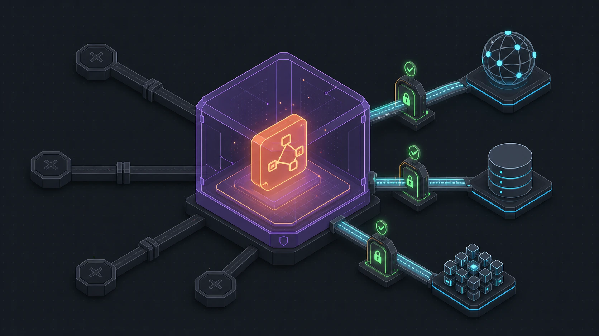

Flow-Like combines a Rust application core, a Wasmtime boundary for external
WASM nodes, authenticated APIs, app-scoped authorization, and deployment-level
controls. These layers reduce risk, but they do not make an untrusted workflow
or an incorrectly exposed deployment safe by themselves.



## Security boundaries

Standalone devices have a separate management and workload boundary. See
[Device security and networking](/devices/security/) for outbound remote
access, authenticated encryption, scoped sharing, local secrets, and the
limits of device isolation.

| Boundary | Enforced by | Operator or author responsibility |
| --- | --- | --- |
| External WASM node | Wasmtime memory isolation, fuel, epoch interruption, resource limits, capability-aware host functions | Review requested permissions and package provenance |
| Self-hosted workflow in `per_run` mode | Single-use gVisor sandbox, external Rust egress gateway, signed dispatch and confirmed termination | Install and qualify the runtime and network boundary; size active and warm capacity |
| Workflow and app data | Scoped storage paths, runtime credentials, app roles | Configure storage and identities with least privilege |
| Public API | OIDC, API keys, PATs, internal JWTs, route-level permission checks | Protect credentials and expose the API only through an appropriate network boundary |
| Service-to-service calls | Audience-specific ES256 backend JWTs | Keep the private signing key on authorized signers; distribute the public verification key to workers and coordinate rotation |
| Network transport | Reverse proxy, load balancer, ingress, and network policy | Configure TLS, trusted forwarding, egress, and internal segmentation |
| Third-party services | Explicit network/model/OAuth use by workflows | Understand what data leaves the deployment and which provider receives it |

## Self-hosted workflow isolation

Compose and Kubernetes default to `per_run`. A Rust manager reserves a clean,
prepared environment, supplies one signed dispatch and destroys the environment
after execution. Tenant code and credentials enter only after reservation.
Failed or cancelled executions never return their environment to the warm pool.
The runner verifies the complete dispatch binding before loading executable code.

Compose runners have no external network interface and access their gateway
through a private Unix socket. Kubernetes runners can reach only their paired
gateway Pod; mandatory Cilium policies deny node, Kubernetes API and metadata
access. The gateway runs outside the tenant sandbox and enforces one immutable
callback/storage/integration policy. Ignoring the proxy settings does not grant
direct external connectivity in the qualified deployment.

The manager is trusted control-plane code. Compose's Docker socket grants
control of its execution daemon; the Kubernetes manager has namespace-scoped
Pod, policy and cancellation permissions. Neither authority reaches workflow
Pods. Restrict who can change execution images, labels, policies and manager
configuration, because those changes can alter the isolation boundary.

Cancellation records a shared marker and confirms termination before reporting
success. Unconfirmed cleanup closes admission and retains state for
reconciliation. External side effects and exported STS credentials can outlive
the sandbox. Shared workers selected through `trusted_shared` do not provide
this per-execution boundary.

## WASM execution

Flow-Like uses [Wasmtime](https://wasmtime.dev/) for external WASM nodes. Core
modules and Component Model binaries use different ABI adapters, then converge
on the same Flow-Like capability and resource boundary.

### Isolation and interruption

- Each instance has WebAssembly linear memory separate from host memory.
- WASI is disabled by the normal security configurations unless explicitly
  enabled.
- Host process environment variables are never inherited by WASM guests,
  including permissive and runtime execution profiles. Any guest environment
  value must be supplied individually through explicit guest configuration.
- Fuel metering limits instruction execution.
- Epoch interruption enforces a wall-clock deadline.
- Memory, tables, memories, table elements, instances, and stack depth are
  bounded by the selected `WasmLimits`.
- Host functions check the granted capabilities before performing protected
  work.

These controls limit a module's direct authority. They do not prove that a
permitted HTTP request is trustworthy, that returned data is safe to use, or
that a high resource limit cannot affect overall capacity.

### Resource profiles

There are two related configuration paths:

1. A package manifest selects memory and timeout tiers. The desktop loader for
   installed packages applies them to every node it loads from the package.
2. Node-level permissions can be converted directly into a security
   configuration that uses the runtime defaults. The server executor uses this
   path and does not apply the manifest tiers.

Current package-manifest defaults are:

| Setting | Default tier |
| --- | --- |
| Memory | Standard, 64 MiB |
| Timeout | Standard, 30 seconds |

The general `WasmLimits::default()` used by direct node-permission conversion
currently allows 256 MiB, 120 seconds, and 100 billion fuel units. The
restrictive preset uses 16 MiB, 10 seconds, and 1 billion fuel units. Do not
assume one table describes every package: inspect the manifest and the
execution path used by the deployment.

Fuel is an instruction budget, not a portable duration. Its wall-clock cost
depends on the module and host.

### Node permissions

External nodes declare permissions with these serialized names:

| Permission | Capability granted |
| --- | --- |
| `network:http` | Outbound HTTP operations |
| `network:websocket` | WebSocket connections |
| `network:tcp` | TCP sockets |
| `network:udp` | UDP sockets |
| `network:dns` | DNS lookups |
| `storage:read` | Read from the host-provided storage scope |
| `storage:write` | Write and delete within the host-provided storage scope |
| `database:read` | Read from wired database and SQL session pins |
| `database:write` | Modify rows through wired database pins |
| `variables` | Read and write execution variables |
| `cache` | Read and write the execution cache |
| `streaming` | Stream incremental output |
| `models` | Use configured model providers |
| `a2ui` | Use dynamic A2UI operations |
| `oauth` | Access configured OAuth flows |
| `functions` | Call registered functions or subflows |

The node-permission conversion begins with no capabilities and adds the
declared set. A package manifest cannot add or remove capabilities. It authors
only resource tiers, a network host allowlist, and OAuth scopes. The capability
listing shown in the store is derived by the registry from the compiled node
definitions, not authored.

:::caution
An empty `allowed_hosts` list means unrestricted hosts. Use an explicit
allowlist when a package only needs known services, but do not treat it as a
complete egress control: the desktop loader for installed packages applies it
to WebSocket connects and WASI sockets, the Flow-Like HTTP host function does
not consult it, and the server executor does not apply it. In a self-hosted
`per_run` sandbox, the deployment's external gateway and network restrictions
still apply to permitted WASM host calls and native nodes.
:::

See [Sandboxing and permissions](/dev/wasm-nodes/sandboxing/) for the author
and user workflow.

## Authentication

The API supports several identities for different callers.

### Interactive users

The deployment delegates interactive authentication to a configured OpenID
Connect provider. Under the API v1 prefix, Flow-Like exposes:

| Endpoint | Behavior |
| --- | --- |
| `/api/v1/auth/openid` | Return the configured OpenID client information |
| `/api/v1/auth/discovery` | Redirect to the provider discovery URL |
| `/api/v1/auth/jwks` | Redirect to the provider JWKS URL |
| `/api/v1/auth/authorize` | Proxy authorization requests |
| `/api/v1/auth/token` | Proxy token exchange |
| `/api/v1/auth/userinfo` | Proxy user-info requests |
| `/api/v1/auth/revoke` | Proxy revocation requests |

Bearer tokens are validated before protected routes resolve the caller and
their app membership.

### API keys and PATs

- Technical users authenticate with `X-API-Key: <key>`.
- Personal Access Tokens use `Authorization: pat_<id>.<secret>`. The API also
  accepts `Authorization: Bearer pat_<id>.<secret>`.

For example, with a token stored in `FLOW_LIKE_PAT`:

```sh
curl --fail https://api.flow-like.com/api/v1/apps \
  -H "Authorization: $FLOW_LIKE_PAT"
```

Authentication identifies the caller; route and app permission checks still
decide what that caller may do. Treat both values as secrets, use narrow roles,
and revoke credentials that are no longer needed.

Personal access tokens use three permission levels: Read Only (`1`), Read &
Write (`2`), and Admin (`4`). Each level is limited by the owner's app and
account permissions. A token does not grant its owner any new role. Read Only
tokens cannot trigger workflows or obtain write-capable upload URLs. Read &
Write tokens can edit and execute ordinary app content; credential and access
management requires Admin.

Earlier UI labels and backend capability names disagreed. Existing values
`1`, `2`, and `4` now follow the UI's three levels. Integrations that used `1`
as unrestricted backend access must replace that token with an appropriately
scoped token. Other legacy capability combinations are rejected and must be
replaced. Creating a PAT through another PAT cannot extend its privileges or
expiry.

The API reads current PAT records and app and registry permissions for each
request. Revocation therefore applies across replicas, at the cost of more
database reads and a dependency on database availability.

### Backend JWTs

API signers use an ES256 P-256 keypair configured through `BACKEND_KEY`,
`BACKEND_PUB`, and optional `BACKEND_KID`. Isolated runners receive the public
verification key and a run-bound JWT, never the private signing key. Tokens include a
type-specific audience. Current audiences cover executors, compilers, users,
realtime collaboration, interaction responders, and app connections.

Verification checks the ES256 algorithm, issuer, expected audience, and token
time claims. All horizontally scaled API instances must use the same active
keypair while tokens signed by it remain valid.

Cached executor identities use the verifier's signed expiry and clock-skew
allowance; caching cannot extend that accepted lifetime. Remote queue references
carry a signed URL and payload hash, which workers verify before downloading
the job. Deploy the API signer before the workers. Workers reject unsigned
remote references, including jobs queued by older producers.

### Untrusted downloads and uploads

Open Graph previews retain support for public and intranet HTTP/HTTPS URLs,
environment proxies and up to five redirects. They read at most 512 KiB,
matching the existing parsing limit without first buffering the entire page.
OAuth discovery and JWKS fetches retain configured HTTP, private-network and
proxy endpoints. Malformed bearer tokens are rejected before fetching keys;
accepted tokens still require signature and claim validation.

Temporary files, registry artifacts, and metadata media
upload directly to object storage using signed URLs. The API handles signing
and metadata rather than file bytes. Temporary upload requests accept 100 files
per batch; clients can send further batches without a daily file-count quota.
Signed PUT URLs remain reusable until expiry, including for retries. The
reported temporary size limit is a client hint, not a byte limit
enforced by those signed PUTs. Object-store policies and deployment quotas
must govern storage consumption.

Cleanup deletes objects under `tmp/user/` after 32 days and objects
under `tmp/solution-staging/` after eight days, allowing issued download URLs
to remain usable for their full seven-day lifetime. This includes older temporary
objects but excludes app files and submitted solution attachments. Persistent
API processes run cleanup hourly; serverless deployments use the
`cache_cleanup` maintenance job. Keep that maintenance schedule enabled.

New 24-hour solution submissions and upload reservations are retired. Their
endpoints return `410 Gone` without creating storage objects, email or payment
sessions. Historical records remain available to administrators; tracking
requires sign-in and the request's tracking token.

Workflow HTTP nodes preserve response bodies, including the final body after
streaming callbacks. Operators may set positive
`FLOW_LIKE_HTTP_MAX_RESPONSE_BYTES` and `FLOW_LIKE_HTTP_TIMEOUT_SECONDS` values
to opt into byte and duration limits. Neither setting imposes a default limit.
Attachment extraction and DOCX/PPTX processing retain support for large inputs
and collections. Their buffered outputs and document expansion still require
suitable execution memory and isolation.

Registry publication stages input in temporary files, hashes it incrementally,
and uploads extracted widget files individually. Media transformation stages
input on disk before decoding and retains the image library's existing decoder
limits. If temporary files are unavailable, both paths fall back to memory.
Registry publication also retains single-PUT support for stores that cannot
complete multipart uploads. Large artifacts remain supported, with resource
use governed by available memory, disk and existing format and compiler limits.

Custom models and attachment downloads retain their existing network behavior,
including server-local services and proxies. Custom Vertex remains supported
with its existing credential checks. Identity, model, attachment and Open Graph
fetches can therefore reach destinations allowed by the deployment network.
Open Graph destinations come directly from callers; model and attachment URLs
can also originate from tenant-controlled data. Network isolation remains
necessary where those callers must not reach server-local services.

Compiler jobs retain their existing size, concurrency and timeout settings.
A timeout ends the async job but cannot stop native compilation that has already
started on a blocking thread. Such work can continue consuming resources after
the request ends. Signed job validation and deployment resource limits remain
in place; hard cancellation of native work is not implemented.

## Authorization

App roles are bitflags evaluated at protected routes. `Owner` and `Admin`
imply the other permissions.

| Area | Permissions |
| --- | --- |
| Team and roles | `ReadTeam`, `ReadRoles` |
| Files | `ReadFiles`, `WriteFiles` |
| Databases | `ReadDatabase`, `WriteDatabase` |
| Boards | `ReadBoards`, `ExecuteBoards`, `WriteBoards` |
| Events | `ListEvents`, `ReadEvents`, `ExecuteEvents`, `WriteEvents` |
| Observability | `ReadLogs`, `ReadAnalytics` |
| App configuration | `ReadConfig`, `WriteConfig` |
| Reusable content | `ReadTemplates`, `WriteTemplates`, `ReadCourses`, `WriteCourses`, `ReadWidgets`, `WriteWidgets` |
| Routes and metadata | `WriteRoutes`, `WriteMeta` |
| API invocation | `InvokeApi` |

`ReadFiles` and `WriteFiles` also imply the corresponding database access for
backward compatibility. Prefer the database-only permissions when a role does
not need file access.

## Storage and credentials

Desktop-local, Docker Compose, Kubernetes, and managed deployments do not have
the same storage boundary.

- Local desktop data is stored on the user's machine unless a configured
  workflow, model provider, connection, or hosted feature sends it elsewhere.
- Hosted APIs use the configured object-store provider and app/user-scoped
  paths.
- Runtime credentials may be scoped for the executing user and app, depending
  on the configured provider.
- A WASM storage capability grants access only through host functions; it does
  not mount the host filesystem into the module.

The bundled RustFS setup separates root, API storage and STS issuer identities.
Root keys reach only the store and initializer. The API requests temporary
credentials whose session policy narrows access to authorized prefixes; the
store must enforce that restriction. The public S3 gateway rejects STS and
administration, while issuance uses a private endpoint. In-run credential renewal
is not implemented: checkout checks actual remaining lifetime against queued
wait, execution and supervisor allowances, including cached grants.

Do not put credentials in board definitions, documentation examples, route
query parameters, or screenshot fixtures.

For Kubernetes, prefer workload identity or an external secret manager where
the provider supports it. Kubernetes Secrets are not encrypted merely because
their manifest values are base64 encoded. Restrict Secret access with RBAC and
enable encryption at rest in the cluster.

For Docker Compose, `.env` and interpolated environment values are deployment
configuration, not a secret-management system. Limit file permissions and use
a dedicated secret mechanism when the environment requires one.

## Transport and network controls

The self-hosted API and supporting services expose HTTP endpoints inside their
deployment network. Production TLS is normally terminated by an ingress,
reverse proxy, or cloud load balancer.

Operators must:

- serve public traffic over HTTPS;
- configure trusted proxy and forwarding behavior correctly;
- avoid exposing Redis, databases, metrics, compiler, or runtime ports
  publicly;
- restrict executor and sink egress to required destinations;
- apply Kubernetes NetworkPolicies or equivalent network controls;
- separate public ingress from internal service authentication.

There is no application-level statement that can compensate for publishing an
internal port directly to an untrusted network.

## Deployment hardening

### Kubernetes

- Use separate service accounts for API, compiler, runtime, and sink
  components.
- Apply least-privilege RBAC and preserve the manager's per-slot NetworkPolicies.
- Set requests, limits, disruption budgets, and autoscaling for the expected
  workload.
- Pin manager/gateway and runner images by immutable digest, as `per_run` requires.
- Install the `runsc` runtime handler on execution nodes and use its RuntimeClass.
  Creating a RuntimeClass object alone does not install gVisor.
- Configure enforcing Cilium policies and `allow-localhost=policy`; verify denial
  of node, API and metadata access on the actual cluster.
- Protect metrics, logs, and tracing endpoints as operational data.

See [Kubernetes security](/self-hosting/kubernetes/security/).

### Docker Compose

- Bind public ports only where required.
- Place internal services on private networks.
- Replace development credentials and signing keys.
- Terminate TLS before public traffic reaches the API.
- Back up object storage and persistent service volumes.
- Keep images and configuration under change control.
- Configure gVisor with `--network=none` and `--host-uds=open`, and pin the runner
  and gateway images. The manager requires a local Unix Docker socket.
- Preserve the local manager SQLite volume and Redis replay/delivery state
  through drained upgrades. Reconcile uncertain work before resuming dispatch.

See [Docker Compose configuration](/self-hosting/docker-compose/configuration/)
and [troubleshooting](/self-hosting/docker-compose/troubleshooting/).

## Dependency and package trust

The repository checks in Rust and Bun lockfiles and maintains third-party
license inventories under `thirdparty/`. Container images can be pinned by
digest. These mechanisms improve reviewability but do not replace vulnerability
scanning, update policy, provenance checks, or deployment-specific image
verification.

External WASM packages add another supply-chain boundary. Review the package
source and requested permissions, use the narrowest trust duration available,
and review updates before relying on an existing package identity.

## Reporting vulnerabilities

Do not open a public GitHub issue for a suspected vulnerability. Follow the
repository [security policy](https://github.com/Rheosoph/flow-like/security/policy)
and report privately to
[security@great-co.de](mailto:security@great-co.de).

Include:

- the affected component and version or commit;
- reproduction steps or a proof of concept;
- expected and observed behavior;
- potential impact;
- any relevant deployment assumptions.
