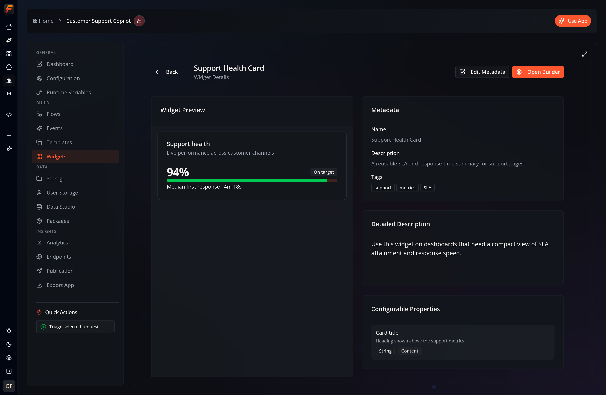

import { Steps, Aside, Card, CardGrid } from '@astrojs/starlight/components';

A Widget is a reusable A2UI component tree owned by an app. Use one for a
status card, navigation block, form, list item, or other interface pattern that
should be inserted into one or more Pages without copying its internal
components.



## Open the builder

<Steps>
1. Open an app and select **Widgets**.
2. Select **Create Widget**, then enter a name and optional description.
3. Open the new Widget's details view.
4. Select **Open Builder**.
</Steps>

New Widgets are blank. The current creation flow does not include a template
picker or a separate package-publishing wizard.


## Builder workspace

| Area | What it controls |
| --- | --- |
| **Components** | Components that can be added to the Widget |
| **Hierarchy** | The normalized component tree and selection |
| **Canvas** | Live rendered Widget surface |
| **Inspector** | Properties, bindings, layout, style, and actions for the selected component |
| **Dev Mode** | Underlying normalized JSON for inspection or validated editing |
| **Preview** | Rendered Widget at a selected responsive size |
| **Settings** | Widget metadata, Events, Versions, and technical information |

The header also provides copy, cut, paste, delete, save, and preview controls.
Component changes are saved after a short debounce; **Save Now** flushes a
pending change immediately.

## Build a status card

This example creates one focused, reusable surface.

<Steps>
1. **Create the outer layout**

   Add a `card` or `column` as the root. Use semantic theme classes such as
   `bg-card`, `text-card-foreground`, and `border-border`.

2. **Add the visible content**

   Add a heading `text`, a value `text`, a `badge` for state, and an optional
   `progress` component.

3. **Organize the hierarchy**

   Put related text in a `column`, place the badge beside the heading with a
   `row`, and keep the component tree shallow.

4. **Bind dynamic values**

   Select a supported property in the Inspector and bind it to the Widget data
   model, or leave it as a useful literal default.

5. **Add an interaction**

   Define a named Widget Event in **Settings → Events**, add a `button`, and
   configure the button action to emit that Event.

6. **Preview edge cases**

   Check narrow width, long labels, empty values, loading state, keyboard
   focus, and both themes.
</Steps>

## Current Widget model

The persisted Widget contains:

```typescript
interface IWidget {
  id: string;
  name: string;
  description?: string;
  rootComponentId: string;
  components: SurfaceComponent[];
  dataModel: DataEntry[];
  customizationOptions: CustomizationOption[];
  exposedProps?: ExposedProp[];
  actions?: WidgetAction[];
  tags: string[];
  version?: [number, number, number];
  createdAt: string;
  updatedAt: string;
}
```

`rootComponentId`, `components`, and `dataModel` form the renderable surface.
`actions` is the public interaction contract. `exposedProps` describes values
that an instance may override without editing the Widget definition.

## Data binding

Static properties use literal `BoundValue` objects:

```json
{
  "type": "text",
  "content": { "literalString": "Service status" },
  "weight": { "literalString": "semibold" }
}
```

A data-bound property uses a path:

```json
{
  "type": "text",
  "content": {
    "path": "$.data.status.label",
    "defaultValue": "Unknown"
  }
}
```

Use element-specific workflow nodes when a Flow owns the visible value:

- **Set Element Text**, **Set Badge Content**, or **Set Markdown Content**
- **Set Element Value**
- **Set Progress**
- **Push Data to Chart**
- **Push CSV to Table** or **Update Table**

Keep the Widget data model for values intentionally shared by several
components.

## Widget Events

Open **Settings → Events** to define the interactions the Widget exposes:

```typescript
interface WidgetAction {
  id: string;
  label: string;
  description?: string;
  icon?: string;
  contextSchema: WidgetActionContextField[];
}
```

An interactive component inside the Widget triggers one of those IDs:

```json
{
  "type": "button",
  "label": { "literalString": "Acknowledge" },
  "actions": [
    {
      "name": "widget_event",
      "context": {
        "actionId": "acknowledge"
      }
    }
  ]
}
```

`widget_event` is the runtime action type; `context.actionId` selects the
Widget action. That Widget-level action must exist before a containing Page
can bind it to behavior. Use one descriptive action per purpose rather than
routing every button through a generic catch-all.

<Aside type="note" title="Current instance-editor boundary">
  The runtime supports exposed-property values and Widget action bindings.
  The repository also contains a dedicated instance inspector, but the current
  Page Builder does not mount that inspector. Normal drag-and-drop insertion
  therefore creates empty instance overrides and bindings. Do not expect
  per-instance controls in the Page Builder until that host integration is
  enabled.
</Aside>

## Exposed properties

An exposed property maps an instance-facing option to one internal component
property:

```typescript
interface ExposedProp {
  id: string;
  label: string;
  description?: string;
  targetComponentId: string;
  propertyPath: string;
  propType:
    | "String"
    | "Number"
    | "Boolean"
    | "Color"
    | "ImageUrl"
    | "Icon"
    | "Json"
    | "TailwindClass"
    | "StyleObject"
    | "BoundValue"
    | { Enum: { choices: string[] } };
  group?: string;
}
```

For example, expose the outer card's accent class, a heading's `content`, or a
metric's bound value. Keep internal spacing and structure private unless a Page
author genuinely needs to change them.

At present, these definitions are mainly populated through validated JSON or
agent tooling and displayed by the Widget details experience; the visual
Settings panel does not provide a complete exposed-property editor.

## Settings

Select **Settings** in the builder header.

### General

Edit the name, description, and tags, then select **Save Metadata**.

### Events

Add, rename, describe, or remove Widget Events, then select **Save Events**.

### Versions

The Versions tab loads existing snapshots and creates a new Patch, Minor, or
Major snapshot. Creating a version saves the current Widget first.

| Version | Use when |
| --- | --- |
| **Patch** | Correcting a compatible implementation detail |
| **Minor** | Adding compatible content or behavior |
| **Major** | Changing behavior or structure that existing uses should review |

There is no release-note form or separate **Publish** step in the current
builder.

### Advanced

Advanced shows the Widget ID, root component ID, selected version, timestamps,
component count, and data-model entry count. These fields are informational.

## Insert a Widget into a Page

Open a Page in the Page Builder, locate the Widget in the component palette,
and drag it into a compatible container. The Page stores a Widget reference
and creates a `widgetInstance` component:

```json
{
  "type": "widgetInstance",
  "instanceId": "widget-status-card-instance",
  "widgetId": "status-card",
  "appId": "app-id",
  "exposedPropValues": {},
  "actionBindings": {}
}
```

The Page owns the instance reference and configuration; the original Widget
continues to own its reusable component tree.

## Design checklist

<CardGrid>
  <Card title="One reusable job" icon="puzzle">
    Keep a Widget focused enough that its name and public actions are obvious.
  </Card>
  <Card title="Useful defaults" icon="approve-check">
    A newly inserted Widget should render meaningful placeholder content before
    data is connected.
  </Card>
  <Card title="Theme-safe color" icon="moon">
    Prefer semantic theme tokens and verify light and dark mode.
  </Card>
  <Card title="Accessible states" icon="person">
    Label inputs, describe images, preserve focus order, and make loading and
    error states visible.
  </Card>
</CardGrid>

- Use stable semantic component IDs.
- Test empty, long, and narrow content.
- Avoid deeply nested layout containers.
- Declare every interactive action at the Widget level.
- Use a Major version when existing instances may need review.
- Verify the rendered Widget, not only the hierarchy view.

## Related guides

- [Widgets overview](/apps/widgets/)
- [A2UI component reference](/reference/a2ui-components/)
- [Visual Builder](/dev/a2ui/visual-builder/)
- [Pages](/dev/a2ui/pages/)
- [FlowPilot UI generation](/reference/flowpilot-ui/)
