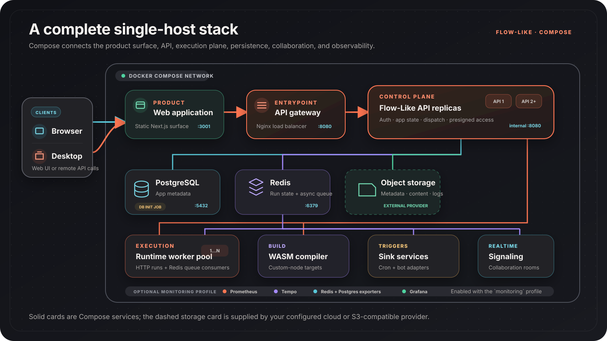

The Compose deployment in `apps/backend/docker-compose/` runs Flow-Like on one
Docker host. It includes the web app, API, execution runtime, persistence,
realtime collaboration, custom-node compilation, and server-side event
services.

## Architecture



The published web port serves the application. The published API port belongs
to an Nginx gateway, which load-balances the internal API replicas. Runtime
replicas are internal services reached over HTTP for interactive runs and
through Redis for queued runs.

Object storage is not created by the Compose file. The stock API includes
Azure, GCP, and R2 runtime credentials. AWS and generic S3 appear in the
configuration, but the checked-in Compose API target must be rebuilt with its
AWS feature before those providers can initialize end to end.

## Services

| Service | Published port | Responsibility |
| --- | --- | --- |
| `web` | `3001` | Flow-Like web application |
| `api-gateway` | `8080` | Stable API entrypoint and load balancer |
| `api` | Internal `8080` | API replicas, authentication, app state, and dispatch |
| `runtime` | Internal `9000` | Shared execution workers and Redis queue consumers |
| `compiler` | `8081` | WASM compilation for custom nodes |
| `signaling` | `4444` | Realtime collaboration signaling |
| `sink-services` | — | Cron and configured bot/event adapters |
| `postgres` | `5432` | Relational application metadata |
| `redis` | `6379` | Execution state, queues, and signaling coordination |
| `db-init` | — | One-time database initialization job |

The optional `monitoring` profile adds Prometheus, Tempo, Grafana, and Redis
and PostgreSQL exporters.

## Quick start

```bash
cd apps/backend/docker-compose
cp .env.example .env

# Configure storage and trust keys in .env, then start the stack.
../../../tools/gen-execution-keys.sh --export
docker compose up -d
```

Start the same stack with observability:

```bash
docker compose --profile monitoring up -d
```

Continue with the [installation guide](/self-hosting/docker-compose/installation/)
before exposing any service outside a development network.

## Execution model

Compose uses long-running runtime replicas. A replica can process multiple runs
over its lifetime, so this is a shared-worker model rather than a fresh
container per invocation.

This model is a good fit for:

- Development and evaluation
- A private team on a controlled host
- Workloads where simple operations and low startup overhead matter

The current Kubernetes Job dispatcher can create a Job, but its executor
entrypoint is still pending. For the implemented and incomplete dispatch
choices, see
[Execution Backends](/self-hosting/execution-backends/).

## Next steps

- [Prerequisites](/self-hosting/docker-compose/prerequisites/)
- [Installation](/self-hosting/docker-compose/installation/)
- [Configuration](/self-hosting/docker-compose/configuration/)
- [Storage providers](/self-hosting/docker-compose/storage/)
- [Monitoring](/self-hosting/docker-compose/monitoring/)
- [Scaling](/self-hosting/docker-compose/scaling/)
- [Troubleshooting](/self-hosting/docker-compose/troubleshooting/)
