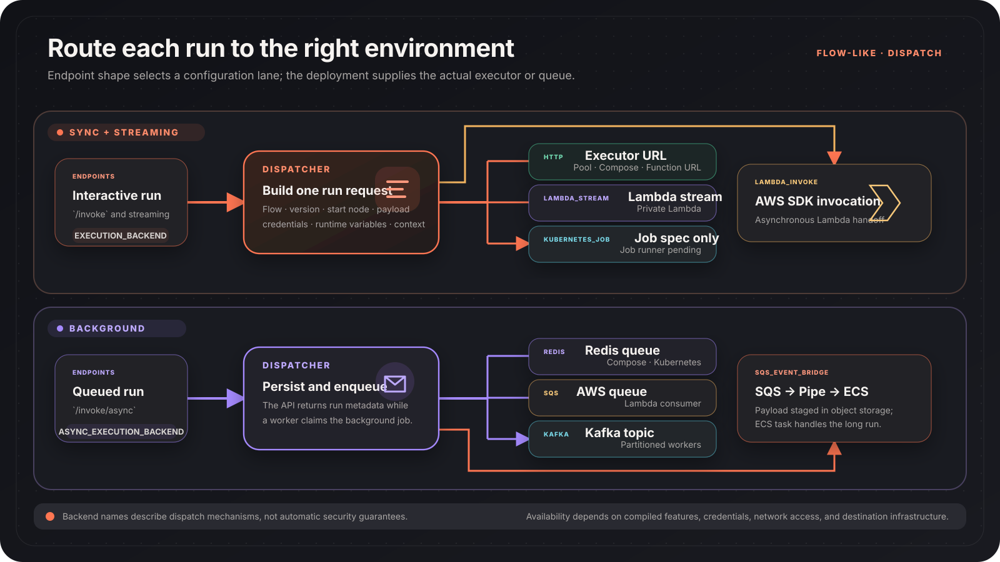

Flow-Like's server API builds a normalized run request and hands it to a
configured dispatch backend. The backend controls transport and worker
lifecycle; it does not change the Flow graph itself.

## Dispatch model



Two environment variables select the default lanes:

```bash
# /invoke and streaming endpoints
EXECUTION_BACKEND=http

# /invoke/async endpoints
ASYNC_EXECUTION_BACKEND=redis
```

Both variables are parsed into the same backend enum, but not every transport
is appropriate for every endpoint. In particular, `lambda_stream` uses the
streaming dispatcher, while queue backends are normally selected for
asynchronous endpoints.

## Supported backend values

| Value | Dispatch behavior | Required configuration |
| --- | --- | --- |
| `http` | Posts to an executor's `/execute` or `/execute/sse` endpoint | `EXECUTOR_URL` |
| `lambda_invoke` | Uses the AWS SDK with asynchronous `Event` invocation | `lambda` build feature, `LAMBDA_EXECUTOR_FUNCTION`, AWS region and credentials |
| `lambda_stream` | Uses the AWS SDK response-stream API | `lambda` build feature, function name, region and credentials |
| `kubernetes_job` | Creates a Kubernetes Job, but the checked-in executor's one-job entrypoint is not implemented | `kubernetes` build feature, cluster access, `K8S_NAMESPACE`, `K8S_EXECUTOR_IMAGE`; a separately implemented compatible job runner |
| `redis` | Pushes the serialized job to a Redis list | `redis` build feature, `REDIS_URL`; optional `REDIS_EXECUTION_QUEUE` |
| `sqs` | Sends the job to an AWS SQS queue | `sqs` build feature, `SQS_EXECUTION_QUEUE_URL` and AWS credentials |
| `kafka` | Posts a record to a Kafka-compatible REST proxy | `KAFKA_BROKERS` as the proxy base URL and `KAFKA_EXECUTION_TOPIC` |
| `sqs_event_bridge` | Stages the payload in object storage, then sends a compact SQS reference for an EventBridge-to-ECS path | `sqs` build feature, staging store, `SQS_EVENT_BRIDGE_EXECUTION_QUEUE_URL`, AWS credentials, and the external Pipe/ECS resources |

Aliases accepted by the parser include `lambda_sdk`, `lambda_streaming`,
`k8s_job`, `isolated`, `redis_queue`, `aws_sqs`, `sqs_ecs`, and `ecs`.
Unknown values fall back to `http`, so validate rendered configuration rather
than relying on a typo to fail closed.

## HTTP executors

`http` describes the protocol, not the platform. `EXECUTOR_URL` can point to:

- The Docker Compose runtime service
- The Kubernetes executor-pool Service
- A Lambda Function URL
- Another compatible HTTP execution service

This is the default synchronous backend in the checked-in Compose and Helm
configurations. It supports ordinary dispatch and an SSE endpoint for streamed
state.

Long-running workers may handle multiple runs over their lifetime. Treat them
as a shared execution environment and verify cleanup, filesystem, credential,
and concurrency behavior for your threat model.

## Kubernetes Job dispatcher

`kubernetes_job` asks the API to create a fresh Kubernetes Job in isolated
mode. The dispatcher builds a pod with run identifiers, scoped credentials,
JWT, callback URL, payload, resource limits, and an optional `RuntimeClass`.

The repository's `flow-like-k8s-executor` image does **not** currently consume
that one-job environment. Unless `EXECUTOR_SERVER_MODE=true`, its entrypoint
logs that job-once mode is unimplemented and exits with status `1`. The
dispatcher therefore proves Job creation, not a functioning end-to-end
execution backend.

Do not select `kubernetes_job` with the checked-in image. Use the HTTP executor
pool, or supply and validate your own compatible one-job runner.

Even with a runner, a fresh pod is not automatically a hardware-isolated
sandbox. Isolation still depends on the container runtime, node configuration,
workload identity, mounted resources, and policies. If a Job names a Kata
runtime class, the matching runtime handler must already exist on the nodes.

## Lambda modes

`lambda_invoke` and `lambda_stream` use AWS SDK clients compiled into the API:

- `lambda_invoke` sends an asynchronous event and returns dispatch metadata.
- `lambda_stream` uses `InvokeWithResponseStream` for a private Lambda.
- A Lambda Function URL can instead be used through the generic `http`
  backend.

The operational and isolation properties are those of the Lambda function and
AWS account configuration. Confirm concurrency, retry, timeout, networking,
and downstream callback behavior for the selected mode.

## Queue backends

Queue transports decouple API response time from worker execution:

- **Redis** uses `LPUSH`; Flow-Like runtime workers consume the configured list.
- **SQS** sends a complete serialized request to the configured queue.
- **Kafka** uses an HTTP REST proxy rather than an embedded Kafka client.
- **SQS + EventBridge + ECS** stores the full payload first and queues a signed
  reference, avoiding ECS container-override payload limits.

Provisioning a queue is only half of the system. A compatible consumer must
claim the message, execute the run, report state, and apply the retry and
dead-letter policy you require.

## Choosing a backend

| Need | Start with | Verify before production |
| --- | --- | --- |
| Compose or a trusted internal cluster | `http` + warm runtime pool | Cross-run cleanup, worker concurrency, host access |
| Background work in Compose | `redis` | Persistence, queue depth, retry and poison-message handling |
| Background work in the checked-in Kubernetes chart | `http` | The chart's executor pool has no Redis queue consumer; deploy one before selecting `redis` |
| Kubernetes with the checked-in executor | `http` + Helm executor pool | Pool capacity, cross-run cleanup, service account, egress |
| A new Kubernetes pod per run | Not available end to end in the checked-in executor | Implement the job runner first; then verify startup, callbacks, identity, runtime class, and egress |
| Private streaming Lambda | `lambda_stream` | AWS feature build, response streaming, timeouts, concurrency |
| AWS asynchronous Lambda | `lambda_invoke` or `sqs` | Retry semantics, DLQ, idempotency, callback reachability |
| Long AWS container task | `sqs_event_bridge` | Staging-store lifetime, signed URL scope, Pipe and ECS task configuration |
| Existing Kafka platform | `kafka` | REST proxy compatibility, authentication, partitions, consumer contract |

Benchmark with your own Flow, image size, region, cluster, and concurrency.
The repository does not define universal latency or cost numbers for these
backends.

## Common configuration

```bash
# HTTP
EXECUTION_BACKEND=http
EXECUTOR_URL=http://runtime:9000

# Redis for background runs
ASYNC_EXECUTION_BACKEND=redis
REDIS_URL=redis://redis:6379
REDIS_EXECUTION_QUEUE=exec:jobs

# AWS Lambda SDK
LAMBDA_EXECUTOR_FUNCTION=arn:aws:lambda:eu-central-1:123456789012:function:flow-like-executor
AWS_REGION=eu-central-1
```

Keep credentials in your platform's secret store. Environment-variable names
belong in documentation and configuration; their secret values do not.
