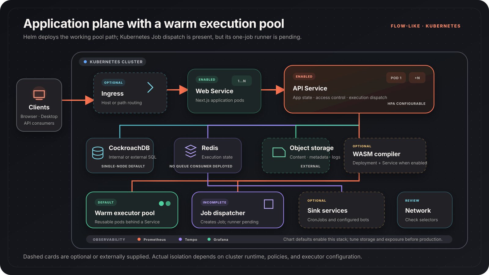

The Helm chart in `apps/backend/kubernetes/helm/` deploys Flow-Like's web,
API, persistence, execution, and observability components to a Kubernetes
cluster.

## Architecture



The default chart values enable the web application, API, a reusable executor
pool, internal CockroachDB, Redis, network policies, and the Prometheus,
Grafana, and Tempo stack. Ingress, the WASM compiler, and sink services are
configurable and are not all enabled by default.

Object storage is supplied separately. Select and configure one of the chart's
`aws`, `azure`, `gcp`, `r2`, or `s3` provider blocks.

## Execution choices

The chart exposes configuration for two server-side execution shapes, but only
the warm HTTP pool is operational with the checked-in executor:

| Shape | Helm value | Current status |
| --- | --- | --- | --- |
| Warm pool | `execution.backend: http` | Implemented; reuses executor pods behind a Service |
| Per-run Job | `execution.backend: kubernetes_job` | API can create the Job, but the image's one-job runner is not implemented and exits |

Asynchronous execution has its own
`execution.asyncBackend` value. The chart default is `redis`, but the
Kubernetes executor-pool binary does not include a Redis queue consumer.
Use `http` for an operational chart-only deployment, or deploy a compatible
consumer before selecting `redis`.

The chart can create a `RuntimeClass` named `kata`, but that manifest alone
does not install a Kata runtime on cluster nodes. Confirm that the configured
handler exists before referencing it. The warm pool does not use the
RuntimeClass, and creating one does not make the incomplete Job path
operational.

## Local development

The checked-in k3d bootstrap creates a local cluster and registry, builds the
required images, and deploys the chart:

```bash
cd apps/backend/kubernetes
./scripts/k3d-setup.sh
```

See [Local Development](/self-hosting/kubernetes/local-development/) for
requirements, generated resources, and access instructions.

## Before a production install

Create a values file for your environment and review at least:

- Image registry and pull policy
- Storage provider, buckets or containers, and credentials
- Backend signing keys
- Internal versus external database
- Redis authentication and persistence
- Ingress, TLS, and network policy
- Resource requests, limits, replica counts, and autoscaling
- Executor image, execution backend, and runtime class
- Monitoring persistence and external exposure

Do not pass long-lived credentials directly on a shared shell command line.
Use existing Kubernetes Secrets or a secrets-management workflow supported by
your cluster.

Continue with the [Installation](/self-hosting/kubernetes/installation/) and
[Security](/self-hosting/kubernetes/security/) guides.

## Component map

| Component | Default | Kubernetes resource |
| --- | --- | --- |
| Web application | Enabled | Deployment + Service |
| API | Enabled | Deployment + Service |
| Warm executor pool | Enabled | Deployment + Service |
| Per-run executor | Incomplete | API can create a Job; checked-in job runner is pending |
| CockroachDB | Internal by default | StatefulSet and Services |
| Redis | Enabled | Chart-managed Redis resources |
| Database migration | Enabled | Helm install/upgrade Job |
| WASM compiler | Disabled | Deployment + Service |
| Sink services | Disabled | CronJob and optional bot workloads |
| Prometheus, Grafana, Tempo | Enabled in chart defaults | Monitoring resources |
| Ingress | Disabled | Ingress |

## Guides

- [Prerequisites](/self-hosting/kubernetes/prerequisites/)
- [Installation](/self-hosting/kubernetes/installation/)
- [Configuration](/self-hosting/kubernetes/configuration/)
- [Database](/self-hosting/kubernetes/database/)
- [Local development](/self-hosting/kubernetes/local-development/)
- [Helm chart](/self-hosting/kubernetes/helm/)
- [API service](/self-hosting/kubernetes/api/)
- [Executor](/self-hosting/kubernetes/executor/)
- [Storage](/self-hosting/kubernetes/storage/)
- [Scripts](/self-hosting/kubernetes/scripts/)
- [Security](/self-hosting/kubernetes/security/)
