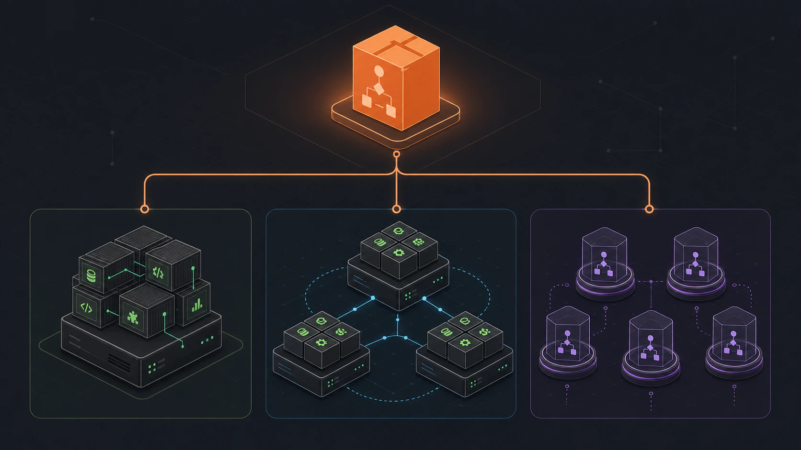

Flow-Like can be deployed on your own infrastructure.



## Deployment Options

| Option | Best for | Isolation | Complexity |
|--------|----------|-----------|------------|
| [Docker Compose](/self-hosting/docker-compose/overview/) | Single machine, development | Container | Low |
| [Kubernetes](/self-hosting/kubernetes/overview/) | Multi-node orchestration after storage, database, and security hardening | Warm executor pods by default | Medium |

Deployment topology and execution isolation are separate choices. Docker
Compose and Kubernetes can use warm HTTP executors or configured serverless
executors. The API also contains a Kubernetes Job dispatcher, but the
checked-in executor's one-job runner is not implemented yet.

## Execution Backends

Flow-Like supports multiple execution backends with different isolation and performance characteristics:

| Backend | Isolation | Latency | Best For |
|---------|-----------|---------|----------|
| HTTP warm pool | Process or container | Low | Trusted, latency-sensitive workloads |
| Lambda invoke, stream, or function URL | Isolated function environment | Medium | Elastic and multi-tenant workloads |
| Kubernetes Job | Dispatcher only in the current tree | Not operational end to end | Requires a compatible one-job runner |

→ [Learn more about execution backends](/self-hosting/execution-backends/)

## Connecting the Desktop App

After deploying your backend, configure the desktop app to connect to it by setting the `FLOW_LIKE_API_URL` environment variable before launch:

```bash
export FLOW_LIKE_API_URL=https://your-api.example.com
./flow-like
```

→ [Desktop client configuration](/self-hosting/desktop-client/)

## Quick Links

- [Execution Backends](/self-hosting/execution-backends/) - Understanding job isolation and choosing the right backend
- [Docker Compose](/self-hosting/docker-compose/overview/) - Simple deployment for development and small teams
- [Kubernetes](/self-hosting/kubernetes/overview/) - Cluster deployment, Helm configuration, and autoscaling options
