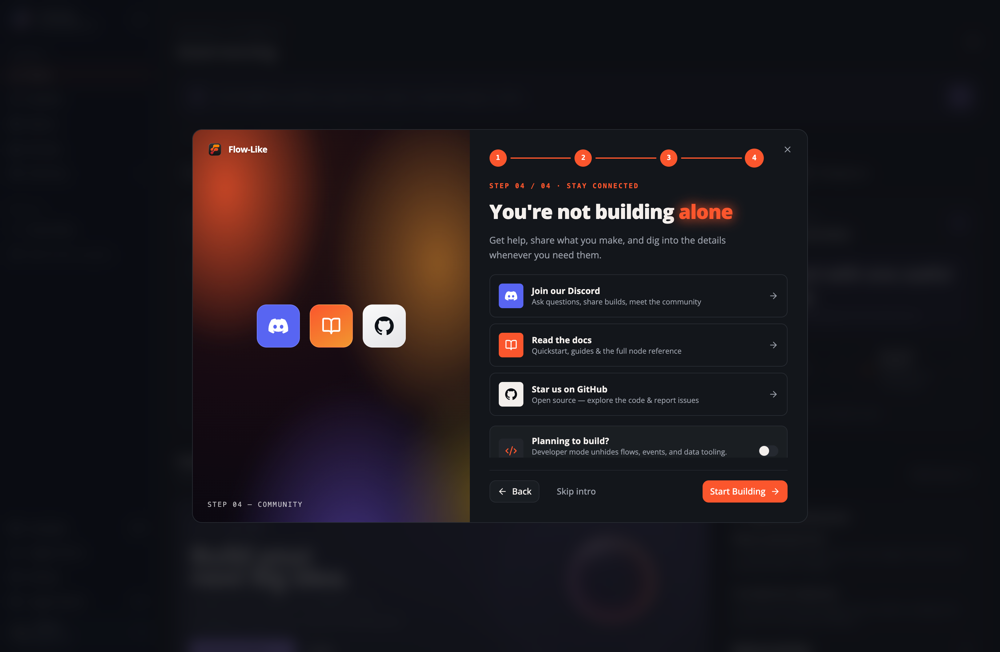
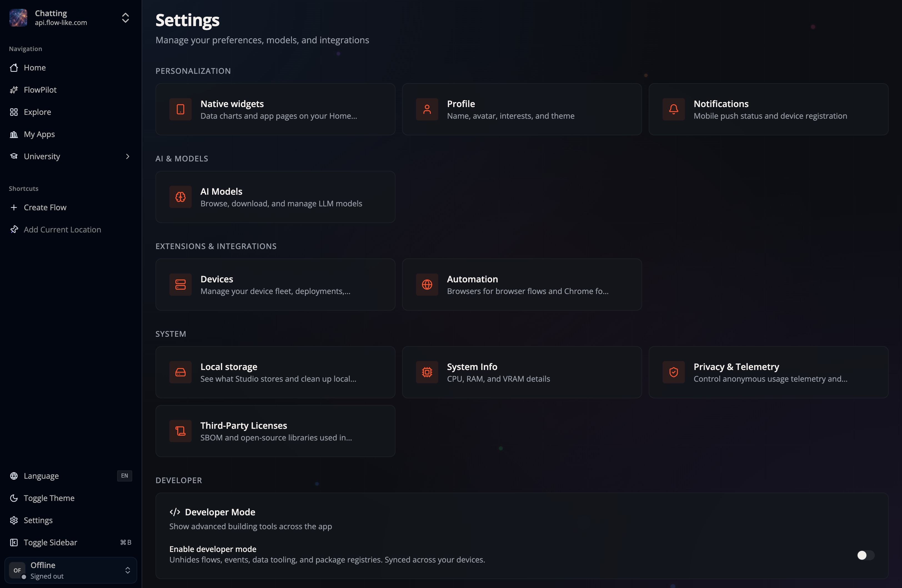
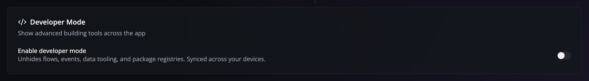

Flow-Like starts in a **simplified view**. Building tools stay hidden until you switch on *Developer Mode*, so you can use apps, browse the store, and manage your files without the full builder surface in the way.

If a building tool is missing, check Developer Mode and your App permissions.
A platform or role restriction can still hide or disable a feature after you
enable the switch.

## What Developer Mode unlocks

With Developer Mode **off**, Flow-Like hides:

- **Explore Models** in the sidebar (models remain available through **Settings → AI Models**).
- **Packages** in the sidebar: the WASM node packages you build (**Mine**) and the ones you use (**Library**)
- Node packages in **Explore**, which then shows apps only
- The App's **Flows**, **Events**, **Templates**, **Widgets**, **Data Studio**, **User Storage**, **Packages**, **Suites**, **Roles**, **Analytics**, **Endpoints**, and **Publication** sections
- **Active Sinks**, **Board Statistics**, and the API **Token** page in settings and the account menu
- Store listing, compliance, and release panels in the project dashboard

With Developer Mode **on**, these building tools appear where the App, platform,
and your permissions allow them. **Dashboard**, **Setup**, **Appearance**,
**Devices**, **Storage**, **Offline access**, **Team**, **Monetization**, and
**Audit trail** do not require Developer Mode, though their other access
requirements still apply.

Hiding is purely visual: direct links to these pages keep working, and your [roles and permissions](/apps/share/#rights-and-roles) are not affected.

## Turn it on in the welcome tour

The last step of the welcome tour asks whether you plan to build. Flip the switch there and Flow-Like starts in the full builder view right away:

## Turn it on in Settings

You can change your mind anytime. Open **Settings** from the sidebar footer and scroll to the **Developer** section:

Toggle **Enable developer mode**:

## Synced with your account

Developer Mode is stored on your Flow-Like account, so it follows you across devices. If you toggle it while offline or signed out, the change applies immediately on that device and is pushed to your account the next time you sign in.
