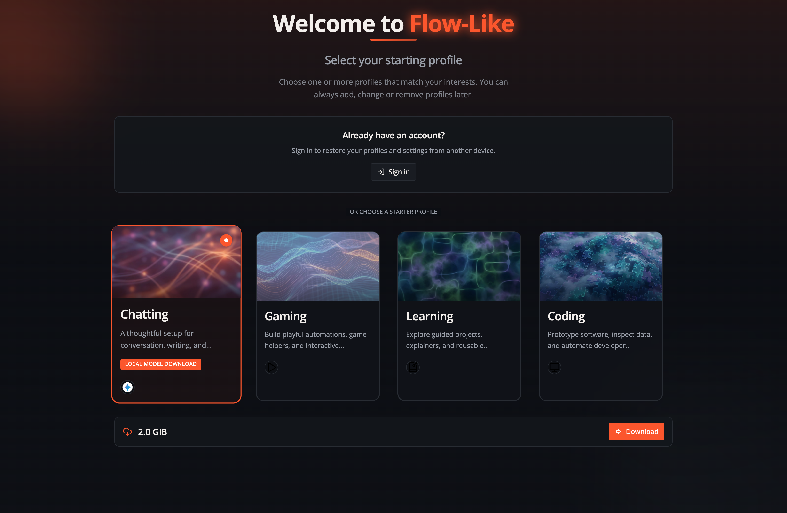
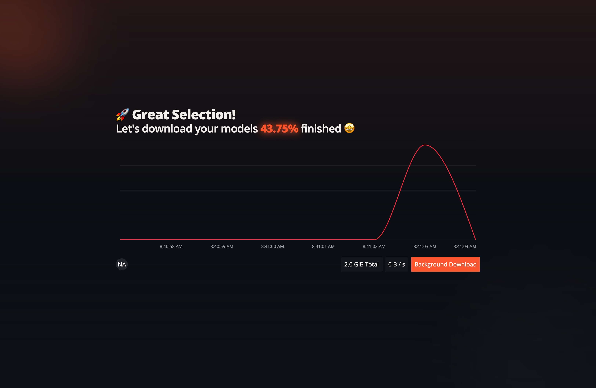
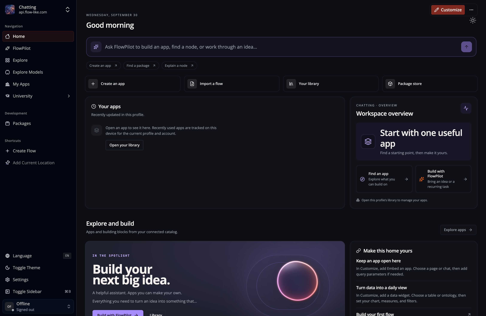

When you first open the Flow-Like Desktop app, you can choose one or more starter [Profiles](/start/profiles/). A **Profile** groups preferences and model assignments. Choose **Chatting** for a conversation-oriented starting point; you can add or switch Profiles later:

In the next step, Flow-Like downloads some initial [language models](/start/models/) for you. You can either wait until the download is complete or proceed to the next step and let the download continue in the background:

Next, Home opens with the active Profile's layout. Its widgets can differ by
Profile and installation. Select **Customize** to arrange them; see
[Customize your Home](/start/home/).

There are additional features of the desktop app to explore next, or you can jump ahead and [create your first app](/apps/create/) to start building a workflow.
