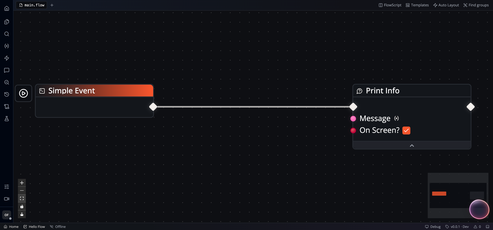

import { Aside, LinkCard, CardGrid } from '@astrojs/starlight/components';

Build a Flow that prints `Hello Flow`. This exercise uses two built-in nodes and
needs no AI model, API key, or external data.

## Choose Desktop or Web

| Client | Before you start |
| --- | --- |
| [Flow-Like Desktop](https://flow-like.com/download) | Install the app and choose a starter [Profile](/start/first-use/). You can create an offline App without signing in. Model downloads can continue in the background. |
| [Flow-Like Web](https://app.flow-like.com) | Sign in and use an online App. Web onboarding opens your workspace; it does not run Desktop's Profile and model-download steps. Workflow execution needs an available server. |

In either client, enable [Developer Mode](/start/developer-mode/) in **Settings**
so that Flows and the other building tools appear.

## Create the App

1. Open **My Apps** and choose **Create Flow**. An empty library offers
   **Create Your First App** instead.
2. Set **Project Name** to `Hello Flow`.
3. On Desktop, select **Offline - Local only**. On Web, keep
   **Online - Sync with cloud**.
4. Select **Create Project**. The initial Flow opens in Studio.

The dialog creates an **App**, the project that holds your Flow and its related
resources. Its **Create Flow** title and **Create Project** button refer to the
same creation action. See the [terminology map](/apps/overview/#terms-you-will-see).

## Connect two nodes

1. Right-click an empty part of the canvas, search for **Simple Event**, and
   add it. If the initial Flow already contains one, use that node.
2. Right-click the canvas again, search for **Print Info**, and add it beside
   the event.
3. Drag the Simple Event's execution output to **Input** on Print Info.
4. Set Print Info's **Message** to the string `Hello Flow` and turn on
   **On Screen?**. Keep the Message value unconnected so this literal is used.

The [Simple Event](/nodes/events/events-simple/) starts the run.
[Print Info](/nodes/logging/log-info/) records its Message at Info level and,
with **On Screen?** enabled, also displays a notification. An execution wire
controls which node runs next; the Message here is a fixed value.

## Run and check the result

1. Use the control beside the Simple Event: **Execute locally** (play icon)
   on Desktop, or **Execute on server** (cloud icon) on Web.
2. Confirm any run dialog. This example has no event inputs to fill in.
3. Look for the `Hello Flow` notification.
4. Open **Runs**, select the new run, and inspect **Logs**. You should see an
   Info entry with the message `Hello Flow`, attributed to Print Info.
5. Change Message to `Hello again` and run the event again. Select the newest
   run to see `Hello again`; the earlier run keeps its original log.

<Aside type="tip" title="If the result is missing">
Check that the execution wire reaches Print Info and that you selected the
newest run. Clear log filters. If Info entries are excluded by the Flow's log
level, open **Run settings** in the status bar, select Info or Debug, and run
again. Web users also need a working remote execution service. See
[Logging and debugging](/studio/logging/).
</Aside>

## Continue from a working Flow

<CardGrid>
  <LinkCard title="Debug a failed run" href="/studio/logging/#practice-fail-correct-and-run-again" description="Add an assertion, inspect its failure, and correct it." />
  <LinkCard title="Understand Studio" href="/studio/overview/" description="Find the Explorer, document tabs, and run panels." />
  <LinkCard title="Give your App an entry point" href="/apps/events/" description="Expose a Flow through a button, chat, schedule, or endpoint." />
  <LinkCard title="Reuse a Flow" href="/apps/templates/" description="Create or use a Template after creating the App." />
</CardGrid>

For a longer guided lesson, read [FlowBook's incident-triage
chapter](https://book.flow-like.com/part-1/04-first-flow-incident-triage/).
Docs covers current tasks and reference contracts; FlowBook develops the
language and application model through connected chapters. Chapters marked
Draft may change as the book develops.

For help, use [Support](/start/support/) or report a reproducible issue on
[GitHub](https://github.com/Rheosoph/flow-like/issues).
