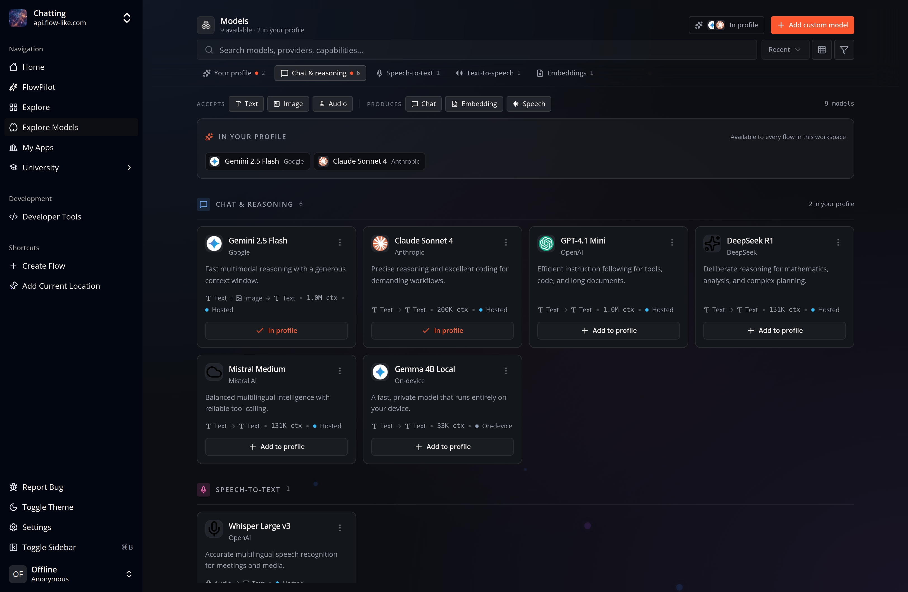

Open **Explore Models** in Flow-Like Desktop to browse language, vision, and
embedding models:

Downloading a model makes its files available on the current device. Assigning
it to a [Profile](/start/profiles/) makes it available to the Profile's AI
features and to compatible nodes in Studio.

On a model card, select **Download** if the files are not present, then select
**Add to profile**. The catalog shows which Profiles already include a model
and whether a download or update is still in progress.

Local models use disk space and execute on supported local hardware. Hosted
models and provider-backed models can instead require a configured provider or
account. The exact models shown depend on the current catalog and Profile.

Once assigned, select the model from compatible nodes in
[Studio](/studio/overview/) or from FlowPilot's model picker.
