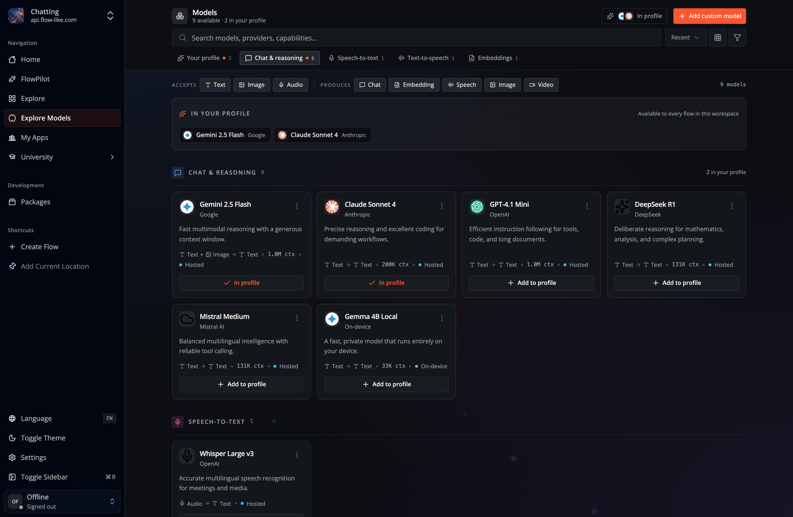
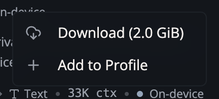

Open **Settings → AI Models** to browse language, vision, embedding, and decision
models. With [Developer Mode](/start/developer-mode/) enabled, **Explore Models**
in the sidebar opens the same catalog:

Downloading a model makes its files available on the current device. Assigning
it to a [Profile](/start/profiles/) makes it available to the Profile's AI
features and to compatible nodes in Studio.

For a local model, open the model card's menu and select **Download** if its
files are not present, then select **Add to Profile**. Hosted models do not
need a local model download. The catalog shows which models are already in
your Profile and whether a download or update is still in progress.

Local models use disk space and execute on supported local hardware. Hosted
models and provider-backed models can instead require a configured provider or
account. The exact models shown depend on the current catalog and Profile.

Once assigned, select the model from compatible nodes in
[Studio](/studio/overview/) or from FlowPilot's model picker.

The **Decisions** category contains SystemOne models for classification,
scoring, and yes/no assessments. Select these in **SystemOne Choice**,
**SystemOne Score**, or **SystemOne Noul** in Studio. **Invoke SystemOne** asks
several named questions together. These models return typed answers and
probabilities and do not appear in chat model pickers. Device deployments also
require the model in the project's manifest dependencies; selecting a profile
model alone does not package it. See [Decision models](/topics/genai/models/#decision-models).
