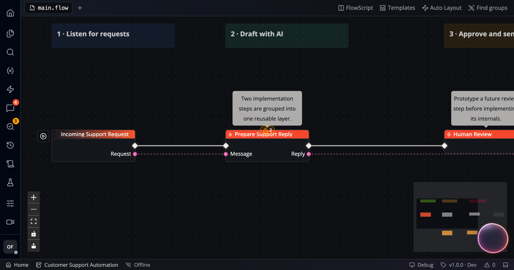
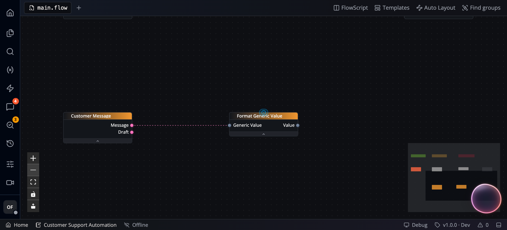
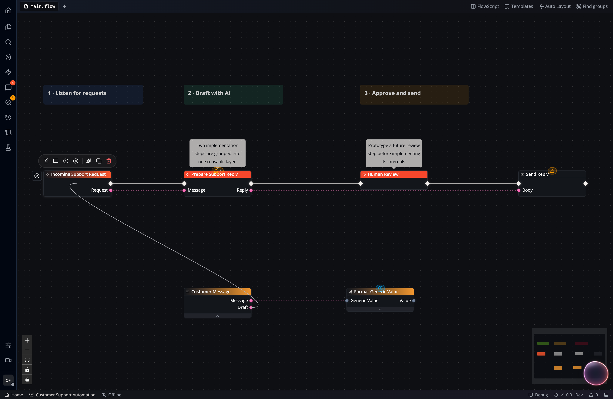
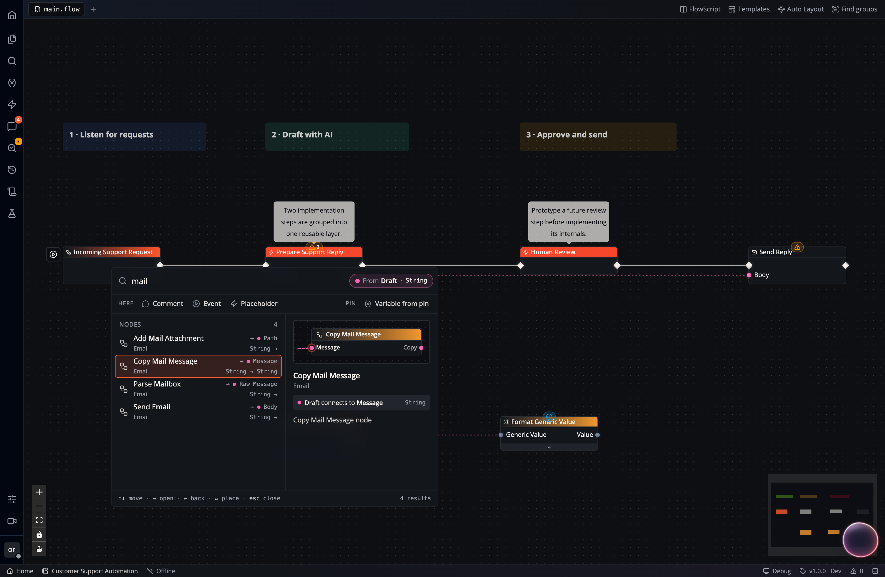

## Connection types

There are two types of *wires* / *connections* between nodes:

- **Execution Wires** (*white*) represent execution flow throughout the graph, typically starting with an *event node*. Executions can branch at *Branch Nodes*, repeat in *Loop Nodes*, or split for *parallel* execution.
- **Data Wires** (*colored, dashed*) represent data transmission between nodes. The *color* of a data wire indicates the *data type* (see also [Variables and Types](/studio/variables/)).

Studio checks connection compatibility:

- You can only connect execution pins to other execution pins.
- Data pins must have compatible types and collection shapes. A String value
  and an array of Strings are different shapes, even though their pins share
  a color.
- Generic pins can accept different data types within the node's declared
  constraints.

Some nodes additionally enforce a *schema* on complex types (structs, *purple*). For example, a *Path* output is only accepted by nodes that also have a *Path* input pin.

A **Generic** input can accept values from several data types. In the
illustrated connection, a String output feeds a Generic input:

Some nodes also update their pin types when connected. For example,
**For Each** begins with a Generic Array input. Connecting an array lets it
match that input's type and the type of its **Value** output. Check the node's
pins after wiring it; generic acceptance and pin-type updates depend on the
node.

## Find compatible nodes

Drag a pin onto open canvas to search for a compatible node:

1. Drag an input or output pin away from its node.
2. Drop it on an empty part of the canvas.
3. Search the filtered catalog and inspect the proposed pin connection.
4. Choose a node to add it with that connection.

The catalog identifies the source pin and previews which pin will receive the
wire:

