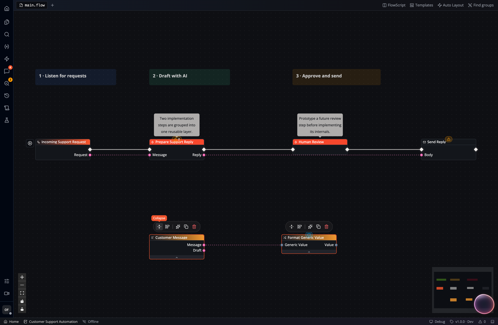
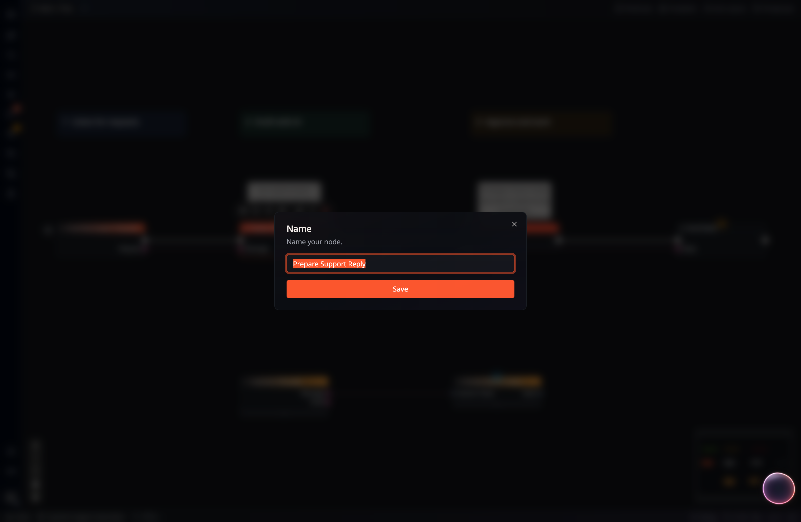
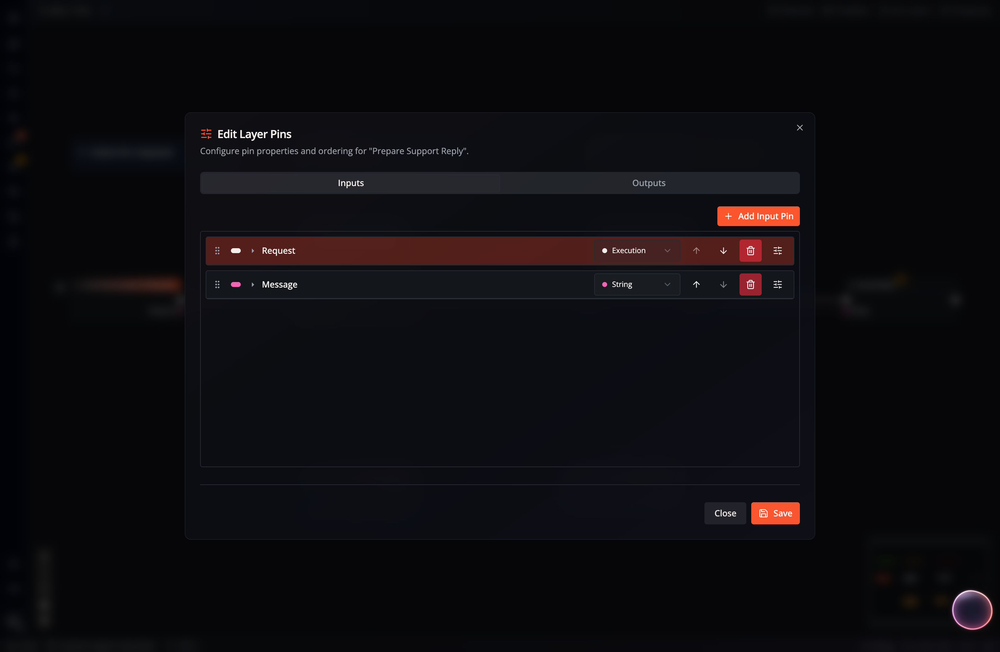
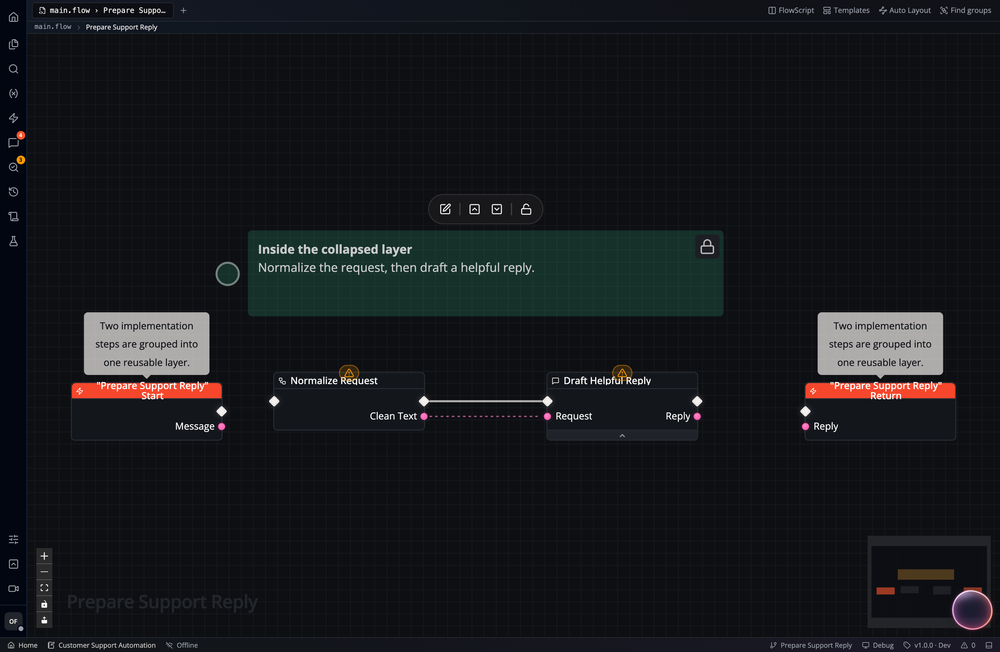
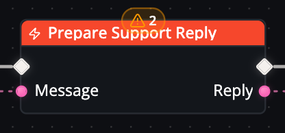
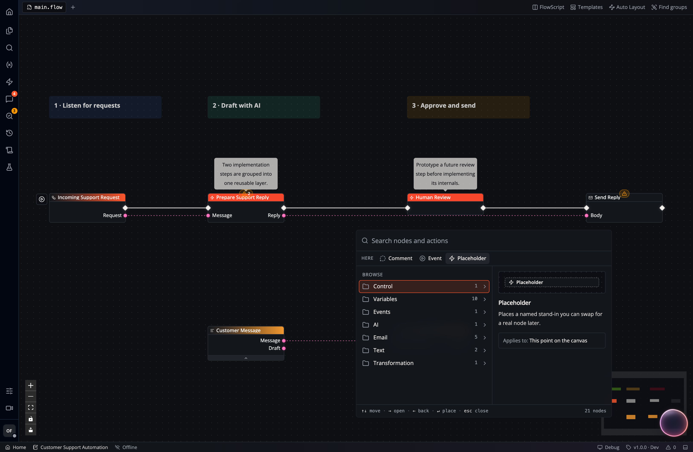

A **Layer** groups part of a Flow behind input and output pins. Open the Layer
to edit its nodes while keeping the parent graph readable. A **Placeholder**
is an empty Layer: define its connections first, then implement its behavior.

## Collapsing Existing Nodes into New Layers

Select two or more nodes and collapse them into a Layer to group a related
part of the workflow:

The resulting collapsed *Layer* is represented by a *Placeholder* node that can now be renamed to describe what is happening inside:

Once created, you can also *edit* the input and output pins of a layer to either change the type or modify the pin names:

Double-clicking a *layer* / *placeholder node* allows you to navigate inside. Here you can see the part of the flow that was previously collapsed. Inputs and outputs connecting the inside to the outside are represented by *start* and *return* nodes:

A layer gets one pin per value that crosses its boundary, not one per connection. An output outside that feeds five nodes inside becomes a single input, named after that output, which fans out to all five. *Extend (Ungroup)* puts the nodes back and wires them to each other directly again.

The parent graph shows the Layer's name and the pins that cross its boundary:

You can connect and copy Layers, or include them in another Layer.

## Prototype with Placeholders

Select **Placeholder** from the node catalog. Rename it and edit its pins as
described above:

Connect the Placeholders to sketch the workflow, then double-click each one
to add its implementation. Check its internal execution and data connections
before relying on its outputs.
