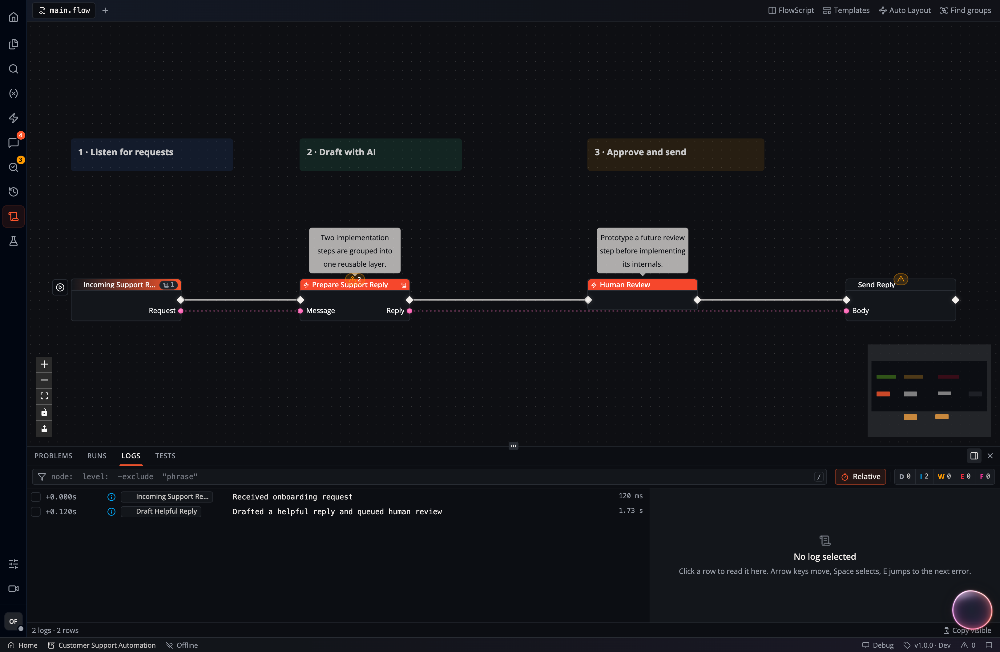

Start with the run that produced the unexpected result. The current graph,
recorded execution, and log messages answer different questions, so check the
Flow version and execution time before changing anything.

## Problems, Runs, and Logs

| Panel | What it tells you |
| --- | --- |
| **Problems** | Diagnostics for the graph being edited, such as invalid configuration or connections. A diagnostic can exist before execution. |
| **Runs** | Recorded executions, their start node, Flow version, time, duration, and highest recorded log severity. |
| **Logs** | Messages for the selected run, attributed to the nodes that produced them. |

This screenshot uses synthetic support-workflow data to illustrate the Logs
panel. The practice exercise below uses Hello Flow.

1. Open the Flow and **Runs**. Refresh if the expected run is absent.
2. Identify the run by its start node, version, and time. Selecting an older
   run can switch Studio to that numbered Flow version. Return to **Latest**
   before editing a correction; the old graph is read-only.
3. Select the run and inspect **Logs**. Clear filters before concluding that
   no errors were recorded.
4. Select a log row to read its full message and structured details. Use
   **Show on board** to locate its node or **Scope to node** to narrow the list.
5. Follow the first relevant error and its preceding messages. Later errors
   can be consequences of the same failure.

The error controls move between errors; `E` goes forward and `Shift + E` goes
back. The log detail panel supports structured JSON in messages. Search,
severity filters, node scoping, and repeated-message folding help reduce a
large log to the part you need. **Copy Markdown** exports the selected evidence
for a bug report; inspect it for private data before sharing it.

## Interpret severity and failure separately

The run list's severity icon reflects recorded log levels. A node can write an
Error message and continue. For example, **Print Error** logs at Error level
and activates its output. That message alone does not establish that execution
stopped or that a later write was rolled back.

A failing **Assert** both logs a failure marker and returns an execution error.
Its **Pass** output stays inactive. To understand a failed run, inspect the
actual node error, executed path, and result in the destination system.

Open **Run settings** in the Studio status bar to choose **Log Level**. The
level determines which messages are retained. Use Info to keep
Info assertions and application messages; Debug adds diagnostic detail and
per-node timings. Changing the level affects new runs and cannot reconstruct
messages omitted from old runs. Do not place passwords or access tokens in
custom log messages.

## Inspect inputs and values

Use the event input form to check the values supplied for a manual run. Record
important intermediate values with **Print Info** or **Print Debug** while
investigating a specific branch. Structured values remain inspectable in the
log detail pane, so include a small relevant object instead of an entire
sensitive document.

For a configured remote Event with **Quality** available, **Recorded inputs**
shows redacted payloads from prior runs. A run listing itself may contain only
metadata; the client fetches the stored payload separately when replaying it.
Permissions or retention can make that payload unavailable even when the run
row remains visible.

## Practice: fail, correct, and run again

Start from [Hello Flow](/start/getting-started/). Its only effect is a log and
notification, so it is suitable for repeated test runs.

1. Add an [Assert](/nodes/utils/testing/flow-assert/) node between Simple Event
   and Print Info. Remove the direct execution wire.
2. Connect Simple Event's execution output to Assert's **Input**, then Assert's
   **Pass** to Print Info's **Input**.
3. Set **Condition** to `false`, **Label** to `first-check`, and **Details** to
   the string `Practice failure`.
4. Run the Simple Event and inspect the newest run. Expect an Error message
   beginning `ASSERT_FAIL first-check Practice failure`. Print Info should not
   run, because Assert did not activate Pass.
5. Change Condition to `true` and run again. Expect `ASSERT_OK first-check`
   at Info level, followed by the Print Info message.
6. Select the older run to confirm its failure evidence remains available.

You have now checked both the failing branch and the correction. For business
logic, replace the fixed Condition with a computed Boolean and use a label
that describes the expectation, such as `invoice-total-positive`.

## Replay deliberately

A run's **⋯ → Re-Run** action retrieves its recorded input and invokes the
matching node in the Flow currently open. It does not restore the old graph,
data, credentials, or external services. Check the selected Flow version and
available node before using a historical payload to test a change.

A replay is a new execution. Mail, database writes, payments, and API calls can
happen again. Use a test destination or a side-effect-free branch when that
repeat would be unwanted. If the node or payload is unavailable, correct the
cause or supply a deliberate manual test input instead of assuming the replay
used the original values.

For a collection of repeatable checks and candidate-version comparison, use
[Event Quality and releases](/apps/event-releases/#validate-with-quality).

## When the evidence is incomplete

| Observation | Check next |
| --- | --- |
| No matching run | App, Flow, version, time range, execution location, and refresh state. |
| Run exists but no visible logs | Clear filters, inspect read permissions, and check the Flow's log level. |
| Some logs failed to load | Retry the failed load before drawing conclusions from the partial list. |
| Error points at a downstream node | Inspect upstream data and the earliest relevant failure. |
| Old run cannot be replayed | Confirm its input is retained and its start node exists in the selected graph. |
| Run looks successful but expected data is missing | Verify the executed branch, returned result, and actual destination; a log message is not a delivery receipt. |

[App audit records](/apps/audit-trail/) track management and access activity.
Use them to investigate who changed configuration; use run logs to understand
what the workflow did. Include the App, Flow/version, run ID, expected result,
and a small relevant log excerpt in a support report.
