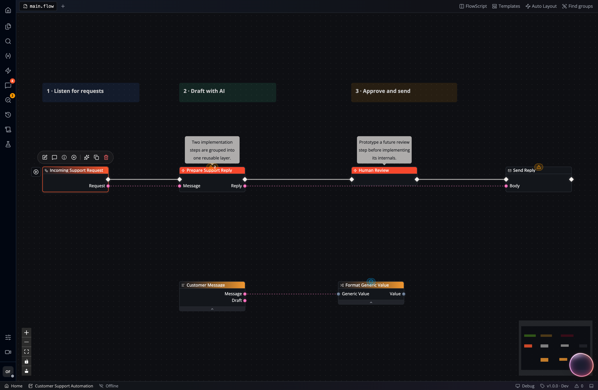
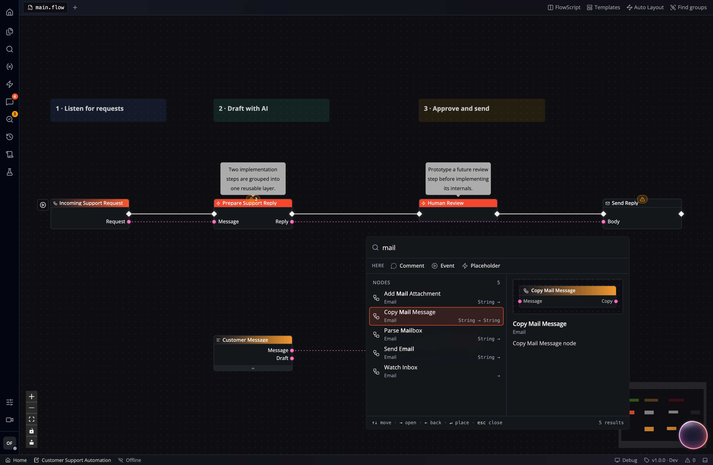

*Nodes* are the core building blocks of your *flows*. They can act as events, functions, variables, or flow control operators.

Each node has a rectangular body that you can place anywhere on the canvas. Most nodes have input and output *pins* that allow you to *wire* them together ([how to connect nodes](/studio/connecting/)).

We distinguish the following major node *types*:

- **Event Nodes** (*red*) mark the entry point into your flow execution and represent different triggering events. You can associate these nodes with [events at the app level](/apps/events).
- **Standard Nodes** (*transparent*) typically have input and output *pins* for *execution* (white wires) plus pins for *data*. These nodes are executed only when an incoming execution pin is connected to a previously executed node in the flow.
- **Pure Nodes** (*yellow*) have data pins without execution pins or wires. They are automatically executed when their data (outputs) are required by downstream nodes.
- **Comment Nodes** (*any color you like*) annotate the flow without taking part in execution. Open a comment to edit rich text and embedded images, then choose **Save** or **Cancel**. If another edit changed its content, saving reports a conflict and keeps your draft; **Reload latest** replaces it with the saved comment. Comments in historical board versions are read-only.
- **Placeholder Nodes** allowing you to [collapse sections of your flow](/studio/layers/).

You can browse all currently available *nodes* in the *Node Catalog*. Simply *right-click* anywhere on the canvas. You can browse nodes by following the catalog hierarchy or by searching for specific terms and keywords:

:::tip
The concept and anatomy of nodes in Flow-Like are similar to the [Unreal Engine Node Concept](https://dev.epicgames.com/documentation/en-us/unreal-engine/nodes-in-unreal-engine). You'll find many similarities that may help you understand common patterns, such as the [difference between standard (impure) and pure nodes](https://dev.epicgames.com/documentation/en-us/unreal-engine/functions-in-unreal-engine#purevsimpure).
:::
