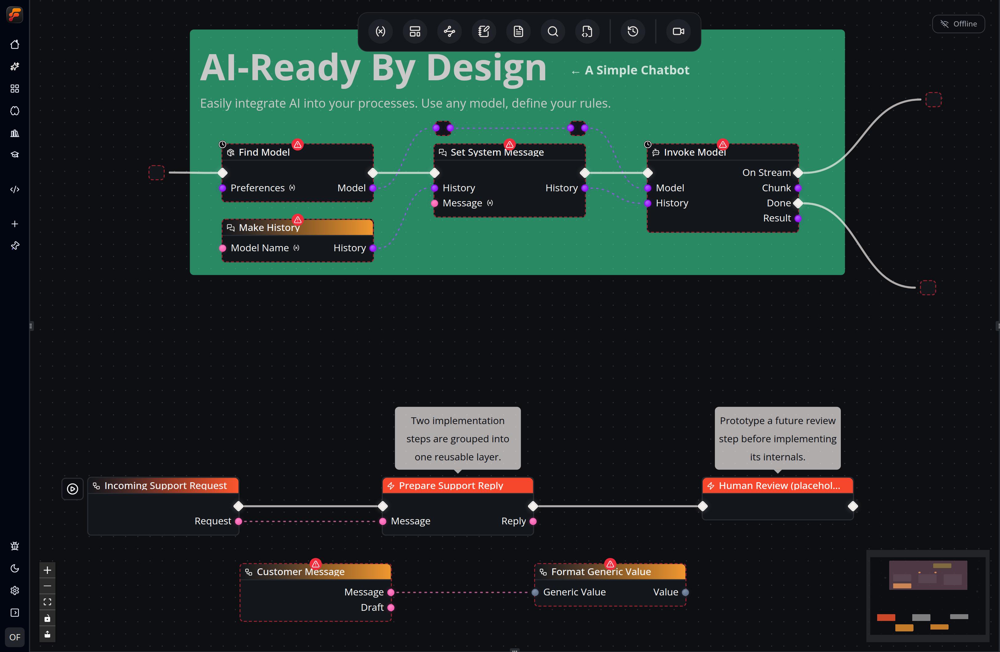
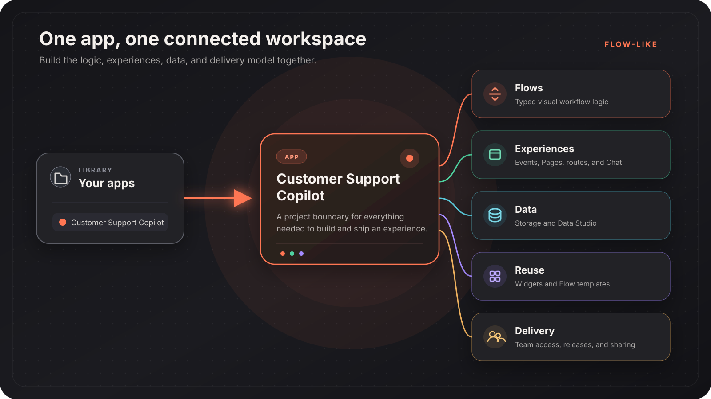

**Flow-Like Studio** is the visual development environment where you build typed **Flows** for automation.

Important components of the Studio environment are:

- [**Nodes**](/studio/nodes/) that you can select from the [**Node Catalog**](/nodes/overview/),
- [**Edges/Wires**](/studio/connecting/) for **Execution** and **Data** transmission between *nodes*,
- a **Canvas** where you can place your nodes and *build* your *flows*,
- [**Layers**](/studio/layers/) that allow you to collapse and define higher-order *nodes*,
- [**Variables**](/studio/variables/) available to the Flow at runtime,
- [**Run History**](/studio/logging/) to inspect previous flow executions,
- [**Logs**](/studio/logging/) stored for every *run* for inspection and tracing,
- [**FlowPilot**](/studio/flowpilot/) AI assistant for building flows with natural language.

A *Flow* represents a *process* and consists of one or more *Nodes*. Nodes are linked through *Edges* (or *Wires*) for *Execution* and *Data*.

Studio edits one Flow at a time. The surrounding [App](/apps/overview/) keeps that Flow together with the events and pages that invoke it, the data it uses, reusable interface building blocks, and delivery controls:

Flows can access and modify [file storage](/apps/storage/) and [Data Studio](/apps/data-studio/) resources within their App. [Events](/apps/events/) connect a Flow to UI actions, chat, schedules, and other entry points.
