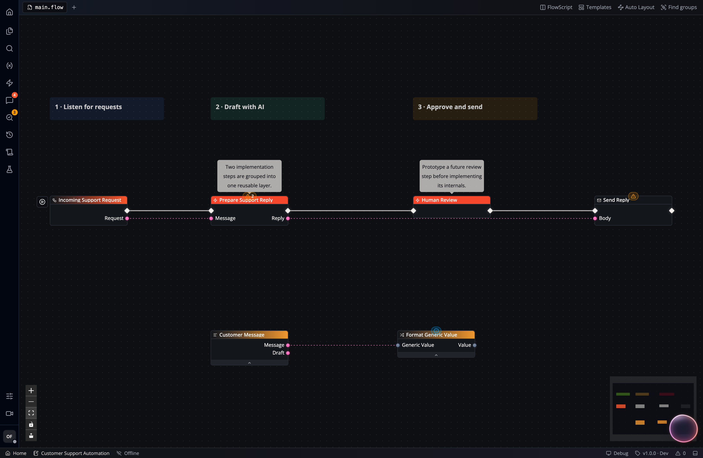
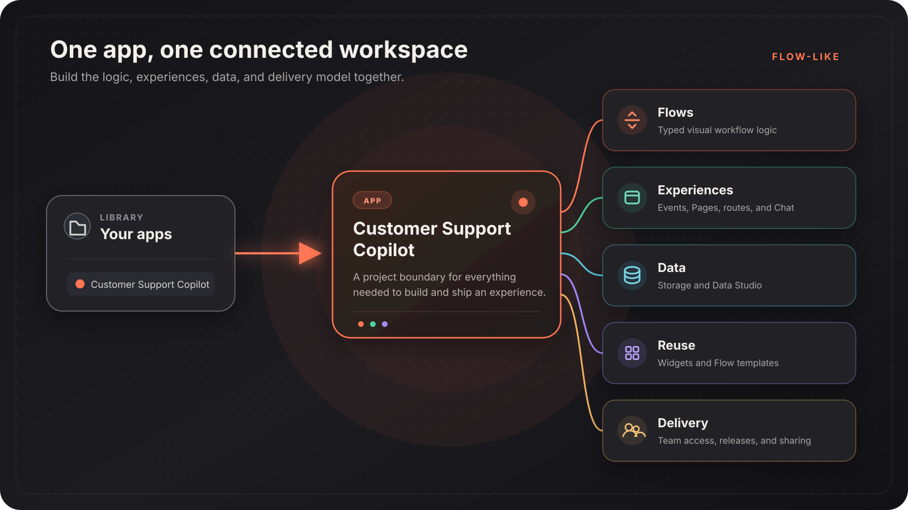

**Studio** is where you edit and inspect one Flow. Its graph and
[FlowScript](/studio/flowscript/) are two views of the workflow. The surrounding
workspace also opens related interfaces, files, and tables without leaving
that Flow.

Enable [Developer Mode](/start/developer-mode/), open **My Apps**, select an App,
then open a Flow from its **Flows** workspace. For your first working example,
follow [Build your first Flow](/start/getting-started/).

## Find the part you need

| Area | Purpose |
| --- | --- |
| **Activity rail** | Open the Explorer, node catalog, variables, entry points, search, or quality view. |
| **Explorer** | Navigate the Flow's files and layers, Pages, reusable Widgets, storage, and tables. |
| **Editor tabs** | Switch between graph/text documents and related resources. Tabs can be pinned, closed, or split where supported. |
| **Canvas** | Add nodes and connect execution and data pins. Right-click an open area to browse compatible nodes. |
| **Inspector** | Review and edit the selected item's properties. |
| **Problems / Runs / Logs** | Inspect graph diagnostics, execution history, and the selected run's log entries. |

Pages, Widgets, stored files, tables, and styles open as editor tabs. These
tabs open the current resource independently of the graph's selected version.
For example, a Page tab edits the latest Page even while the graph displays a
read-only snapshot.

A [Flow version](/studio/versioning/) includes its owned Page snapshots for
pinned runtime use. Widgets, files, tables, and App styles follow separate
storage and version rules. Opening them in a tab does not add them to a Flow
snapshot.

## Build and organize logic

A Flow contains [nodes](/studio/nodes/) joined by [connections](/studio/connecting/).
Execution pins determine which step runs next. Data pins carry typed values.
Use [variables](/studio/variables/) for shared Flow state and configuration.

Use [layers](/studio/layers/) to group part of a graph. Double-click a layer or
function call to enter it; use the breadcrumb to return to its parent. The
Explorer and document tabs help you find a particular file or interface in a
larger workflow.

[FlowPilot](/studio/flowpilot/) can explain the current context or propose graph,
text, and interface changes. Review those changes and run representative inputs
before moving an Event to the new implementation.

## Run, inspect, and publish deliberately

Run from an event node, then open **Runs** and **Logs** to inspect the result.
**Problems** shows editor diagnostics that may exist before any run. A log
entry belongs to an execution; a diagnostic belongs to the current graph.
See [Logging and debugging](/studio/logging/) for a complete example.

Create an immutable [Flow version](/studio/versioning/) when a known graph must
remain available. [Events](/apps/events/) connect that graph to Pages, chat,
schedules, APIs, and other entry points. An Event targeting Latest sees draft
changes; a pinned Event keeps its selected version.

[Apps and core concepts](/apps/overview/) explains ownership. A Flow can use its
App's [file storage](/apps/storage/) and [Data Studio](/apps/data-studio/)
resources, but publishing the Flow does not make copies of those resources.
