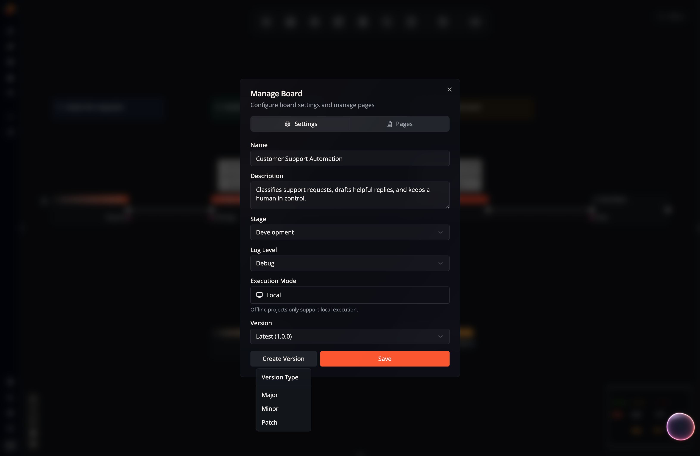

Flow-Like can save immutable versions of a Flow while keeping a separate
editable draft. Events, Pages, and Templates can then refer to either the
latest draft or a known version.

## Version Format

Flow versions use three numeric parts:

```text
major.minor.patch
```

| Version Type | When to Use | Example |
| --- | --- | --- |
| **Major** | Existing callers or behavior may need migration | `1.4.2` → `2.0.0` |
| **Minor** | Compatible behavior or capability is added | `1.4.2` → `1.5.0` |
| **Patch** | Compatible correction or small adjustment | `1.4.2` → `1.4.3` |

Flow-Like does not infer the semantic meaning of a change. Choose the bump that
matches how the Flow is consumed.

## Create a Flow version

1. Open the Flow in Studio.
2. Open **Manage Board** from the Studio toolbar.
3. Under **Version**, select **Create Version**.
4. Choose **Major**, **Minor**, or **Patch**.

The current draft is saved as an immutable snapshot and the editable draft
moves to the next version number. Existing snapshots are not overwritten.



The **Version** selector distinguishes:

- **Latest** — the editable Flow draft and its current version number.
- A numbered version — a read-only snapshot.

Open a numbered version to inspect its graph or execution history. Return to
**Latest** before editing.

## Pin an Event

An Event can target **Latest** or a numbered Flow version:

| Event target | Behavior |
| --- | --- |
| **Latest** | Uses the current Flow draft when the Event runs |
| **Pinned version** | Uses that immutable snapshot until the Event is edited |

Pin production-facing Events when changes to the draft must not affect live
behavior. Use **Latest** for development entry points where immediate changes
are intentional.

To change the target, open the Event and edit **Flow Version**. Confirm that
the selected event node still exists in the target version and test the Event
with representative payloads.

## Pages and actions

Page-target Events also expose a **Flow Version** selector. Data Studio
ontology actions can likewise bind to a published Flow version so a governed
action does not drift with an editable draft.

If you update a Flow used by one of these entry points:

1. Create and test a new Flow version.
2. Update the Event, Page target, or ontology action to the new version.
3. Verify the complete interface or invocation path.
4. Keep the previous version available until rollback is no longer required.

## Flow Templates

A [Flow Template](/apps/templates/) snapshots either the latest draft or a
selected Flow version. A Template has its own metadata and versions, but it
does not replace versioning the source Flow.

Use a Template when you want a reusable Flow blueprint. Use a pinned Event
when you want an App entry point to keep running a known implementation.

## App version metadata

An App also has a free-form **Version** field in its details. That value is
release metadata for people browsing the App; editing it does not create a
snapshot of the App, its Flows, storage, or Events.

Treat the App version as a label for a tested collection of Flow and interface
versions, and record the corresponding changes in the App changelog.

## Roll back safely

If a pinned entry point needs to be rolled back:

1. Re-select the previous tested Flow version on the Event or action.
2. Keep debugging on **Latest**.
3. Create a new patch version for the correction.
4. Test and pin the corrected version.

## Related

- [Events](/apps/events/) — configure app entry points
- [Logging](/studio/logging/) — inspect version-specific runs
- [Templates](/apps/templates/) — create reusable Flow snapshots
