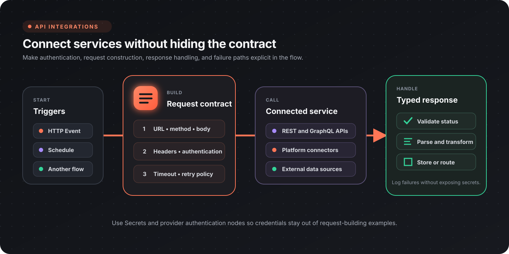

Flow-Like can call raw HTTP APIs, receive event-driven input, and use provider-specific nodes for common services. Keep authentication, request construction, response validation, and failure handling visible in the workflow.



## Choose an integration path

| Need | Recommended path |
|------|------------------|
| Call a REST or GraphQL endpoint | Build an HTTP request and run **API Call** |
| Reuse a supported service operation | Use the provider's typed nodes |
| Receive an external event | Expose an app event or webhook entry point |
| Stream a long response | Use **Streaming API Call** |
| Download a remote file | Use **HTTP Download** |
| Let an AI workflow call external tools | Connect an MCP server |

Provider coverage changes as packages evolve. Search the [node catalog](/nodes/overview/) for the service and operation you need instead of relying on a fixed connector count.

## Build and send HTTP requests

The HTTP nodes separate request construction from execution. That makes the URL, method, headers, authentication, body, and timeout policy inspectable before the network call runs.

| Stage | Useful nodes |
|-------|--------------|
| Create | [Make Request](/nodes/web/api/request/http-make-request/) |
| Address | [Set Url](/nodes/web/api/request/http-set-url/), [Set Method](/nodes/web/api/request/http-set-method/) |
| Headers | [Set Header](/nodes/web/api/request/http-set-header/), [Set Headers](/nodes/web/api/request/http-set-headers/) |
| Authentication | [Set Bearer Auth](/nodes/web/api/request/http-set-bearer-auth/) |
| Body | [Set Struct Body](/nodes/web/api/request/http-set-struct-body/), [Set String Body](/nodes/web/api/request/http-set-string-body/), [Set Form Body](/nodes/web/api/request/http-set-form-body/) |
| Execute | [API Call](/nodes/web/api/http-fetch/) or [Streaming API Call](/nodes/web/api/streaming-http-fetch/) |

A typical JSON request uses this sequence:

1. Create the request.
2. Set the URL and HTTP method.
3. Add the content type and authentication.
4. Attach a structured body.
5. Execute the request.
6. validate the status before parsing or storing the response.

For example, the structured body can be a regular JSON-compatible value:

```json
{
  "customer_id": 123,
  "items": [
    {
      "sku": "FLOW-001",
      "quantity": 2
    }
  ]
}
```

### Authentication

Use the narrowest authentication mechanism supported by the service:

| Method | Guidance |
|--------|----------|
| Bearer token | Read the token from a Flow-Like secret and apply **Set Bearer Auth** |
| API key header | Read the key from a secret and apply **Set Header** |
| OAuth provider | Configure the provider connection and use its typed nodes |
| Basic or custom scheme | Construct the required header from secret-backed values |

Do not paste credentials into request examples, board constants, logs, or screenshots. Keep request-building examples focused on field names and retrieve the actual credential at runtime.

## Validate and parse responses

Treat status validation and body parsing as separate steps. The response node family exposes:

| Check or conversion | Node |
|---------------------|------|
| Status code | [Get Status Code](/nodes/web/api/response/http-response-get-status/) |
| Success range | [Is Success](/nodes/web/api/response/http-response-is-success/) |
| One header | [Get Header](/nodes/web/api/response/http-response-get-header/) |
| All headers | [Get Headers](/nodes/web/api/response/http-response-get-headers/) |
| JSON body | [To Struct](/nodes/web/api/response/http-response-to-json/) |
| Text body | [To Text](/nodes/web/api/response/http-response-to-text/) |
| Binary body | [To Bytes](/nodes/web/api/response/http-response-to-bytes/) |

Route unsuccessful responses into an explicit error path. Include enough context to diagnose the request, but redact authorization headers and sensitive response fields before logging.

### Reliability checklist

- Set a timeout appropriate to the service.
- Retry only transient failures and rate limits; do not retry every `4xx` response.
- Make write operations idempotent when the API supports idempotency keys.
- Preserve the status and a safe response excerpt in the error path.
- Validate required fields after parsing JSON.
- Batch or paginate list operations instead of assuming one response contains every record.

## Provider integrations

The catalog includes typed nodes for services such as GitHub, Microsoft 365, Google Workspace, Notion, Atlassian, and Databricks. Exact operations differ by provider and package version.

| Provider family | Typical operations |
|-----------------|--------------------|
| GitHub | local Git repositories, issues, pull requests, files, actions, releases |
| Microsoft 365 | OneDrive, SharePoint, Outlook, Planner, To Do |
| Google Workspace | Drive, Gmail, Sheets, Slides, Meet, Calendar |
| Notion | databases, pages, search, files |
| Atlassian | Jira issues and attachments, Confluence pages and content |
| Data platforms | jobs, SQL execution, storage, and catalog operations |
| Collaboration | Teams, email, calendars, files, and notifications |

Use a provider node when its typed inputs match the operation. Use the raw HTTP path when you need an endpoint or option that the package does not expose.

### Work with an existing Git checkout

Use **Sync Repository** when a recurring workflow needs the latest files. It
clones a missing repository and updates an existing checkout. **Clone
Repository** remains useful when the workflow requires a fresh clone; it fails
when the destination already contains files.

Local Git nodes require Git on the machine running the workflow and a
**FlowPath** backed by a local filesystem store. FlowPath identifies a location
within a configured store. Connect the **Repository Path** output from Clone or
Sync to subsequent Git nodes. Those nodes expect the repository root, rather
than a file or a subdirectory inside it. Clone appends the repository name to its
**Target Directory**; Sync uses its **Repository** path as the exact checkout
directory. A clone copied to S3, memory, or another
non-local store is a file snapshot and cannot be updated with these nodes.

Clone, Fetch, Pull, Push, and Sync authenticate over HTTPS with the **GitHub
Provider**. Use remote URLs on the provider's host; Git URL rewrites are not
supported. Credentials are supplied for each operation and kept out of newly
cloned repositories' remote URLs.

The [GitHub catalog](/nodes/data/github/) includes both local Git operations
and GitHub API operations. **Switch Branch** changes the local checkout.
**Create Branch** and **Delete Branch** call GitHub's API; use **Create Local
Branch** and **Delete Local Branch** to change branches in the checkout.

| Goal | Local Git nodes |
|------|-----------------|
| Create or update a checkout | Init Repository, Clone Repository, Sync Repository, Fetch Repository, Pull Repository |
| Inspect files and history | Repository Status, Repository Diff, Repository Log, List Local Branches |
| Change the checked-out version | Switch Branch, Checkout Revision, Create Local Branch, Delete Local Branch |
| Record and publish changes | Stage Files, Unstage Files, Commit Changes, Push Repository |
| Set work aside | Stash Changes, List Stashes, Pop Stash |
| Combine or undo changes | Merge Branch, Abort Merge, Reset Repository |
| Configure remotes | List Remotes, Add Repository Remote, Set Repository Remote URL, Remove Repository Remote |
| Mark versions | List Local Tags, Create Local Tag, Delete Local Tag |

#### Refresh a repository on each run

1. Select a directory in a local filesystem store and configure the GitHub
   provider for the repository.
2. Run **Sync Repository** with the owner, repository, and optional branch. Use
   the same destination on later runs.
3. Connect **Success** to the processing steps and pass **Repository Path** to
   file-reading or Git nodes.
4. Route **Error** separately and inspect **Error Message** before retrying.

Sync checks that an existing checkout's `origin` matches the requested
repository. Updates use fast-forward behavior: the branch can advance only
when its existing commits are already in the remote history. A divergent
branch needs an explicit reconciliation step. Sync does not silently discard
local work or replace a checkout belonging to another repository.

For a checkout you already have, use **Fetch Repository** to download remote
history without changing checked-out files. Inspect **Repository Log** with a
remote revision such as `origin/main` to see the downloaded commits. **Pull
Repository** updates the current branch using fast-forward-only behavior.

#### Commit and push workflow changes

Inspect **Repository Status**, write the intended files, then use **Stage
Files** with explicit repository-relative **Paths**, or enable **All** to stage
all tracked changes and new nonignored files. Paths are literal; wildcards are
not expanded. Review **Repository Diff** with **Staged** enabled before running
**Commit Changes**. Supply **Author Name** and **Author Email**, or use an
identity already configured in the repository. **Unstage Files** removes changes
from the next commit while retaining the edited files. Finish with **Push
Repository**, then use GitHub's **Create Pull Request** node if the workflow
needs a review.

**Switch Branch** expects an existing local branch and requires a clean checkout
by default. To start from a remote branch, use **Create Local Branch** with a
**Start Point** such as `origin/feature`, then switch to the new local branch. Use
**Stash Changes** to set unfinished tracked changes aside and **Pop Stash** to
restore them. Enable **Include Untracked** when new files should be stashed too.

**Merge Branch** defaults to fast-forward-only behavior. Disable **Fast Forward
Only** when the workflow should allow a merge commit. If a merge reports
conflicts, inspect the checkout and resolve them before committing, or run
**Abort Merge**. **Reset Repository** defaults to `mixed`, which keeps edited
files. Its `hard` mode can discard edits and requires **Allow Destructive** to
be enabled explicitly. Keep that choice separate from a routine refresh.

## Incoming events and webhooks

For an incoming webhook, design the board around a small, auditable boundary:

1. Accept the request through the appropriate app event.
2. Verify the provider signature before trusting the body.
3. Parse and validate the event schema.
4. Branch on the event type.
5. Make repeated delivery safe with the provider's event or idempotency identifier.
6. Return promptly and move long-running work to an asynchronous path where appropriate.

See [App events](/apps/events/) for the app-side event model.

## Files, email, and MCP

- [HTTP Download](/nodes/web/http-download/) writes a remote file through the workflow's file abstraction.
- [Send Mail](/nodes/email/smtp/email-smtp-send/) sends email over an SMTP connection.
- [MCP Local Server](/nodes/ai/github/copilot/mcp/copilot-mcp-local-server/) starts a configured local MCP process.
- [MCP HTTP Server](/nodes/ai/github/copilot/mcp/copilot-mcp-http-server/) connects to an MCP endpoint over HTTP.

MCP tools can expand what an AI workflow is able to call. Review the server's tools, credentials, and data access as carefully as any other external integration.

## Design checklist

- [ ] Authentication comes from secrets or a provider connection
- [ ] Request timeout and retry behavior are explicit
- [ ] Non-success responses have a dedicated path
- [ ] Parsed responses are validated before downstream use
- [ ] Logs redact tokens and sensitive payload fields
- [ ] Pagination, batching, and rate limits are considered
- [ ] Webhook signatures and replay behavior are handled
- [ ] Provider-specific nodes are preferred when they improve type safety

## Related guides

- [App events](/apps/events/)
- [Data pipelines](/topics/data-pipelines/overview/)
- [Document processing](/topics/document-processing/overview/)
- [Node catalog](/nodes/overview/)
