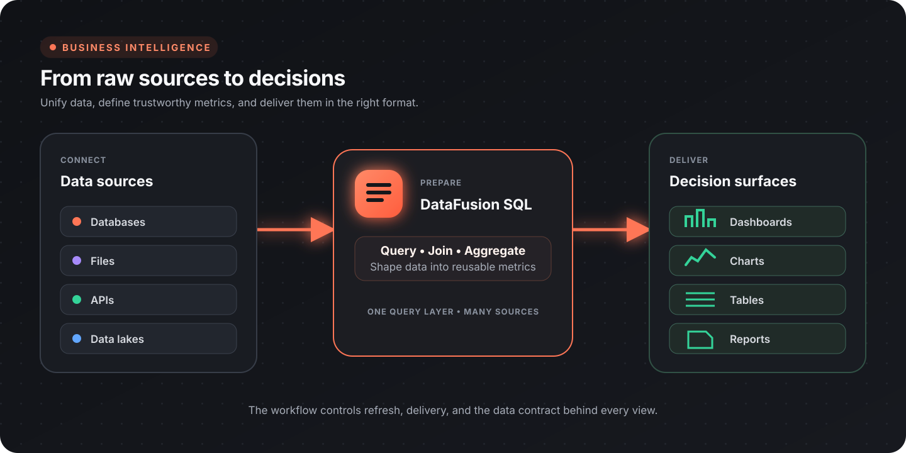

Flow-Like combines query workflows with A2UI pages, charts, tables, and report delivery. Use it to move from governed source data to a decision-ready view without hiding metric logic inside a chart.



## BI architecture

| Layer | Responsibility |
|-------|----------------|
| Sources | Databases, files, APIs, and data-lake tables |
| Query | Join, filter, aggregate, and shape data |
| Metrics | Define business meaning, grain, filters, and ownership |
| Presentation | Dashboards, tables, exports, and scheduled reports |
| Operations | Refresh, access, quality checks, and incident ownership |

The dashboard is the last layer, not the source of truth. Define and test the underlying query before styling the visualization.

## Connect data

Create one DataFusion session and register the sources required by the analysis:

| Source | Entry point |
|--------|-------------|
| PostgreSQL, MySQL, SQLite, and other databases | [DataFusion databases](/nodes/data/datafusion/databases/) |
| CSV, JSON, Parquet | [DataFusion](/nodes/data/datafusion/) |
| Delta and Iceberg tables | [DataFusion lakes](/nodes/data/datafusion/lakes/) |
| APIs | [API integrations](/topics/api-integrations/overview/) |
| Flow-Like local database | [Database nodes](/nodes/data/database/) |

Push filters into the source query where possible. Select only the columns and time range needed by the view.

## Define metrics before charts

A metric definition should include:

| Field | Example |
|-------|---------|
| Name | Net revenue |
| Business meaning | Captured sales less refunds |
| Formula | `captured_amount - refunded_amount` |
| Grain | One row per order |
| Time field and timezone | `captured_at`, Europe/Berlin |
| Inclusion rules | Successful captures only |
| Owner | Finance Analytics |
| Freshness | Updated every hour |

Keep the definition next to the workflow or query that implements it. Reuse that logic across dashboards and reports.

For example:

```sql
SELECT
  DATE_TRUNC('month', captured_at) AS month,
  SUM(captured_amount - refunded_amount) AS net_revenue
FROM payments
WHERE status = 'captured'
GROUP BY DATE_TRUNC('month', captured_at)
ORDER BY month;
```

Validate dates, team IDs, and other user-controlled filters against an allow list or strict parser before constructing query text. Do not concatenate arbitrary input into SQL.

## Build a dashboard

Use [Pages](/apps/pages/) to create the route and A2UI components to present the result.

### Recommended composition

| Region | Content |
|--------|---------|
| Header | Page title, freshness timestamp, and important scope |
| Filters | Date range and a small set of decision-relevant dimensions |
| KPI row | A few primary metrics with comparison context |
| Main chart | The most important trend or comparison |
| Detail table | Records or grouped values used to explain the chart |
| Status area | Loading, empty, stale, and error states |

The workflow for the page should:

1. read validated filter values;
2. run the source queries;
3. calculate or retrieve governed metrics;
4. push values to text, chart, and table elements;
5. update freshness and error states.

Relevant A2UI nodes include [Push Data to Chart](/nodes/ui/elements/charts/a2ui-push-csv-to-chart/), [Push CSV to Table](/nodes/ui/elements/table/a2ui-write-csv-to-table/), and [Set Element Text](/nodes/ui/elements/a2ui-set-element-text/).

## Choose the right visual

| Question | Useful visual |
|----------|---------------|
| How is a value changing over time? | Line chart |
| How do categories compare? | Bar chart |
| What contributes to a whole? | Stacked bar; pie only for a few categories |
| Where is a process losing volume? | Funnel |
| How do two measures relate? | Scatter plot |
| Which records need action? | Sortable, filterable table |
| Is performance within a target? | KPI with target and trend context |

Label units, timezones, and aggregation clearly. Avoid dual axes unless the relationship cannot be shown more honestly in separate views.

See [Data visualization](/topics/datascience/visualization/) for chart design guidance.

## Filters and drill-down

Treat filters as query inputs:

- validate the date range and allowed dimension values;
- use a default that answers a useful question;
- keep the selected scope visible;
- use route parameters or query parameters when a view should be shareable;
- make drill-down navigation preserve enough context to explain how the user arrived there.

A chart interaction may trigger a workflow or navigate to a detail page. The destination should repeat the selected scope and metric definition.

## Scheduled reports

Use an event-driven Flow to produce recurring reports:

1. query the governed metrics for the reporting window;
2. compare them with the prior period or target;
3. render a concise summary and supporting table or chart;
4. validate that the data is fresh enough to publish;
5. deliver through the configured channel;
6. record the run, recipients, and source window.

When the data is incomplete or stale, send an operational alert instead of publishing a confident-looking report.

## Data quality

Add checks before a result reaches the page or report:

- row count is within an expected range;
- key fields are non-null and unique;
- totals reconcile with an authoritative source;
- the latest source timestamp meets the freshness target;
- dimension values are recognized;
- joins do not unexpectedly multiply records;
- period comparisons use equivalent windows and timezones.

Display freshness and known limitations near the affected metric. A correct chart of incomplete data is still misleading.

## Performance

- Aggregate in SQL rather than sending raw event-level data to the page.
- Select only required fields and rows.
- Cache or materialize expensive, reusable results where appropriate.
- Debounce interactive filters.
- Paginate large detail tables.
- Separate fast summary queries from slow diagnostic queries.

## Access and governance

Scope each source connection to the data the workflow needs. Keep credentials in secrets or provider connections, and review access at the App, Flow, source, and delivery layers.

For sensitive dashboards:

- avoid putting private fields in client-side page data unless displayed;
- redact sensitive values from errors and logs;
- document metric owners and report recipients;
- keep drill-down routes subject to the same access policy as the summary page.

## Dashboard checklist

- [ ] Every metric has a definition, grain, owner, and freshness expectation
- [ ] Filters are validated and visible
- [ ] Dynamic query values are strictly validated or allow-listed
- [ ] The page shows loading, empty, stale, and error states
- [ ] Charts label units, scope, and time
- [ ] Detail data explains the summary
- [ ] Quality checks run before publishing
- [ ] Access is scoped across source, workflow, page, and delivery
- [ ] Expensive queries are bounded or cached

## Next steps

- [DataFusion](/topics/datascience/datafusion/)
- [Data visualization](/topics/datascience/visualization/)
- [Building internal tools](/topics/internal-tools/overview/)
- [Data pipelines](/topics/data-pipelines/overview/)
