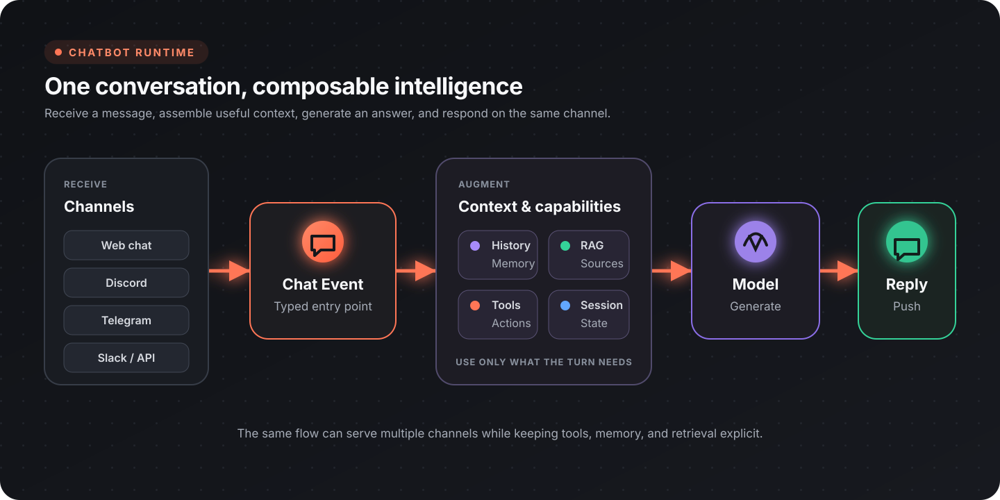

Flow-Like chat workflows can combine conversation history, retrieval, tools, and model responses. Design the bot as a controlled workflow: accept an event, assemble the allowed context, perform bounded work, return a response, and record enough information to evaluate the result.

## Choose a chatbot pattern

| Pattern | Best for | Main control |
|---------|----------|--------------|
| Prompted assistant | Drafting, explanation, simple Q&A | System instructions and model settings |
| Retrieval assistant | Answers grounded in a document collection | Search quality and citation policy |
| Tool-using agent | Looking up or changing external state | Tool permissions and confirmation |
| Guided conversation | Intake, troubleshooting, approvals | Explicit state and structured interactions |
| Notification bot | Proactive updates in a channel | Event filtering and delivery rules |

Start with the least autonomous pattern that completes the task. Add retrieval or tools only when the user need justifies the additional data and permissions.

## Core chat workflow

| Stage | Relevant nodes or design work |
|-------|-------------------------------|
| Receive | [Chat Event](/nodes/events/events-chat/) |
| Build history | [Make History](/nodes/ai/generative/history/ai-generative-make-history/), [Push Message](/nodes/ai/generative/history/ai-generative-add-history-message/) |
| Set instructions | [Set System Message](/nodes/ai/generative/history/ai-generative-set-system-prompt-message/) |
| Invoke | [Invoke Model](/nodes/ai/generative/ai-generative-invoke/) or an agent invocation |
| Return | [Push Response](/nodes/events/chat/events-chat-push-response/) |
| Stream | [Push Chunk](/nodes/events/chat/events-chat-push-response-chunk/) |

The system instructions should define the bot's role, allowed sources, tool policy, refusal behavior, and response shape. Keep them versioned with the Flow so changes can be tied to evaluation results.

## Conversation history

Only include history that helps the current turn. Long, unbounded transcripts increase latency and can distract the model from current instructions.

Use one of these approaches:

- retain the most recent turns;
- summarize older turns into a compact memory record;
- preserve durable facts separately from conversational text;
- clear history when the task or user context changes;
- keep private session data scoped to the correct user or conversation.

History nodes include [Set History N](/nodes/ai/generative/history/ai-generative-set-history-n/), [Pop Message from History](/nodes/ai/generative/history/ai-generative-pop-history-message/), and [Clear History](/nodes/ai/generative/history/ai-generative-clear-history/).

## Ground responses with retrieval

Use retrieval when the bot must answer from a controlled corpus rather than general model knowledge.

1. ingest documents and preserve source metadata;
2. split content into retrieval-sized chunks;
3. embed and store each chunk;
4. embed the user's query;
5. retrieve relevant chunks;
6. pass only the useful context to the model;
7. return source references with the answer;
8. decline or ask for clarification when retrieval is insufficient.

See [Retrieval-Augmented Generation](/topics/genai/rag/) for the full indexing and query workflow.

## Add tools

For multi-step or external operations, build an agent and register only the tools it needs.

| Need | Node |
|------|------|
| Build from a configured model | [Agent from Model](/nodes/ai/agents/builder/agent-from-model/) |
| Set agent instructions | [Set Agent System Prompt](/nodes/ai/agents/builder/agent-set-system-prompt/) |
| Register Flow-Like functions | [Register Function Tools](/nodes/ai/agents/builder/agent-register-function-tools/) |
| Register MCP tools | [Register MCP Tools](/nodes/ai/agents/builder/agent-register-mcp-tools/) |
| Invoke | [Invoke Agent](/nodes/ai/agents/agent-invoke/) |
| Stream | [Stream Invoke Agent](/nodes/ai/agents/agent-stream-invoke/) |

Separate read tools from write tools. Ask for confirmation before destructive, costly, or externally visible actions. Validate tool arguments in the workflow even if the model produced them.

## Stream useful progress

Streaming improves perceived latency, but it should not expose raw internal reasoning or unvalidated tool output.

- stream user-facing response chunks with **Push Chunk**;
- use [Push Step](/nodes/events/chat/events-chat-push-step/) for named progress stages;
- use [Push Stats](/nodes/events/chat/events-chat-push-stats/) for safe, structured status data;
- finish with a complete response or an explicit error state.

If the workflow fails after partial output, tell the user that the operation did not complete. Do not let a partial success message imply that a side effect happened.

## Attachments

Chat events can work with attachments, and responses can include attachments from paths or signed URLs:

- [Extract Attachments](/nodes/events/chat/ai-gen-llm-history-extract-attachments/)
- [From Path](/nodes/events/chat/attachments/events-chat-attachment-from-path/)
- [From Signed URL](/nodes/events/chat/attachments/events-chat-attachment-from-signed-url/)
- [Push Attachment](/nodes/events/chat/events-chat-push-attachment/)

Validate type and size before processing uploads. Do not automatically pass every attachment to a model; select the minimum content needed for the task.

## Structured interactions

Use interaction nodes when free-form text would make a task ambiguous:

| Interaction | Node |
|-------------|------|
| Form | [Chat Form](/nodes/events/chat/interaction/interaction-form/) |
| One choice | [Single Choice](/nodes/events/chat/interaction/interaction-single-choice/) |
| Multiple choices | [Multiple Choice](/nodes/events/chat/interaction/interaction-multiple-choice/) |

Structured interactions are useful for approvals, configuration, and collecting required fields before a tool runs.

## Channels

The same conversational logic can be connected to the Flow-Like app chat surface or to supported provider-specific messaging nodes. Keep channel transport separate from the core response workflow:

- normalize incoming identity, message text, and attachments;
- call the shared bot workflow;
- adapt the result to the channel's formatting and size limits;
- store channel-specific delivery identifiers outside the model prompt.

Search the [node catalog](/nodes/overview/) for current provider coverage.

## Safety and privacy

- Treat retrieved documents, web content, and tool output as untrusted data rather than instructions.
- Restrict tools and credentials to the minimum required scope.
- Require confirmation for destructive or externally visible actions.
- Redact secrets and personal data from traces and error messages.
- Make uncertainty visible; do not invent a source or claim that a tool succeeded.
- Keep tenant, user, and conversation state isolated.
- Define retention for transcripts, uploaded files, and retrieved context.

## Evaluate the bot

Maintain a representative test set for:

- common successful requests;
- ambiguous or incomplete requests;
- no-result retrieval queries;
- prompt-injection attempts in user and retrieved content;
- tool failures and timeouts;
- confirmation-required actions;
- long conversations and history truncation;
- attachment type and size limits.

Track answer correctness, source grounding, tool success, latency, cost, and escalation or refusal quality. Review traces by failure category instead of relying only on an average score.

## Production checklist

- [ ] System instructions and model settings are versioned
- [ ] History is bounded and scoped to the correct session
- [ ] Retrieval preserves source references
- [ ] Tool permissions are minimal
- [ ] Write actions have validation and confirmation
- [ ] Streaming has a clear completion and failure state
- [ ] Uploads are validated before processing
- [ ] Test cases cover failures and adversarial input
- [ ] Logs and traces redact sensitive data

## Next steps

- [Retrieval-Augmented Generation](/topics/genai/rag/)
- [Agents](/topics/genai/agents/)
- [Prompt templates](/topics/genai/prompt-templates/)
- [API integrations](/topics/api-integrations/overview/)
