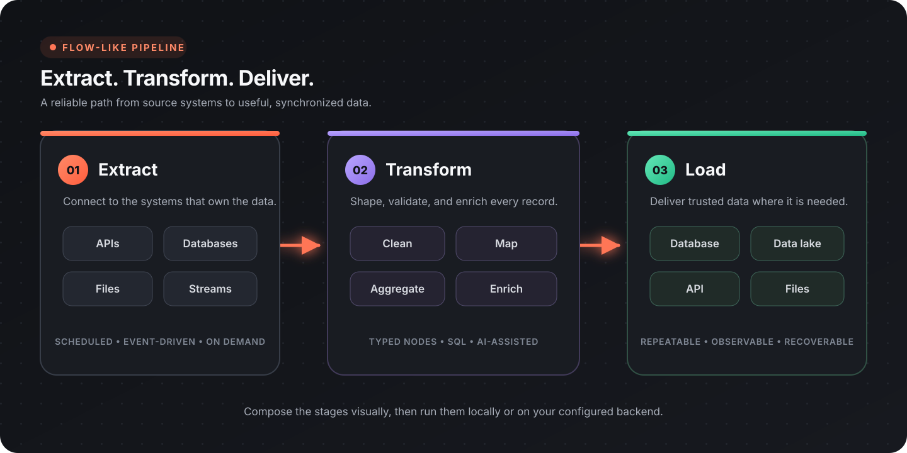

Flow-Like Flows can coordinate data movement across APIs, databases, files, and local storage. A reliable pipeline makes each boundary explicit: where data came from, how it changed, where it was written, and what happens when a step fails.



## Pipeline architecture

| Stage | Responsibility |
|-------|----------------|
| Trigger | Decide when and why the run starts |
| Extract | Read source records without losing provenance |
| Normalize | Standardize names, types, dates, and identifiers |
| Transform | Filter, join, aggregate, enrich, and validate |
| Load | Write to the destination with idempotent behavior |
| Observe | Record counts, duration, failures, and checkpoints |

Keep these responsibilities visible even when a small pipeline combines several of them in one Flow.

## Extract data

### Databases and data lakes

DataFusion nodes can mount files and register database or lake sources in a query session.

| Source | Relevant nodes |
|--------|----------------|
| Session | [Create DataFusion Session](/nodes/data/datafusion/df-create-session/) |
| PostgreSQL, MySQL, SQLite, and other databases | [DataFusion databases](/nodes/data/datafusion/databases/) |
| CSV, JSON, Parquet | [Mount CSV](/nodes/data/datafusion/df-mount-csv/), [Mount JSON](/nodes/data/datafusion/df-mount-json/), [Mount Parquet](/nodes/data/datafusion/df-mount-parquet/) |
| Delta and Iceberg | [DataFusion lakes](/nodes/data/datafusion/lakes/) |
| Local Flow-Like database | [Open Database](/nodes/data/database/open-local-db/) |

Use source-side filters when possible. For an incremental database read, select records using a stable cursor such as an updated timestamp plus a unique ID, then save the new checkpoint only after the destination write succeeds.

### APIs

Build a request with the [HTTP request nodes](/nodes/web/api/request/) and execute it with [API Call](/nodes/web/api/http-fetch/). Handle pagination according to the provider's contract:

- cursor pagination: save and submit the returned cursor;
- page pagination: increment the page until the response is empty or marks completion;
- link pagination: follow the provider's next link;
- time windows: use non-overlapping boundaries and a stable tie-breaker.

Read credentials from secrets, validate the status before parsing, and respect provider rate limits.

### Files and documents

Use format-specific readers rather than treating every file as raw text:

- [Buffered CSV Reader](/nodes/utils/csv/csv-buffered-reader/) for large CSV files;
- DataFusion mounts for CSV, JSON, or Parquet queries;
- [Document processing](/topics/document-processing/overview/) for PDFs, spreadsheets, images, DOCX, and PPTX;
- provider download nodes or [HTTP Download](/nodes/web/http-download/) for remote files.

Validate the actual content type where practical. A file extension alone is not a sufficient trust boundary.

## Transform data

### SQL transformations

Register the required sources in one DataFusion session, then use [SQL Query](/nodes/data/datafusion/df-sql-query/) for filtering, joins, aggregation, and window functions.

```sql
SELECT
  customer_id,
  DATE_TRUNC('day', created_at) AS order_day,
  SUM(amount) AS revenue
FROM orders
WHERE created_at >= TIMESTAMP '2026-01-01 00:00:00'
GROUP BY customer_id, DATE_TRUNC('day', created_at);
```

Construct dynamic query text only from validated, allow-listed values; never concatenate arbitrary user input. Keep business definitions such as revenue or active customer in one reusable query or workflow so dashboards and reports do not drift.

### Workflow transformations

Use workflow nodes when the transformation is naturally record-oriented or depends on external services:

| Need | Pattern |
|------|---------|
| Normalize one record | Map source fields into a stable destination schema |
| Apply business rules | Branch on validated, named conditions |
| Call an enrichment API | Limit concurrency and cache reusable results |
| Process a collection | [For Each](/nodes/control/control-for-each/) or [Parallel For Each](/nodes/control/control-par-for-each/) |
| Combine parallel results | [Gather](/nodes/control/parallel/control-gather/) |

Prefer set-based SQL for large joins and aggregations. Use per-record workflow loops only when each record requires its own logic or side effect.

## Validate data

Validate before writing:

- required fields are present;
- identifiers are unique where expected;
- numeric and date values parse in the intended locale and timezone;
- enum values are recognized;
- foreign keys or reference values exist;
- row counts and totals are plausible;
- rejected records retain the source reference and rejection reason.

Separate invalid data from execution errors. An invalid record may be routed to review while the run continues; a broken destination connection may require the run to stop.

## Load data

The local database catalog supports single and batch writes:

| Behavior | Node |
|----------|------|
| Insert one record | [Insert](/nodes/data/database/insert/insert-local-db/) |
| Insert a batch | [Batch Insert](/nodes/data/database/insert/batch-insert-local-db/) |
| Upsert one record | [Upsert](/nodes/data/database/insert/upsert-local-db/) |
| Upsert a batch | [Batch Upsert](/nodes/data/database/insert/batch-upsert-local-db/) |
| Insert CSV data | [Batch Insert (CSV)](/nodes/data/database/insert/csv-insert-local-db/) |

Choose a deterministic key and use upsert when a run may be retried. For external destinations, use their idempotency or merge mechanism when available.

## Trigger and schedule runs

Choose a trigger that matches freshness needs:

| Trigger | Best for |
|---------|----------|
| Schedule | Periodic imports, reports, and maintenance |
| App or generic event | User-initiated or system-initiated jobs |
| Incoming API event | Near-real-time updates from external systems |
| Upstream completion | Multi-stage pipelines with explicit dependencies |

See [App events](/apps/events/) for event configuration. Avoid polling much more frequently than the source can change or the destination can safely accept writes.

## Reliability patterns

### Checkpoints

Store the last successful cursor, time window, or source offset. Update it only after the corresponding destination batch commits.

### Idempotency

Make retries safe by using stable source identifiers, destination upserts, provider idempotency keys, or a run ledger.

### Batching and concurrency

Batch to bound memory and transaction size. Limit parallel work according to database capacity, file size, and API rate limits.

### Error handling

Record the stage, safe source identifier, error type, attempt count, and run ID. Redact credentials and sensitive payload fields. Retry transient failures with backoff; route permanent data errors to review.

### Observability

At minimum, record:

- run start, end, and duration;
- extracted, accepted, rejected, and written counts;
- current checkpoint;
- retry and failure counts;
- the Flow and configuration version used for the run.

## Example: customer synchronization

| Stage | Operation |
|-------|-----------|
| Trigger | Run on a schedule or explicit app event |
| Extract | Request customer pages from the source API |
| Normalize | Standardize email, country, and timestamp fields |
| Enrich | Resolve optional reference data with bounded concurrency |
| Validate | Require a source ID and valid business fields |
| Load | Batch upsert by source ID |
| Finish | Save the cursor and emit a run summary |

If a batch fails after extraction, repeat the same batch with the same source IDs. The upsert key and delayed checkpoint update prevent duplicates or skipped pages.

## Design checklist

- [ ] Source, destination, and owner are documented
- [ ] Credentials come from secrets or provider connections
- [ ] Pagination or incremental cursors are explicit
- [ ] Transformations produce a stable schema
- [ ] Invalid records have a review or quarantine path
- [ ] Destination writes are idempotent
- [ ] Batch size and concurrency are bounded
- [ ] Checkpoints advance only after successful writes
- [ ] Run metrics and safe error context are retained

## Next steps

- [DataFusion](/topics/datascience/datafusion/)
- [API integrations](/topics/api-integrations/overview/)
- [Document processing](/topics/document-processing/overview/)
- [Building internal tools](/topics/internal-tools/overview/)
