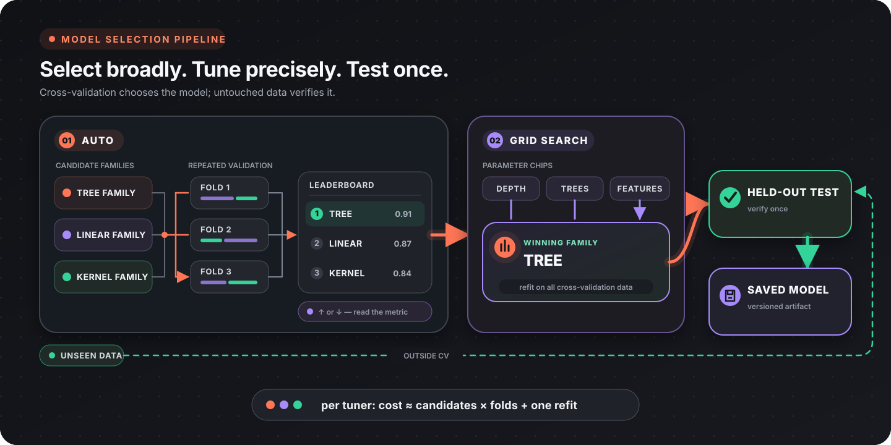

Auto Training separates two decisions that are easy to blur together: first choose the model family, then tune that family's configuration. Flow-Like runs both decisions as explicit cross-validation workflows and returns the winning fitted model.

Flow-Like has four tuning nodes. Two sweep model *families* to answer “which kind of model fits this data?”, and two sweep *hyperparameters* to answer “what is the best configuration of this family?”. Each pair exists twice because an ordered target cannot be tuned against a nominal objective.

All four load a feature-vector column and a target column from a database, cross-validate every candidate on the same folds, retrain the winner on the full tuning dataset, and return it as a model. Keep a final test set outside that entire loop.

:::tip[The two-stage path]
Run an Auto node to choose the family, connect its `Best Model Type` to the matching Grid Search node, then evaluate the tuned winner once on the untouched test set. Every family either Auto node can report is tunable by its Grid Search counterpart, so the hand-off never dead-ends.
:::

## The four tuning nodes

| Node | Use it for | Target type |
|------|------------|-------------|
| [Auto Classifier](/nodes/ai/ml/tuning/ai-ml-tuning-auto-classifier/) | Comparing classifier families, ranked by accuracy or macro-F1 | Unordered classes |
| [Auto Ordinal](/nodes/ai/ml/tuning/ai-ml-tuning-auto-ordinal/) | Comparing ordinal families, ranked by an ordinal metric | Ordered levels |
| [Grid Search](/nodes/ai/ml/tuning/ai-ml-tuning-grid-search/) | Exhaustive hyperparameter search for one classifier family | Unordered classes |
| [Ordinal Grid Search](/nodes/ai/ml/tuning/ai-ml-tuning-ordinal-grid-search/) | Exhaustive hyperparameter search for one ordinal family | Ordered levels |

The Auto node's `Best Model Type` output and the matching Grid Search `Model Type` input use the same model-kind strings, so the pins connect directly for supported families.

### What the Auto nodes sweep

| Node | Families tried | Off by default |
|------|----------------|----------------|
| Auto Classifier | Gaussian Naive Bayes, Decision Tree (three depths), Logistic Regression (three penalties), Random Forest, one-vs-all SVM | Nothing; SVM, Logistic Regression and Random Forest each have an include toggle |
| Auto Ordinal | Proportional Odds and Ordered Probit, All-Threshold under a logistic and a hinge margin, Ordinal Ridge (three penalties), Continuation Ratio, Adjacent Category | The neural family (CORAL and CORN heads) |

Neither Auto node covers everything in the catalog. [AdaBoost](/nodes/ai/ml/classification/fit-adaboost/), [KNN](/nodes/ai/ml/classification/fit-knn-classifier/), [Multinomial Naive Bayes](/nodes/ai/ml/classification/fit-multinomial-naive-bayes/) and [Frank & Hall](/nodes/ai/ml/ordinal/fit-ordinal-frank-hall/) are not swept by an Auto node, and neither Grid Search node can tune them either, so reach for the training node directly if you want to try them. [One-Class SVM](/nodes/ai/ml/classification/fit-one-class-svm/) is novelty detection rather than a classifier over a target column, so no tuner covers it at all.

## Why ordered targets need their own tuners

Auto Classifier and Grid Search resolve the target in a way that discards the level order: rank ids are assigned in whatever order the labels appear, and both rank candidates by accuracy (Auto Classifier also offers macro-F1). Under accuracy, predicting level 1 when the truth was level 5 costs exactly what predicting level 4 costs. A distance-blind objective picks the wrong model on an ordered target, and nothing in the resulting leaderboard reveals it — the scores look entirely plausible.

The ordinal tuners keep the ordered contract end to end. The level set is resolved once, before the folds are cut, and handed to every candidate, so a level a fold happens to miss cannot renumber the ranks for that fold. Ranking then uses a metric that knows how far a miss was.

Both ordinal tuners take a `Class Order` pin: comma-separated labels from lowest to highest. Leave it empty when the labels are numeric and numeric order is what you want. Non-numeric labels have no inferable order, so the search fails rather than guessing one. Both also publish a `Levels` output stating the resolved order and whether it came from your list (`Explicit`) or from reading the labels as numbers (`Numeric`). Check that output first when a leaderboard looks upside down.

Every ordinal candidate is a gradient or a least-squares fit on the raw columns. Scale the features with [Fit Feature Scaler](/nodes/ai/ml/preprocessing/fit-feature-scaler/) and [Apply Transform](/nodes/ai/ml/preprocessing/ml-apply-transform/) before writing the column the tuner reads. Unscaled columns change which family and which hyperparameters win, not only how fast they converge.

## Choosing the metric

Auto Classifier ranks by `accuracy` or `macro_f1`. Grid Search has no metric pin at all and always ranks by accuracy — worth knowing if you selected the family under macro-F1 because the classes are imbalanced, because the tuning step will then optimize a different objective.

Both ordinal tuners offer the same six metrics:

| Metric | What it answers | Direction |
|--------|-----------------|-----------|
| `Quadratic Kappa` | Chance-corrected agreement, penalising a two-level miss four times as hard as a one-level miss. The standard headline metric | Higher is better |
| `Linear Kappa` | The same, with every step along the scale costing the same. Use it when one level is one unit of loss | Higher is better |
| `Mean Rank Error` | Average number of levels a prediction is off by | **Lower is better** |
| `Macro Rank Error` | The same, averaged per true level so each level gets one vote. This is the metric that moves when a model has collapsed onto the majority level | **Lower is better** |
| `Kendall Tau-b` | Does the model order the rows correctly, ties corrected. Ignores calibration entirely | Higher is better |
| `Spearman` | The same question via rank correlation on midranks | Higher is better |

Two of the six are error metrics. Ranking one the wrong way round crowns the worst candidate in the sweep and leaves a result that reads as normal, so the nodes never publish a score without its direction: Auto Ordinal sets `higher_is_better` in its `Results` struct, and Ordinal Grid Search additionally exposes it as a dedicated `Higher Is Better` output pin next to `Best Score`. Branch on that pin rather than assuming a larger number is better.

The two rank-association metrics answer a different question from the rest. A model whose predictions are all shifted by one level scores a perfect 1.0 under Kendall tau-b and Spearman. Use them when the ranking is what the workflow consumes, and a kappa or an error metric when the predicted level itself is.

## Reading the leaderboard

Auto Ordinal returns the fullest result. Each leaderboard entry carries:

| Field | Meaning |
|-------|---------|
| `model_type` | The model kind, using the same strings the rest of the catalog uses — this is what feeds Grid Search |
| `variant` | The configuration in words, for example `Support Vector Ordinal Regression (all-threshold loss, hinge margin)`. Several variants can share one model type |
| `params` | Only the hyperparameters the node set explicitly; anything absent stayed at the estimator's own default |
| `cv_score` | Mean score across the folds, in the units of the chosen metric |
| `train_time_secs` | Seconds spent fitting and scoring this configuration across all folds |
| `rank` | Position, 1 being best under the metric **and its direction** |

Alongside the leaderboard, the ordinal nodes return a `skipped` list. A configuration that fails to fit on any fold is dropped from the ranking with a warning in the run log and its reason recorded, rather than ending the run. That matters because some failures are structural rather than accidental: Continuation Ratio refuses to fit when a fold omits a middle level, and a CORN head fails on a fold that omits a level nothing reaches, while every other family on the same folds is healthy. Only when *every* configuration fails does the node return an error. Ordinal Grid Search lists the reasons in that error; Auto Ordinal only does so when nothing ever completed a fold — when configurations failed *after* an earlier one had scored, it errors with a bare `Leaderboard is empty after ranking` and the reasons are left in the run-log warnings.

Auto Classifier and Grid Search have no equivalent. A fit failure there aborts the whole run.

Grid Search and Ordinal Grid Search report per-combination entries with `mean_score`, `std_score` and the individual `fold_scores`. Read the spread, not only the mean: two combinations whose means differ by less than their fold-to-fold standard deviation are not meaningfully separated, and picking between them is picking noise.

## Budget the search

Total cost is roughly (candidates x folds) model fits, plus one refit of the winner on the full dataset. Both Auto nodes expand their families into more configurations than the family count suggests — Auto Classifier sweeps three tree depths and three logistic penalties, Auto Ordinal three ridge penalties — so the default Auto Ordinal sweep is nine configurations, eleven with the neural family on.

Auto Ordinal's neural family is off by default, and the default is the recommendation. A network is refitted from scratch on every fold and typically dominates the runtime of the entire sweep. Switch it on when you suspect the levels are not separated by a single monotone direction in the features; the hidden layer is its whole contribution. With no hidden layer, CORAL is exactly the all-threshold model and CORN is exactly Continuation Ratio, so when a linear family still wins, prefer it.

Reproducibility differs between the two pairs:

| Node | Fold shuffle |
|------|--------------|
| Auto Ordinal, Ordinal Grid Search | Seeded through a `Seed` pin, default 42. The same seed reproduces the same folds and therefore the same leaderboard |
| Auto Classifier, Grid Search | Unseeded. Re-running can reorder candidates that were within noise of each other |

Change the seed on an ordinal tuner to check whether a narrow win survives a different split. If it does not, the win was the split. Auto Ordinal's neural candidates also use a fixed weight-initialization seed, and the winner's refit reuses it, so the model handed out is the one that was scored.

Random Forest and AdaBoost are not bit-reproducible across processes even where a seed is fixed: linfa breaks ties in hash-map order, and the seed fixes the sampling, not the tie-breaks.

## Parameter grids

Both Grid Search nodes take a `Parameter Grid` pin: a list of `{name, values}` entries whose full cartesian product is the sweep. The pin is seeded once with the default grid for whichever model type was selected when the node was placed, and is deliberately never rewritten afterwards, so a hand-edited grid is never clobbered.

Two consequences follow:

- Leaving the grid empty uses the default grid for the currently selected model type. This is what keeps the node correct after `Model Type` is switched.
- An entry the selected family does not consume is **rejected with an error**, not ignored. An ignored entry would make the sweep fit the same configuration repeatedly and report identical scores as a tuning result.

Accepted parameter names per family:

| Node | Model type | Accepted parameters |
|------|------------|---------------------|
| Grid Search | `DecisionTree` | `max_depth`, `min_weight_split` |
| Grid Search | `LogisticRegression` | `alpha` |
| Grid Search | `RandomForest` | `ensemble_size`, `max_depth`, `min_weight_split`, `bootstrap_proportion`, `feature_proportion` |
| Grid Search | `GaussianNaiveBayes`, `SVMMultiClass` | None; clear the grid and they run as a single configuration |
| Ordinal Grid Search | `OrdinalLogistic` | `alpha`, `link`, `loss`, `margin`, `learning_rate`, `max_iterations` |
| Ordinal Grid Search | `OrdinalRidge` | `alpha` |
| Ordinal Grid Search | `OrdinalContinuationRatio` | `alpha`, `link`, `learning_rate` |
| Ordinal Grid Search | `OrdinalAdjacentCategory` | `alpha`, `learning_rate` |
| Ordinal Grid Search | `OrdinalNeural` | `alpha`, `head`, `activation`, `hidden_layers`, `learning_rate`, `max_iterations`, `seed` |

Keep grids small. Every added value multiplies into the product, and every resulting combination is refitted once per fold.

## Keep the test set out of selection

Tuning is model selection, and model selection consumes evaluation data. Keep a final test set out of the tuning loop entirely — split it off with [Split Dataset](/nodes/ai/ml/dataset/ai-ml-dataset-split/) or [Stratified Split](/nodes/ai/ml/dataset/ai-ml-dataset-stratified-split/) before the tuner ever sees the rows. Cross-validation inside the tuner selects the model; the held-out set is what reports how it performs.

Record with the result:

- candidate families or parameter ranges;
- the selected metric and its direction;
- the seed, where the node has one;
- the split definition;
- the winning configuration and its score;
- the training data version.

Evaluate the winner on the held-out set with the nodes that match the task: [Accuracy](/nodes/ai/ml/metrics/ml-eval-accuracy/) and [Confusion Matrix](/nodes/ai/ml/metrics/ml-eval-confusion-matrix/) for classification, [Ordinal Metrics](/nodes/ai/ml/ordinal/ml-ordinal-metrics/) for ordered targets. Then persist the model with [Save Model](/nodes/ai/ml/save-ml-model/) and serve it through [Predict](/nodes/ai/ml/ml-predict/).

## Tuning checklist

- [ ] Target type decided: ordered levels use the ordinal tuners, not the classifier ones
- [ ] Features scaled before the column the tuner reads
- [ ] `Class Order` supplied for non-numeric ordered labels, and the `Levels` output checked
- [ ] Metric chosen deliberately, and its direction read from the node rather than assumed
- [ ] Final test set held out of the tuning loop
- [ ] Fold spread reviewed, not just the mean score
- [ ] Skipped configurations and their reasons reviewed
- [ ] Seed, metric, split, winning configuration and data version recorded
- [ ] Winner re-evaluated on the held-out set before it is saved

## Next steps

- [Machine Learning overview](/topics/datascience/ml/)
- [Model configuration](/topics/datascience/ml-configuration/)
