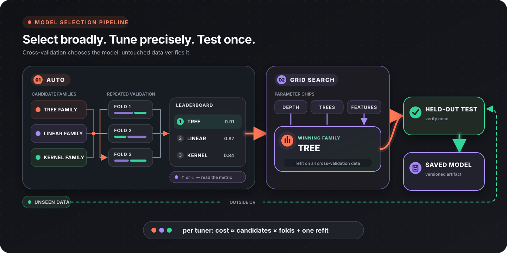

Auto Training compares models against a fixed task and returns a saved model that the runtime can load by identifier. The experiment nodes pin source tables, fit preprocessing on training rows, compare candidates on validation data, and evaluate the selected model once on an independent test partition.

Use the [durable experiment nodes](#durable-table-experiments) for background training, dataset variants, resource budgets, and optional LLM consultation. The existing cross-validation tuners below remain available for explicit family selection and parameter grids.

For camera and sensor inspections that start with an LLM teacher and later switch to a trained model, see [Teacher-to-student inspections](#teacher-to-student-inspections) below.



The four cross-validation tuning nodes compare model families or sweep one family's hyperparameters. Each pair supports nominal or ordered targets.

All four load a feature-vector column and a target column from a database, cross-validate every candidate on the same folds, retrain the winner on the full tuning dataset, and return it as a model. Keep a final test set outside that entire loop.

:::tip[The two-stage path]
Run an Auto node to choose the family, connect its `Best Model Type` to the matching Grid Search node, then evaluate the tuned winner once on the untouched test set. Every family either Auto node can report is tunable by its Grid Search counterpart, so the hand-off never dead-ends.
:::

## Durable table experiments

The task nodes share one experiment controller and return an `experiment_id` immediately. Training continues in local app storage. **Get Auto Training Result** reads the current leaderboard and outputs; **Cancel Auto Training** and **Resume Auto Training** preserve the experiment's remaining budget and saved work.

| Node | Task |
|---|---|
| Auto Train Tabular | Numeric and categorical features for classification, regression, or explicitly ordered classes |
| Auto Train Forecast | Prepared sensor windows, future targets, or temporal classification |
| Auto Train Vision | Image classification, boxes, semantic masks, instance masks, or an explicit fusion recipe |
| Auto Train Anomaly | Sensor reconstruction or image-feature anomaly models |
| Auto Train Agent | The same search with an optional LLM consultant; returns after selection and final evaluation |
| Step Auto Training | Run one candidate for a workflow that controls the search loop |
| Finalize Auto Training | Freeze the validation winner and audit it on the final test partition |

Supply a database connection, a task specification, stable row IDs, feature and target mappings, and a split policy. Use a group such as a part, production run, or overlapping sensor window to keep related rows in one partition. Temporal splits use timestamp boundaries, an embargo, and the task's prediction horizon. A source is pinned to its exact branch and version before it is read; incomplete reads and duplicate row IDs fail.

Tabular mappings accept explicit numeric and categorical columns. Numeric imputation, standardization, and categorical vocabulary are fitted only on training rows and saved in the model's preprocessing manifest. Missing and previously unseen categories have distinct encoded values. Targets, group IDs, timestamps, and outcome columns cannot be selected as tabular features. Use tensor or serialized-sample mappings for images, sequences, detection annotations, and per-row label provenance. **Window Features** constructs causal tabular statistics; sequence tensors and image decoding still require their explicit preprocessing nodes.

By default, preparation creates separate experiment tables for training, validation, and test rows. They retain original and generated named columns alongside model inputs, source lineage, and a preprocessing digest, and return pinned references. Set `tables.create_tables` to `false` to keep only the durable dataset snapshots. Updating an existing table requires both `allowed_destination` and its matching `expected_destination`; the controller rejects a changed destination. Feature proposals preserve every row's partition, target, and provenance.

The search tries native baselines and bounded Burn recipes appropriate to the task. Tabular classification includes Gaussian Naive Bayes, decision trees, and logistic regression. `ordered_target: true` uses the declared label order, adds ordinal ridge and ordinal logistic models, and defaults to minimizing `mean_rank_error`. Temporal candidates include LSTM, GRU, CNN1D, and TCN. Generated Burn candidates use seeded configuration sampling and successive halving: surviving configurations resume their weights and optimizer state at larger epoch budgets. Classical candidates complete their configured fit. Classical solver calls check cancellation and time limits before and after fitting, so an active solver call must return before cancellation takes effect.

Architectures needing additional information, such as an image/sensor fusion layout or EfficientAD teacher weights, can be supplied through `initial_candidates`. Visual feature models such as PatchCore and PaDiM require compatible feature tensors. The trainer does not infer a missing input layout or download pretrained assets.

Set the quality goal separately from the model's decision threshold. For example, this classification goal requires at least 32 audited samples and 95% accuracy:

```json
{
  "task": { "kind": "classification" },
  "primary_metric": "accuracy",
  "direction": "maximize",
  "minimum_audited_samples": 32,
  "bounds": [ { "name": "accuracy", "minimum": 0.95, "maximum": null } ]
}
```

The controller measures predictions itself. Validation and final-test labels must be reviewed or measured; teacher labels can contribute training examples. Workers receive a snapshot without test rows. The final candidate is frozen before its test evidence is opened, and an agent cannot change the target or select another candidate after seeing the result. A model that misses the requested bounds is still returned with `goal_met: false` and `unmet_constraints`.

**Auto Train Agent** receives the training profile, allowed feature columns, and measured validation results. Its typed actions are `run_next`, `train_burn`, `select_features`, `engineer_features`, and `finish`. Feature proposals can combine the authorized operations below. The agent cannot edit labels, provenance, splits, budgets, or scores. Failed or rejected consultations leave deterministic search available. Calls reserve a conservative token allowance before invocation. Cost reservations use the operator's `token_price_ceiling_micros`; set that ceiling for the provider's billing currency and pricing. Provider-reported usage is returned separately from these reservations.

Results include the best trial and model artifact IDs, native weights reference, fitted preprocessing, source versions, created or updated tables, dataset snapshots, validation leaderboard, final-test metrics, and budget use. Final prediction evidence can be materialized as a separate table when the Agent finishes or **Get Auto Training Result** retrieves a completed background run. **Predict Auto Model** accepts raw rows, applies the selected trial's saved preprocessing, and loads its artifact. **Export Auto Model** writes native weights and a separate JSON manifest to the supplied paths.

Local storage must survive executor restarts. A process supervisor can continue an experiment with `flow-like-auto-trainer --repository PATH --experiment ID`; add `--resume` for cancelled work, `--step` for one trial, or `--result` to read its artifacts. Build the binary with `flow-like-catalog-ml/training-auto` for automatic GPU selection or `training-cpu` for CPU execution. The node's optional `experiment_id` continues Agent consultation against the same saved experiment.

### Feature engineering

Set `feature_plan` on an Auto Training request, or use these nodes to prepare a dataset directly:

| Node | Operation |
|---|---|
| Derive Columns | Named arithmetic expressions, safe division, logarithms, square roots, clipping, and missing-value fallback |
| Window Features | Grouped lags, deltas, rates, and rolling mean, standard deviation, RMS, minimum, or maximum |
| Join Sources | Exact-key or backward as-of joins against declared source aliases |
| Fit Preprocessing | Fit imputation, categorical encoding, optional standardization, and optional PCA on training rows |
| Materialize Dataset | Write prepared train, validation, and test partitions with their named columns and lineage |

A `FeaturePlan` contains ordered `pipeline.steps`, selected `numeric_columns` and `categorical_columns`, `imputation`, `standardize`, optional `pca_components`, and resource `limits`. Expressions are typed Rust operations. They do not execute arbitrary SQL, DataFusion expressions, or scripts. New output names must be unique, and expressions cannot read protected target or identity columns.

Declare related tables through `feature_sources`, each with an `alias`, `source`, and `allowed_columns`. Sources are pinned before their selected values are saved in the fitted pipeline. Duplicate exact keys and duplicate as-of key/timestamp pairs fail. As-of joins select a preceding timestamp, with optional tolerance and availability time; joins preserve row count.

Splits are fixed before transformations run. Window history resets at train, validation, and test boundaries. Imputation (`median`, `mean`, or `constant`), scaling, category vocabulary, and PCA use training rows only. PCA supports up to 128 input features and 32 components and rejects components beyond the observed rank.

**Predict Auto Model** replays the saved pipeline. Set `stateful_features: true` and pass the returned `feature_state` into the next call to retain causal window history. Each group's timestamps must strictly increase. Without state, each batch starts with empty history. Row, byte, expression, join, and history limits also apply during inference.

### Continuous learning projects

**Create Learning Project** saves a training request, review policy, aggregate budget, and deployment identity. A workflow timer or event must invoke **Step Learning Project** or **Learning Project Agent** to advance it. The Agent adds optional feature and model consultation; saving a project alone does not schedule execution.

Feed **Observe Learning Samples** stable sample/group IDs, capture times, model predictions, and optional embeddings and declared operating slices. **Select Samples for Review** prioritizes uncertainty, teacher disagreement, diversity, and rare predicted classes. **Review Learning Sample** records an independent reviewed annotation or measured outcome with its availability time and increasing revision. **Analyze Model Errors** reports classification errors by class and declared slice; it does not diagnose detection or segmentation failure regions. Consultant error summaries use training or validation observations and exclude independent audit samples and groups.

Put the raw source row in each observation's `sample` field. Canary replay requires the original mapped columns, matching identity/group/time, and a timestamp mapping or serialized sample. Window pipelines also require raw rows for preceding observations. New training examples must be present in the configured source table; observation collection does not insert them there. The next cycle reopens the latest source version, pins it, and overlays available reviews.

Retraining requires enough new reviews, an available budget, and the configured cooldown. Embedding drift, observed classification error, and **Notify Learning Product Change** also contribute reasons. Each cycle excludes previously sealed audit groups and keeps previously trained groups out of its new test partition. Candidate and champion predictions use their own saved preprocessing on the same fresh audit cohort.

For a time split, optional `rolling_time_split` on project creation supplies `validation_duration_ms` and `test_duration_ms`. Each cycle fixes its boundaries relative to its reservation time: validation ends one test duration earlier, and training ends one validation duration before that. The existing embargo and prediction horizon still apply. Omitting this option preserves the original fixed cutoffs.

Set explicit quality bounds before enabling `automatic_promotion`. **Promote Learning Model** checks those bounds, audited sample counts, and `minimum_improvement`. With a positive `canary_fraction` and an existing champion, **Route Learning Project** assigns deterministic candidate traffic. Full promotion then requires fresh reviewed canary samples and actual predictions from both models. Supplied observation labels do not substitute for those predictions.

**Get Learning Project** exposes state, blocking reasons, cycles, and spending. Reservations, experiments, and completed predictions survive executor restarts when local app storage persists; later ticks resume saved work. **Pause Learning Project** suspends training and routes decisions to the teacher, **Resume Learning Project** continues the saved project, and **Rollback Learning Model** restores the prior deployment. Aggregate cycle, training, consultation, storage, and observation budgets bound the loop.

## The four tuning nodes

| Node | Use it for | Target type |
|------|------------|-------------|
| [Auto Classifier](/nodes/ai/ml/tuning/ai-ml-tuning-auto-classifier/) | Comparing classifier families, ranked by accuracy or macro-F1 | Unordered classes |
| [Auto Ordinal](/nodes/ai/ml/tuning/ai-ml-tuning-auto-ordinal/) | Comparing ordinal families, ranked by an ordinal metric | Ordered levels |
| [Grid Search](/nodes/ai/ml/tuning/ai-ml-tuning-grid-search/) | Exhaustive hyperparameter search for one classifier family | Unordered classes |
| [Ordinal Grid Search](/nodes/ai/ml/tuning/ai-ml-tuning-ordinal-grid-search/) | Exhaustive hyperparameter search for one ordinal family | Ordered levels |

The Auto node's `Best Model Type` output and the matching Grid Search `Model Type` input use the same model-kind strings, so the pins connect directly for supported families.

### What the Auto nodes sweep

| Node | Families tried | Off by default |
|------|----------------|----------------|
| Auto Classifier | Gaussian Naive Bayes, Decision Tree (three depths), Logistic Regression (three penalties), Random Forest, one-vs-all SVM | Nothing; SVM, Logistic Regression and Random Forest each have an include toggle |
| Auto Ordinal | Proportional Odds and Ordered Probit, All-Threshold under a logistic and a hinge margin, Ordinal Ridge (three penalties), Continuation Ratio, Adjacent Category | The neural family (CORAL and CORN heads) |

Neither Auto node covers everything in the catalog. [AdaBoost](/nodes/ai/ml/classification/fit-adaboost/), [KNN](/nodes/ai/ml/classification/fit-knn-classifier/), [Multinomial Naive Bayes](/nodes/ai/ml/classification/fit-multinomial-naive-bayes/) and [Frank & Hall](/nodes/ai/ml/ordinal/fit-ordinal-frank-hall/) are not swept by an Auto node, and neither Grid Search node can tune them either, so reach for the training node directly if you want to try them. [One-Class SVM](/nodes/ai/ml/classification/fit-one-class-svm/) is novelty detection rather than a classifier over a target column, so no tuner covers it at all.

## Why ordered targets need their own tuners

Auto Classifier and Grid Search resolve the target in a way that discards the level order: rank ids are assigned in whatever order the labels appear, and both rank candidates by accuracy (Auto Classifier also offers macro-F1). Under accuracy, predicting level 1 when the truth was level 5 costs exactly what predicting level 4 costs. A distance-blind objective picks the wrong model on an ordered target, and nothing in the resulting leaderboard reveals it. The scores look entirely plausible.

The ordinal tuners keep the ordered contract end to end. The level set is resolved once, before the folds are cut, and handed to every candidate, so a level a fold happens to miss cannot renumber the ranks for that fold. Ranking then uses a metric that knows how far a miss was.

Both ordinal tuners take a `Class Order` pin: comma-separated labels from lowest to highest. Leave it empty when the labels are numeric and numeric order is what you want. Non-numeric labels have no inferable order, so the search fails rather than guessing one. Both also publish a `Levels` output stating the resolved order and whether it came from your list (`Explicit`) or from reading the labels as numbers (`Numeric`). Check that output first when a leaderboard looks upside down.

Every ordinal candidate is a gradient or a least-squares fit on the raw columns. Scale the features with [Fit Feature Scaler](/nodes/ai/ml/preprocessing/fit-feature-scaler/) and [Apply Transform](/nodes/ai/ml/preprocessing/ml-apply-transform/) before writing the column the tuner reads. Unscaled columns change which family and which hyperparameters win, not only how fast they converge.

## Choosing the metric

Auto Classifier ranks by `accuracy` or `macro_f1`. Grid Search always ranks by accuracy. If you selected the family under macro-F1 because the classes are imbalanced, the tuning step will optimize a different objective.

Both ordinal tuners offer the same six metrics:

| Metric | What it answers | Direction |
|--------|-----------------|-----------|
| `Quadratic Kappa` | Chance-corrected agreement, penalising a two-level miss four times as hard as a one-level miss. The standard headline metric | Higher is better |
| `Linear Kappa` | The same, with every step along the scale costing the same. Use it when one level is one unit of loss | Higher is better |
| `Mean Rank Error` | Average number of levels a prediction is off by | **Lower is better** |
| `Macro Rank Error` | The same, averaged per true level so each level gets one vote. This is the metric that moves when a model has collapsed onto the majority level | **Lower is better** |
| `Kendall Tau-b` | Does the model order the rows correctly, ties corrected. Ignores calibration entirely | Higher is better |
| `Spearman` | The same question via rank correlation on midranks | Higher is better |

Two of the six are error metrics. Ranking one the wrong way round crowns the worst candidate in the sweep and leaves a result that reads as normal, so the nodes never publish a score without its direction: Auto Ordinal sets `higher_is_better` in its `Results` struct, and Ordinal Grid Search additionally exposes it as a dedicated `Higher Is Better` output pin next to `Best Score`. Branch on that pin rather than assuming a larger number is better.

The two rank-association metrics answer a different question from the rest. A model whose predictions are all shifted by one level scores a perfect 1.0 under Kendall tau-b and Spearman. Use them when the ranking is what the workflow consumes, and a kappa or an error metric when the predicted level itself is.

## Reading the leaderboard

Auto Ordinal returns the fullest result. Each leaderboard entry carries:

| Field | Meaning |
|-------|---------|
| `model_type` | The model kind, using the strings expected by Grid Search |
| `variant` | The configuration in words, for example `Support Vector Ordinal Regression (all-threshold loss, hinge margin)`. Several variants can share one model type |
| `params` | Only the hyperparameters the node set explicitly; anything absent stayed at the estimator's own default |
| `cv_score` | Mean score across the folds, in the units of the chosen metric |
| `train_time_secs` | Seconds spent fitting and scoring this configuration across all folds |
| `rank` | Position, 1 being best under the metric **and its direction** |

Alongside the leaderboard, the ordinal nodes return a `skipped` list. A configuration that fails to fit on any fold is dropped from the ranking with a warning in the run log and its reason recorded, rather than ending the run. That matters because some failures are structural rather than accidental: Continuation Ratio refuses to fit when a fold omits a middle level, and a CORN head fails on a fold that omits a level nothing reaches, while every other family on the same folds is healthy. Only when *every* configuration fails does the node return an error. Ordinal Grid Search lists the reasons in that error; Auto Ordinal only does so when nothing ever completed a fold. When configurations failed *after* an earlier one had scored, it errors with a bare `Leaderboard is empty after ranking` and the reasons are left in the run-log warnings.

Auto Classifier and Grid Search have no equivalent. A fit failure there aborts the whole run.

Grid Search and Ordinal Grid Search report per-combination entries with `mean_score`, `std_score` and the individual `fold_scores`. Read the spread, not only the mean: two combinations whose means differ by less than their fold-to-fold standard deviation are not meaningfully separated, and picking between them is picking noise.

## Budget the search

Total cost is roughly (candidates x folds) model fits, plus one refit of the winner on the full dataset. Both Auto nodes expand each family into several configurations. Auto Classifier sweeps three tree depths and three logistic penalties; Auto Ordinal sweeps three ridge penalties. The default Auto Ordinal sweep is nine configurations, eleven with the neural family on.

Auto Ordinal's neural family is off by default, and the default is the recommendation. A network is refitted from scratch on every fold and typically dominates the runtime of the entire sweep. Switch it on when you suspect the levels are not separated by a single monotone direction in the features; the hidden layer is its whole contribution. With no hidden layer, CORAL is exactly the all-threshold model and CORN is exactly Continuation Ratio, so when a linear family still wins, prefer it.

Reproducibility differs between the two pairs:

| Node | Fold shuffle |
|------|--------------|
| Auto Ordinal, Ordinal Grid Search | Seeded through a `Seed` pin, default 42. The same seed reproduces the same folds and therefore the same leaderboard |
| Auto Classifier, Grid Search | Unseeded. Re-running can reorder candidates that were within noise of each other |

Change the seed on an ordinal tuner to check whether a narrow win survives a different split. If it does not, the win was the split. Auto Ordinal's neural candidates also use a fixed weight-initialization seed, and the winner's refit reuses it, so the model handed out is the one that was scored.

Random Forest and AdaBoost are not bit-reproducible across processes even where a seed is fixed: linfa breaks ties in hash-map order, and the seed fixes the sampling, not the tie-breaks.

## Parameter grids

Both Grid Search nodes take a `Parameter Grid` pin: a list of `{name, values}` entries whose full cartesian product is the sweep. The pin is seeded once with the default grid for whichever model type was selected when the node was placed, and is deliberately never rewritten afterwards, so a hand-edited grid is never clobbered.

Two consequences follow:

- Leaving the grid empty uses the default grid for the currently selected model type. This is what keeps the node correct after `Model Type` is switched.
- An entry the selected family does not consume is **rejected with an error**, not ignored. An ignored entry would make the sweep fit the same configuration repeatedly and report identical scores as a tuning result.

Accepted parameter names per family:

| Node | Model type | Accepted parameters |
|------|------------|---------------------|
| Grid Search | `DecisionTree` | `max_depth`, `min_weight_split` |
| Grid Search | `LogisticRegression` | `alpha` |
| Grid Search | `RandomForest` | `ensemble_size`, `max_depth`, `min_weight_split`, `bootstrap_proportion`, `feature_proportion` |
| Grid Search | `GaussianNaiveBayes`, `SVMMultiClass` | None; clear the grid and they run as a single configuration |
| Ordinal Grid Search | `OrdinalLogistic` | `alpha`, `link`, `loss`, `margin`, `learning_rate`, `max_iterations` |
| Ordinal Grid Search | `OrdinalRidge` | `alpha` |
| Ordinal Grid Search | `OrdinalContinuationRatio` | `alpha`, `link`, `learning_rate` |
| Ordinal Grid Search | `OrdinalAdjacentCategory` | `alpha`, `learning_rate` |
| Ordinal Grid Search | `OrdinalNeural` | `alpha`, `head`, `activation`, `hidden_layers`, `learning_rate`, `max_iterations`, `seed` |

Keep grids small. Every added value multiplies into the product, and every resulting combination is refitted once per fold.

## Keep the test set out of selection

Tuning is model selection, and model selection consumes evaluation data. Keep a final test set out of the tuning loop entirely. Split it off with [Split Dataset](/nodes/ai/ml/dataset/ai-ml-dataset-split/) or [Stratified Split](/nodes/ai/ml/dataset/ai-ml-dataset-stratified-split/) before the tuner ever sees the rows. Cross-validation inside the tuner selects the model; the held-out set is what reports how it performs.

Record with the result:

- candidate families or parameter ranges;
- the selected metric and its direction;
- the seed, where the node has one;
- the split definition;
- the winning configuration and its score;
- the training data version.

Evaluate the winner on the held-out set with the nodes that match the task: [Accuracy](/nodes/ai/ml/metrics/ml-eval-accuracy/) and [Confusion Matrix](/nodes/ai/ml/metrics/ml-eval-confusion-matrix/) for classification, [Ordinal Metrics](/nodes/ai/ml/ordinal/ml-ordinal-metrics/) for ordered targets. Then persist the model with [Save Model](/nodes/ai/ml/save-ml-model/) and serve it through [Predict](/nodes/ai/ml/ml-predict/).

## Tuning checklist

- [ ] Target type decided: ordered levels use the ordinal tuners, not the classifier ones
- [ ] Features scaled before the column the tuner reads
- [ ] `Class Order` supplied for non-numeric ordered labels, and the `Levels` output checked
- [ ] Metric chosen deliberately, and its direction read from the node rather than assumed
- [ ] Final test set held out of the tuning loop
- [ ] Fold spread reviewed, not just the mean score
- [ ] Skipped configurations and their reasons reviewed
- [ ] Seed, metric, split, winning configuration and data version recorded
- [ ] Winner re-evaluated on the held-out set before it is saved

## Next steps

- [Machine Learning overview](/topics/datascience/ml/)
- [Model configuration](/topics/datascience/ml-configuration/)

## Teacher-to-student inspections

An inspection can use a teacher model while it collects labelled examples, train a smaller student in the background, compare both on independent evidence, and send subsequent decisions to the student. Teacher labels are training data. Agreement with the teacher is reported separately from accuracy against reviewed labels or observed outcomes.

Automatic device selection tries **CUDA, ROCm, WGPU, then CPU**. It skips backends absent from the installed build and tests a forward calculation and its gradient before selecting a device. Missing drivers or a failed probe advance to the next backend. WGPU uses the platform's graphics API, including Metal on macOS. Native classical models run on CPU.

Use `training-auto` to include the backends supported by the build target. Native desktop builds, local ML executor bundles, and standalone releases enable it by default. `training-cpu` supports smaller custom builds that omit those automatic product bundles; `training-wgpu`, `training-cuda`, and `training-rocm` select individual GPU features. Feature selection happens when building the application. Runtime selection uses the hardware and drivers on the machine running it. Selecting CPU in a standard desktop build leaves its compiled GPU support available for other workflows.

The standard Windows MSVC and Linux GNU x86_64 builds include all four backends. macOS and ARM64 Windows/Linux builds include WGPU and CPU, as do Windows GNU and Linux musl builds. Other targets keep CPU support. Automatic selection skips WGPU software adapters so machines without a usable GPU use the native CPU backend.

Compute configuration defaults to `backend: "auto"`, device index `0`, and CPU fallback enabled. **Probe Training Device** accepts `{"backend":"auto"}` and reports the concrete backend selected. To pin a device, supply its backend and set `allow_cpu_fallback: false`. With fallback enabled, an explicit GPU request tries that backend, then the remaining lower-priority backends, ending with CPU. Saved configurations that explicitly select CPU continue using CPU.

Lifecycle nodes use a SQLite ledger and immutable model blobs in the executor's local app storage. Keep that storage on a persistent volume. These nodes return an error when the app store is remote-only. The standalone `flow-like-ml-worker` binary can run saved jobs under a process supervisor; its `--repository` argument selects the same ledger. Board shadow/replay execution cannot mutate that ledger. Use the explicit comparison branch of a live inspection workflow to record candidate predictions.

### Build the inspection loop

1. **Build Inspection Spec** turns a description into a task, label order and input shape. **Plan Inspection Training** chooses a supported Burn recipe. Review dimensions and labels against the actual source. A changed specification creates a separate training stream.
2. Read camera frames or sensor values. Use **Preprocess Inspection Image**, **Make Inspection Sample**, **Sensor Window**, or **Build Visual Sequence** to attach tensor shape, timestamps, source identity and a split group. Frames from the same part, production run or overlapping window must share a group.
3. **Teacher Label** evaluates the evidence in the supplied multimodal history. **Review Annotation** records corrections. For future events, **Attach Observed Outcome** attaches a measured target only after its observation interval has ended.
4. **Record Training Sample** stores an immutable annotation revision. Supply the time the label became available, and reuse it on retries. **Train After N Samples** or a specific trainer starts a job after enough new accepted samples arrive and the training partition has enough examples.
5. **Route Inspection** sends decisions to the teacher during collection. Once a candidate exists, its shadow output also runs the candidate for comparison. **Training Job Status**, **Cancel Training**, **Resume Training**, and **Recover Training Jobs** expose the durable job state.
6. **Record Model Comparison** stores sample-aligned predictions. **Evaluate Student** handles classification; **Evaluate Inspection Task** handles task-specific evidence. Training and validation groups do not count as independent audited evidence.
7. **Promote Student** or **Promote by Audited Metrics** checks minimum sample counts and quality bounds before atomically changing the active artifact. **Route Inspection** then activates only the student decision branch.
8. Use **Distribution Drift** and **Loss Drift** to monitor changes. **Pause/Resume Student Routing** sends decisions back to the teacher, including when no previous student exists. **Rollback Student** restores the previous deployment. A failed promotion leaves the teacher in control while the next batch supplies more training data.

The confidence cutoff for a single prediction, the number of new examples needed to train, and the quality required for promotion are separate settings. **Apply Decision Threshold**, **Student Confidence Gate**, and **Select Decision Threshold** cover prediction decisions. Fit calibration and choose thresholds on validation data; reserve reviewed test groups for promotion.

### Available student families

| Data and task | Native implementation |
|---|---|
| Engineered sensor features | MLP, histogram gradient boosted trees, Isolation Forest |
| Temporal classification or forecasting | LSTM, GRU, causal TCN, 1D CNN |
| Reconstruction anomalies | Dense, convolutional sequence and LSTM autoencoders |
| Image classification | ResNet-18, MobileNetV2, EfficientNet |
| Object detection | YOLOX with SimOTA assignment and box, objectness and class losses |
| Semantic segmentation | U-Net |
| Instance segmentation | Mask R-CNN with a compact residual backbone, region proposals, ROIAlign and mask loss |
| Visual anomalies | PatchCore memory bank, PaDiM spatial Gaussians, EfficientAD |
| Image sequences | CNN-LSTM |
| Images plus sensor channels | Image/sensor fusion network |

**Extract Image Features** and **Feature Map to Patches** connect a trained image backbone to PatchCore or PaDiM. EfficientAD requires compatible pretrained PDN-small teacher weights. Its training and calibration sets contain normal images. The imported teacher remains frozen. Mask R-CNN's compact backbone does not load arbitrary ResNet-50/FPN checkpoints.

The native histogram booster supports squared-error regression and binary logistic classification. It does not import XGBoost model files.

A temporal classifier configuration for **Train LSTM** looks like this:

```json
{
  "recipe": {
    "architecture": "lstm",
    "input_features": 6,
    "hidden": 32,
    "outputs": 2,
    "objective": "classification"
  },
  "backend": { "backend": "auto" },
  "epochs": 30,
  "batch_size": 32,
  "learning_rate": 0.001,
  "seed": 42,
  "gradient_clip": 5.0
}
```

The inspection's sample shape is `[window_length, 6]`. The trainer supplies the batch dimension. Keep preprocessing identical during training and inference, and save its steps with the recipe. The lifecycle node's compute configuration selects the execution backend.

### Camera, sensor and teacher adapters

**Read Modbus Sensor** supports Modbus TCP registers and discrete values. **Decode Sensor Registers** makes byte order, word order and numeric representation explicit. **Read OPC UA Sensor** requires the `sensor-opcua` feature and a trusted PKI store in the executor's app storage. The node reads anonymously; the Rust adapter also supports credentials on encrypted channels. **Capture GenICam Frame** requires `sensor-genicam` and captures GigE Vision frames. Its image conversion supports Mono8, RGB8 and BGR8. Other transport and pixel formats require an adapter.

FFT, STFT, band energy, signal statistics and timestamped resampling run in Rust. Resampling has an explicit maximum gap. **Align Modalities** uses only sensor readings available at the image timestamp.

The ONNX catalog includes GroundingDINO detection, a SAM image encoder, and SAM prompt segmentation adapters. Supply compatible ONNX sessions, the expected preprocessing and, for GroundingDINO, tokenized inputs with class-token positions. These adapters do not bundle or download pretrained weights.

### Persistence and export

A model artifact records its dataset digest, architecture, label order and preprocessing. Native checkpoints also retain optimizer and sampler state for resume. Training jobs use leases, cancellation and resource reservations; model promotion uses an expected deployment generation to reject competing updates.

Enable `training-onnx-export` for **Export Student to ONNX**. Export uses fixed input dimensions and reports output semantics. Unsupported graphs fail explicitly. Native inference remains available for them. ONNX export parity is covered for MLP, ResNet-18 and U-Net; temporal and proposal-based models need exporter support for their operators.

The cross-platform CI job exercises CPU learning, checkpoint resume, lifecycle races and protocol emulators on Linux, Windows and macOS. Physical camera/PLC interoperability and application accuracy still depend on the installed equipment and the inspection dataset.
