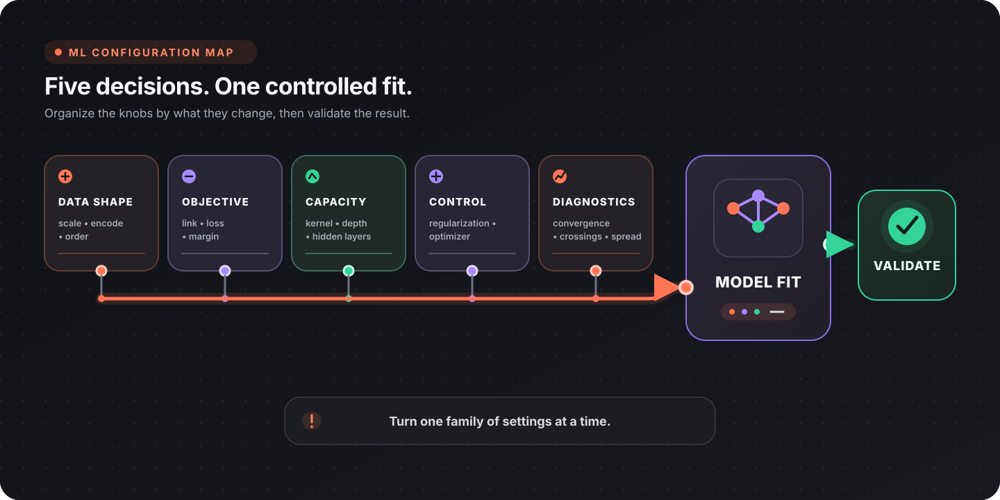

Model configuration is easier when you decide what kind of behaviour must change before touching a pin. Data shape, objective, capacity, control, and diagnostics are separate levers; move one family at a time so the result remains explainable.

This guide covers settings that change what a model *is*, not only how well it scores. It assumes a working training board. Defaults quoted here are the pin defaults in the catalog; ranges are the values the pins accept.

## Find the setting you need

| What you are trying to change | Start here |
|-------------------------------|------------|
| Ordinal probabilities, cut points, or proportional-odds behaviour | [Ordinal model configuration](#ordinal-model-configuration) |
| Coefficient shrinkage or feature selection | [Regularization](#regularization) |
| The shape of an SVM decision boundary | [Kernels](#kernels) |
| Overfitting, forest size, or boosting behaviour | [Tree and ensemble settings](#tree-and-ensemble-settings) |
| A genuinely non-linear ordered target | [Neural configuration](#neural-configuration) |
| Numeric scale or text vectorization | [Preprocessing configuration](#preprocessing-configuration) |
| A fit that converged but still looks wrong | [Diagnostics](#diagnostics) |

## Ordinal model configuration

[Train Ordinal Model (Proportional Odds)](/nodes/ai/ml/ordinal/fit-ordinal-logistic/) has four independent configuration axes. Together they span the whole threshold-model family, from the classical proportional-odds fit to support vector ordinal regression to the generalized ordinal model.

| Axis | Values | What it changes | Main decision |
|------|--------|-----------------|---------------|
| Link Function | Logit, Probit, CLogLog, Cauchit | Which CDF sits behind the cut points | Which latent distribution you believe produced the levels |
| Loss | CumulativeLink, AllThreshold, ImmediateThreshold | What the optimizer minimizes, and whether per-level probabilities exist at all | Probabilities, or robustness when proportional odds fails |
| Margin | Logistic, Hinge, SquaredHinge | Shape of the penalty a misplaced cut point pays | Whether only rows near a cut point should influence the fit |
| Free Features | Feature indices | One shared slope vs one slope per cut point | Parsimony vs per-threshold effects, at the risk of crossing curves |

The axes are not fully orthogonal in effect: Link applies only under the CumulativeLink loss, and Margin applies only under the two threshold losses. The node logs a warning when a non-Logistic Margin is ignored under CumulativeLink, but a Link chosen under a threshold loss is dropped without one.

### Link function

The link is the CDF in `P(y <= k | x) = G(theta_k - x . beta)`.

| Link | Latent assumption | Reach for it when |
|------|-------------------|-------------------|
| Logit (default) | Logistic | The general case. Coefficients read as log odds ratios, which is the proportional-odds model people expect |
| Probit | Normally distributed latent variable | Reporting into econometrics or the social sciences, where ordered probit is the convention |
| CLogLog | Asymmetric: leaves the bottom level quickly, approaches the top slowly | "Time until something escalates" targets, where the shape of the ordering is not symmetric |
| Cauchit | Heavy-tailed | Extreme rows should not pull the fit. Outliers have far less leverage than under Logit or Probit |

[Train Ordinal Model (Continuation Ratio)](/nodes/ai/ml/ordinal/fit-ordinal-continuation-ratio/) exposes the same four links, and there CLogLog carries a second meaning: the fit becomes the discrete-time proportional-hazards (grouped survival) model, each sub-model's output is the hazard of stopping at that step, and a shared feature effect multiplies every hazard by the same factor.

### Loss

| Loss | Minimizes | Per-level probabilities | Proportional-odds assumption |
|------|-----------|-------------------------|------------------------------|
| CumulativeLink (default) | The likelihood of each observed level | Yes; [Predict](/nodes/ai/ml/ml-predict/) returns a confidence | Assumed |
| AllThreshold | The penalty on every cut point on the wrong side of the observation | No | Dropped |
| ImmediateThreshold | The penalty on the two cut points bracketing the observation | No | Dropped |

The threshold losses are often more robust when proportional odds does not hold, because they place cut points rather than fitting a likelihood. That is also their cost: the resulting model has no probability model, so the Predict node returns no confidence and anything downstream that expects a per-level probability gets nothing. Switch back to CumulativeLink if you need them.

### Margin

The margin shapes what a cut point pays for sitting on the wrong side of an observation. It is read only by the two threshold losses.

| Margin | Behaviour | Note |
|--------|-----------|------|
| Logistic (default) | Smooth everywhere; charges even well-placed cut points a little | Safe starting point |
| Hinge | Charges nothing once the cut point clears the margin, so only rows near a cut point influence the fit | Hinge with AllThreshold **is** support vector ordinal regression (Chu and Keerthi's implicit-constraint SVOR); with ImmediateThreshold it is the explicit-constraint variant |
| SquaredHinge | The differentiable version of the hinge kink | Distant violations are punished quadratically, so a single outlier can drag the cut points |

Selecting a non-Logistic margin under CumulativeLink is a silent no-op in the model but not in the log: the node warns that the likelihood loss has no margin.

### Free Features and the crossing rate

Free Features takes comma-separated 0-based feature indices. A freed feature gets its own coefficient at every cut point instead of one shared across all of them. Leaving the pin empty is the standard proportional-odds model; listing every index is the fully generalized ordinal model; anything in between is partial proportional odds.

Freeing features relaxes an assumption, and it removes a constraint that was doing real work. Per-threshold slopes are unconstrained, so the cumulative curves may cross — `P(y <= k)` can land above `P(y <= k+1)`, which implies a negative probability for a level. Nothing downstream fails when that happens: prediction clamps and renormalizes, so a degenerate model still looks healthy.

The **Crossing Rate** output is the only signal. It is the share of training rows (0.0 to 1.0) whose curves crossed, and it is always 0.0 without Free Features because a shared slope cannot cross. Any value above 0 means the fit is no longer a clean probability model — free fewer features, or return to the shared fit.

The **Effective Coefficients** output tells you whether freeing a feature bought anything. It reports each freed feature's spread, the largest minus the smallest coefficient across the cut points. A spread near zero means one shared slope described the feature just as well and the extra parameters were spent for nothing.

### Optimizer settings

The gradient-fitted ordinal nodes — Proportional Odds, Continuation Ratio, [Adjacent Category](/nodes/ai/ml/ordinal/fit-ordinal-adjacent-category/) and [Neural](/nodes/ai/ml/ordinal/fit-ordinal-neural/) — share an Adam optimizer and the same four pins.

| Pin | Default | Change it when |
|-----|---------|----------------|
| Alpha (L2 Penalty) | 1.0 | The fit diverges or coefficients blow up. Cut points, intercepts and level contrasts are never penalized |
| Max Iterations | 500 | Converged reports false. A network usually needs noticeably more than a linear fit |
| Tolerance | 1e-7 | A tighter fit is worth more iterations. 0 always spends the full budget |
| Learning Rate | 0.1 (Neural: 0.05) | Lower it if training oscillates or goes non-finite; raise it if the fit did not converge in budget |

These are gradient fits, so scale the features first with [Fit Feature Scaler](/nodes/ai/ml/preprocessing/fit-feature-scaler/). Unscaled columns make them converge slowly or not at all.

### Configuration surface by node

| Node | What you configure |
|------|--------------------|
| [Proportional Odds](/nodes/ai/ml/ordinal/fit-ordinal-logistic/) | Link, Loss, Margin, Free Features, plus the Adam settings |
| [Ridge](/nodes/ai/ml/ordinal/fit-ordinal-ridge/) | Alpha only. Closed form, so there is no optimizer to tune and nothing to converge |
| [Continuation Ratio](/nodes/ai/ml/ordinal/fit-ordinal-continuation-ratio/) | Link, plus the Adam settings applied to each sub-model separately |
| [Adjacent Category](/nodes/ai/ml/ordinal/fit-ordinal-adjacent-category/) | The Adam settings |
| [Frank & Hall](/nodes/ai/ml/ordinal/fit-ordinal-frank-hall/) | Base Learner, plus that learner's own hyperparameters |
| [Neural (CORAL/CORN)](/nodes/ai/ml/ordinal/fit-ordinal-neural/) | Head, Hidden Layers, Activation, Seed, plus the Adam settings |

Every ordinal node also takes a **Class Order** pin. Leave it empty when the level labels are numeric and their numeric order is the one you want; supply it lowest-first when they are not, because non-numeric labels carry no inferable order and training fails rather than guessing.

Frank & Hall swaps its hyperparameter pins with the selected Base Learner: Gaussian Naive Bayes shows Variance Smoothing, Decision Tree shows Max Depth, Min Samples Split and Split Quality, Random Forest shows the full forest configuration. Its Random Forest base fits one entire forest per cut, so a 100-tree forest on a 5-level target is 400 trees in both fit time and saved model size. It predicts by counting how many of the K-1 cut models answered yes, so it yields no calibrated probabilities regardless of base learner.

Continuation Ratio is the strictest family: every declared level must occur in the training data, middle ones included, because each sub-model is conditioned on having reached its level. Its **Subset Sizes** output counts the rows each sub-model actually saw and only ever decreases, so the last entry is the entire evidence behind the top level.

## Regularization

Alpha is spelled the same on many nodes and means different things.

| Node | Pin | What it penalizes | Zero allowed |
|------|-----|-------------------|--------------|
| [Proportional Odds](/nodes/ai/ml/ordinal/fit-ordinal-logistic/), [Continuation Ratio](/nodes/ai/ml/ordinal/fit-ordinal-continuation-ratio/), [Adjacent Category](/nodes/ai/ml/ordinal/fit-ordinal-adjacent-category/) | Alpha (L2 Penalty) | Coefficients only; cut points, intercepts and contrasts stay free | Yes, fits unpenalized |
| [Ordinal Ridge](/nodes/ai/ml/ordinal/fit-ordinal-ridge/) | Alpha (L2 Penalty) | Added to the diagonal of the normal equations | **No.** Must be strictly greater than 0 |
| [Neural](/nodes/ai/ml/ordinal/fit-ordinal-neural/) | Alpha (L2 Penalty) | Weight matrices only; biases and the head's ordering parameters stay free | Yes |
| [Logistic Regression](/nodes/ai/ml/classification/fit-logistic-regression/) | Alpha (L2) | Coefficients | Yes |
| [GLM](/nodes/ai/ml/regression/fit-glm/) | Alpha (L2 Penalty) | Coefficients | Yes |
| [Ridge/Lasso/ElasticNet](/nodes/ai/ml/regression/fit-elastic-net/) | Penalty (Alpha) with L1 Ratio | The overall penalty budget, split between L1 and L2 | Yes; 0 is ordinary least squares |
| [Multinomial Naive Bayes](/nodes/ai/ml/classification/fit-multinomial-naive-bayes/) | Alpha | Nothing. It is additive count smoothing, not a coefficient penalty | 0 makes any term unseen in a class impossible for that class |

The hard rule is Ordinal Ridge. Its penalty is added to the diagonal of the normal equations and is the only thing keeping them positive definite, so the Cholesky solve has a unique answer with collinear or wide features. At 0 or below the fit is rejected rather than returning an arbitrary solution.

The [Ridge/Lasso/ElasticNet](/nodes/ai/ml/regression/fit-elastic-net/) node runs one solver for all three; Penalty Type only decides how the budget is split.

| Penalty Type | L1 Ratio | Behaviour |
|--------------|----------|-----------|
| Ridge | Forced to 0.0 | Shrinks every coefficient, keeps every feature, handles correlated features well |
| Lasso | Forced to 1.0 | Drives weak coefficients to exactly zero. **This is the one to reach for when you want feature selection** — a zero in the Coefficients output marks a feature the model discarded |
| ElasticNet (default) | Your value, 0.0 to 1.0 | A blend of the two |

Penalties compare coefficients against each other, which only means something when the features share a scale. Fit a scaler before any penalized model. Coordinate descent stops silently at Max Iterations, so the node reconstructs the duality-gap test and logs a warning when the fit did not actually converge.

## Kernels

Three nodes share one kernel implementation: [Train Classifier (SVM)](/nodes/ai/ml/classification/fit-svm-multi-class/), [Train Regressor (SVM)](/nodes/ai/ml/regression/fit-svm-regression/) and [Fit Novelty Detection (One-Class SVM)](/nodes/ai/ml/classification/fit-one-class-svm/). All three expose one Kernel pin and one Kernel Parameter pin whose meaning depends on the kernel.

| Kernel | Kernel Parameter means | Use it for |
|--------|------------------------|------------|
| Gaussian (default) | The `eps` in `exp(-squared distance / eps)`. Larger is smoother, and on One-Class SVM, looser | Smooth non-linear boundaries and targets |
| Linear | Ignored | The plain SVM/SVR, and a half-space boundary for One-Class SVM |
| Polynomial | The degree in `(<x, x'> + 1)^degree` | Interaction terms |

Three constraints on the polynomial kernel are enforced at fit time.

- **The degree must be finite and at least 1.** A degree below 1, or a non-finite one, is rejected before the other two checks run — there is no fractional-order or negative-order polynomial kernel here.
- **The degree must be a whole number.** The kernel is computed with `powf`, which returns NaN for any non-integer exponent once the base is negative — and the base `<x, x'> + 1` goes negative for any pair of rows whose inner product is below -1, which is routine for centred or standardized features. A single NaN entry then either panics inside the classifier's Platt scaling or passes silently, with SVR emitting null and One-Class SVM marking every row an outlier. Fractional degrees are rejected instead.
- **The degree is capped at 10.** Kernel values grow as `(<x, x'> + 1)^degree`, so a large degree spans more than 20 orders of magnitude and the solve stops being meaningful long before the cap. Typical values are 2 to 5.

Kernel Parameter defaults to **30**, which is a Gaussian width. It is not a valid degree, so switching the kernel to Polynomial without also changing this pin fails the fit. Set a real degree after switching.

The remaining SVM knobs are per-node:

| Pin | Node | Effect |
|-----|------|--------|
| C | SVM, SVR | Penalty for training rows outside the tolerated margin. Higher fits the training data harder and risks overfitting |
| Mode | SVR | Picks the formulation: Epsilon-SVR penalises deviations larger than Epsilon, Nu-SVR replaces Epsilon with Nu. Defaults to Epsilon-SVR |
| Epsilon | SVR (Epsilon-SVR mode) | Width of the insensitive tube; errors smaller than this are not penalised |
| Nu | SVR (Nu-SVR mode) | Replaces Epsilon with a target fraction of support vectors |
| Nu | One-Class SVM | Upper bound on the fraction of training rows treated as outliers. Raise it when the training set is known to be contaminated |
| Solver Tolerance | SVR, One-Class SVM | SMO stopping threshold. Smaller trains longer for a more precise solution. The SVM classifier does not expose it and keeps linfa's default |

The SMO solver materialises a dense n-by-n kernel matrix, so training cost grows quadratically with row count. The SVM nodes log a warning past 5000 rows.

## Tree and ensemble settings

| Setting | Nodes | Effect |
|---------|-------|--------|
| Max Depth | [Decision Tree](/nodes/ai/ml/classification/fit-decision-tree/) (10), [Random Forest](/nodes/ai/ml/classification/fit-random-forest/) (10) | Lower it first when training accuracy far exceeds validation accuracy. On a forest it is also the main lever on saved model size |
| Base Tree Depth | [AdaBoost](/nodes/ai/ml/classification/fit-adaboost/) (1) | Boosting is designed around shallow trees; 1 gives classic decision stumps. Deep base trees defeat the point and overfit quickly |
| Min Samples Split | Decision Tree (2), Random Forest (2.0) | Fewest samples a node must hold before it may be split. On the forest this is a summed sample weight, counted within each tree's bootstrap sample |
| Min Samples Leaf, Min Impurity Decrease | Decision Tree | Additional pruning; larger impurity thresholds prune harder |
| Split Quality | Decision Tree, Frank & Hall's tree base | Gini is cheaper; Entropy favours balanced information gain |
| Ensemble Size | Random Forest (100, up to 2000) | Both fit time and saved model size scale linearly, so 500 trees costs roughly 500 times a single tree |
| Estimators | AdaBoost (50, up to 2000) | A maximum, not a guarantee: boosting stops early once a learner is no better than random guessing. Read the Estimators Kept output for what was actually retained |
| Learning Rate | AdaBoost (1.0) | Shrinkage on each learner's vote. Below 1 it regularizes the ensemble but needs more estimators; 0.1 with 500 estimators is a common pairing |
| Bootstrap Proportion | Random Forest (0.7) | Share of rows drawn with replacement per tree. Lower it to decorrelate the trees |
| Feature Proportion | Random Forest (0.0) | Share of features offered to each tree. Leave at 0 for the textbook default of sqrt(feature count) |
| Seed | Random Forest, AdaBoost (42) | Fixes the bootstrap and feature sampling |

Cost grows linearly with ensemble size on both nodes, in fit time and in the size of the artifact you save and load.

**Random Forest and AdaBoost are not bit-reproducible across processes, even with a fixed seed.** linfa resolves modal-class ties in hash-map iteration order, which Rust re-randomizes on every run. The seed fixes the sampling, not the tie-breaks. Record metrics with a tolerance rather than asserting an exact score, and do not treat a changed model hash as evidence that the data changed.

Random Forest and AdaBoost differ in what they are sensitive to: bagging averages away a single tree's variance, while boosting concentrates on the rows its predecessors got wrong and is therefore far more sensitive to label noise and outliers.

## Neural configuration

[Train Ordinal Model (Neural CORAL/CORN)](/nodes/ai/ml/ordinal/fit-ordinal-neural/) is the only trainer in the catalog that is non-linear in the features, probabilistic and rank-consistent at once.

| Pin | Default | What it does |
|-----|---------|--------------|
| Hidden Layers | `16` | Comma-separated widths from the input side, e.g. `16, 8`. Every width must be at least 1; a zero-width layer disconnects the head from the features |
| Activation | Relu | Relu's piecewise-linear folds are what let a small network represent a non-monotone level boundary. Tanh is smooth and bounded but saturates on large inputs and then passes almost no gradient |
| Head | Coral | Coral shares one latent score across every cut point, so a row's position is a single number: fewer parameters, lower variance, and the right choice when the top levels are thin. Corn asks each step conditionally and gives every step its own weights, which suits a genuinely sequential target |
| Alpha (L2 Penalty) | 1.0 | Penalizes weight matrices only |
| Seed | 42 | Weight initialization, the only randomness in the fit |

**With no hidden layers the network reduces exactly.** CORAL becomes Proportional Odds with Loss = AllThreshold and Margin = Logistic; CORN becomes Continuation Ratio with the Logit link — the same objective in the same parameters. Prefer those nodes for linear problems: convex objective, no seed dependence, readable coefficients. The node logs a warning when Hidden Layers is empty. The hidden layers are the entire contribution of this node, so reach for it only when the level is genuinely not monotone in the features.

Two costs come with the network. The objective is **not convex**, so the seed changes the fitted model and an unlucky one can leave the fit in a poor local optimum; refit with two or three seeds to see whether the result is stable. And parameters have to be paid for in rows: the **Architecture** output reports the parameter count next to the training row count and their ratio. The node warns below three rows per parameter. Below one, the network can reproduce the training labels outright and its training score stops carrying information.

Corn additionally refuses to fit a declared level that no training row reaches, because that step's task would have no rows. Coral tolerates it.

## Preprocessing configuration

### Feature scaler

[Fit Feature Scaler](/nodes/ai/ml/preprocessing/fit-feature-scaler/) learns per-feature offsets and scales from the training table. It is a fitted model, and that is the point: apply it to held-out data and to inference input with [Apply Transform](/nodes/ai/ml/preprocessing/ml-apply-transform/) using the **same fitted model**, so train and test are scaled by identical statistics. Fitting a second scaler on the test set silently shifts the evaluation.

| Method | What it does | Right when |
|--------|--------------|------------|
| Standard (default) | Centers each feature and divides by its standard deviation | The general case for gradient and distance based models. Produces negative values |
| MinMax | Squeezes each feature into the Min..Max range (Min and Max pins are read only here) | A bounded input range is required downstream |
| MaxAbs | Divides each feature by its largest absolute value, keeping zeros at zero | Sparse or count-like features. Zeros stay zero and non-negative data stays non-negative |

That last row matters ahead of [Multinomial Naive Bayes](/nodes/ai/ml/classification/fit-multinomial-naive-bayes/), which requires non-negative finite features and rejects the matrix otherwise. Standard scaling produces negative values and will fail it. Feed it raw counts, TF-IDF weights, or MaxAbs-scaled features.

The Offsets and Scales outputs expose what was learned. Scales are stored as reciprocals, so the value is 1/std for Standard and 1/(max-min) for MinMax, and stays 1 for a constant feature.

### TF-IDF

[Fit TF-IDF Vectorizer](/nodes/ai/ml/preprocessing/fit-tfidf-vectorizer/) learns a vocabulary from a text column.

| Pin | Default | Note |
|-----|---------|------|
| IDF Method | Smooth | Smooth is `log((1+n)/(1+df))+1` and never divides by zero. Non-Smooth is `log(n/df)+1`, sharper, but requires every term to appear. Textbook is `log(n/(1+df))`, which pushes near-universal terms to a negative weight and therefore cannot feed Multinomial Naive Bayes |
| Min N-Gram / Max N-Gram | 1 / 1 | Max must not be smaller than Min |
| Lowercase | true | Collapses casing variants into one entry |
| Max Features | 0 (all) | Keeps only the most frequent N entries, capping vector width |
| Min / Max Document Frequency | 0.0 / 1.0 | Drops rare typos at the bottom and boilerplate at the top |
| Stopwords | empty | Comma-separated words excluded from the vocabulary |

Tokenization always uses the built-in regex tokenizer, because a custom tokenizer function cannot be persisted and would make the saved model unloadable.

**The TF-IDF caveat:** unlike the scaler, linfa recomputes the inverse document frequencies from the corpus being transformed. Vectors are therefore only comparable within a single Apply Transform run. Transforming train and test separately produces two different weighting schemes on the same vocabulary. Transform them together, or accept that the numbers are not on a common scale.

The fitted vocabulary is verbatim training text and travels inside the saved model.

## Diagnostics

| Node | Works on | Reports |
|------|----------|---------|
| [Model Info](/nodes/ai/ml/model-info/ml-model-info/) | Any model | Model type, class or cluster count, class names |
| [Feature Importance](/nodes/ai/ml/model-info/ml-feature-importance/) | Decision Tree, Random Forest, AdaBoost | Normalized per-feature importance, the top feature, and leaf and depth statistics. Accepts optional column labels in training order |
| [Get Coefficients](/nodes/ai/ml/model-info/ml-get-linear-coefficients/) | Linear Regression | Coefficients and intercept |
| [Get Centroids](/nodes/ai/ml/model-info/ml-get-kmeans-centroids/) | KMeans | The cluster centroids, with the cluster count and their dimensionality |

Get Coefficients is specific to [Train Regression (Linear)](/nodes/ai/ml/regression/fit-linear-regression/) and errors on anything else. Some of the other linear fits publish their own Coefficients output pin instead: [Ridge/Lasso/ElasticNet](/nodes/ai/ml/regression/fit-elastic-net/), Ordinal Ridge and Adjacent Category each expose coefficients directly on the training node. [GLM](/nodes/ai/ml/regression/fit-glm/) and [Logistic Regression](/nodes/ai/ml/classification/fit-logistic-regression/) expose none — their only output is the model handle, and no diagnostics node reads their coefficients.

Read Adjacent Category coefficients as **per-step** quantities: `exp(coefficient)` is the factor on the odds of scoring one level higher rather than staying put. A cumulative coefficient from Proportional Odds means something else — the log odds ratio of everything at or below a cut against everything above it. Same number, different meaning. Because the per-step effect applies once per step, the bottom-to-top effect is (levels - 1) times it, which the Coefficients struct reports directly as `bottom_to_top_effect`.

### Read the ordinal outputs first

| Output | Nodes | What it tells you |
|--------|-------|-------------------|
| Levels | Every ordinal node | The resolved level order the model actually trained on, lowest first, and whether it came from your Class Order list (Explicit) or from reading the labels as numbers (Numeric) |
| Converged | Proportional Odds, Continuation Ratio, Adjacent Category, Neural | False means the optimizer hit Max Iterations before the objective settled. The model is usable but under-fitted |
| Crossing Rate | Proportional Odds | Above 0 means freed features produced crossing cumulative curves and the per-level probabilities are no longer trustworthy |
| Effective Coefficients | Proportional Odds | Every feature's coefficient at every cut point, plus each freed feature's spread |
| Subset Sizes | Continuation Ratio | Rows behind each sub-model. The last entry is the evidence behind the top level |
| Coefficients | Ordinal Ridge, Adjacent Category | Ridge: coefficients and intercept on the rank scale, where the sign says which way a feature pushes the level. Adjacent Category: the shared per-step coefficients, the level contrasts, and `bottom_to_top_effect` |
| Architecture | Neural | Head, activation, fitted layer widths, parameter count and rows per parameter |

**Check Levels first whenever an ordinal model behaves oddly.** A wrong level order does not fail and does not look wrong: it trains a confident, well-converged, backwards model, and no accuracy or kappa figure reveals it. Nothing else in the run exposes it, which is why the resolved order is also written to the run log at Info level.

Evaluate ordinal predictions with [Ordinal Metrics](/nodes/ai/ml/ordinal/ml-ordinal-metrics/) rather than plain accuracy, which charges a one-level miss the same as a four-level miss.

One wiring trap worth naming: [ROC-AUC & Log Loss](/nodes/ai/ml/metrics/ml-roc-auc/) needs `P(positive class)` in its Probabilities Column, and no node writes that column for you. [Predict](/nodes/ai/ml/ml-predict/) in Database mode writes the predicted class and nothing else; `confidence` is only a field on the struct its **Vector** mode returns for a single row. Building the column means looping rows through Vector mode and writing the value yourself.

Convert it while you do. `confidence` is the **winning** class's probability, which is a different number from the positive class's: use it directly where the prediction is the positive class and `1 - confidence` elsewhere. Feeding confidence in raw produces a curve that means nothing and does not error. Models with no probability model — Decision Tree, Random Forest, AdaBoost, both Naive Bayes variants, Frank & Hall and Ordinal Ridge — report no confidence at all, so neither metric is available for them.

## Next steps

- [Machine Learning](/topics/datascience/ml/)
- [Data loading and storage](/topics/datascience/loading/)
- [DataFusion and SQL](/topics/datascience/datafusion/)
- [Data visualization](/topics/datascience/visualization/)
