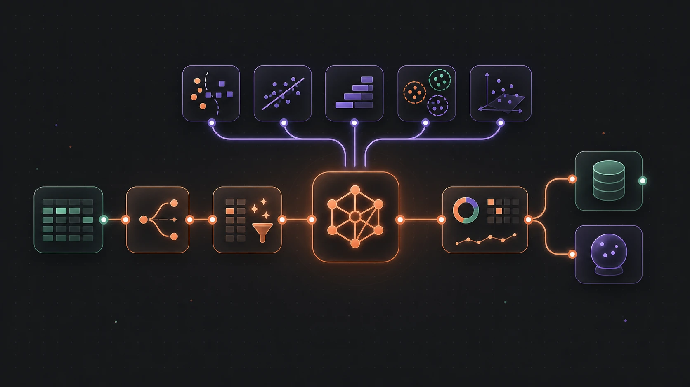
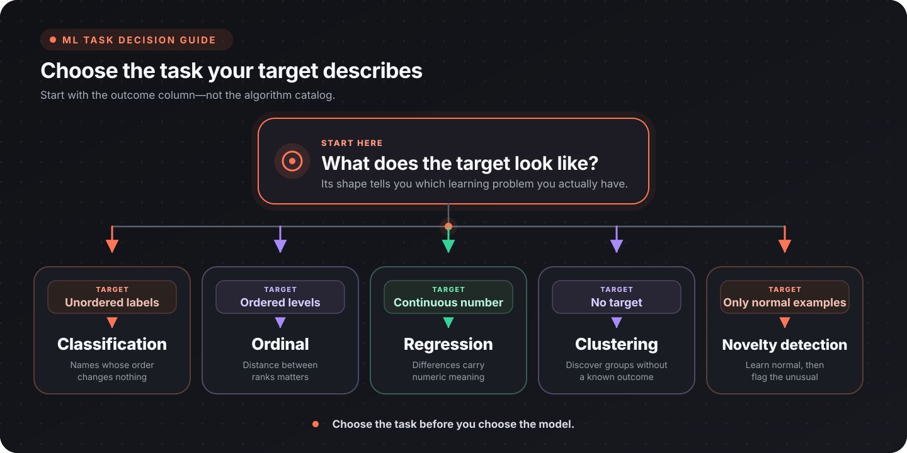

Flow-Like turns classical machine learning into an inspectable flow: prepare the data, fit the model, measure it, save it, and replay the same contract at prediction time. The important choices stay visible as nodes instead of disappearing inside a notebook.

:::tip[Choose your path]
Use this page to pick a task and a strong baseline. Go to [Advanced Configuration](/topics/datascience/ml-configuration/) when you need to tune one model deliberately, or [Auto Training](/topics/datascience/ml-auto-training/) when you want cross-validation to compare candidates.
:::

Browse the [Machine Learning node catalog](/nodes/ai/ml/) for the complete pin schemas and defaults of every node named here.

## Choose the learning task

Start with the target column, not the algorithm.

| The target looks like | Task | Deciding test |
|-----------------------|------|---------------|
| Names with no inherent order | [Classification](/nodes/ai/ml/classification/) | Reordering the labels changes nothing about the problem |
| Levels with an order | [Ordinal](/nodes/ai/ml/ordinal/) | Being off by two levels is worse than being off by one |
| A continuous number | [Regression](/nodes/ai/ml/regression/) | The difference between 10 and 12 means the same as between 100 and 102 |
| No target column | [Clustering](/nodes/ai/ml/clustering/) | You want groups, but nothing supplies the correct groups |
| Only examples of normal behaviour | Novelty detection with [One-Class SVM](/nodes/ai/ml/classification/fit-one-class-svm/) | New rows should be flagged as inliers or outliers |

### Ordinal is its own task

A classifier discards the order of the levels, so predicting `low` when the truth is `high` costs it exactly as much as predicting `medium`. A regressor does the opposite and invents distances the levels do not carry — `high` is not exactly twice `medium`. If your target is a rating, severity grade, tier, or Likert answer, start in the [Ordinal](/nodes/ai/ml/ordinal/) family.

If a five-star review predicted as one star is a worse mistake than one predicted as four, the order carries information and a classifier will throw it away.

#### Order the target labels

Ordinal trainers need to know which level is lowest. Numeric labels order numerically — integers are parsed before floats, so `"1"`, `"2"`, `"10"` sorts 1 < 2 < 10, not lexicographically. Non-numeric labels have no inferable order, so training fails rather than guessing: supply the `Class Order` pin as a comma-separated list, lowest first (`low, medium, high`). Each trainer reports back the order it actually used, and whether it came from your list or from reading the labels as numbers. Check that output first whenever an ordinal model behaves oddly.

### Use a model trained elsewhere

The [ONNX inference](/nodes/ai/ml/onnx/) family runs compatible models that were trained elsewhere and exported to ONNX. Validate the model's expected tensors and reproduce its preprocessing exactly.

## Choose models and transforms

Start with the simplest model that matches the target and constraints. Compare alternatives on the same untouched evaluation set; a more complex model earns its place only when it improves the metric that matters.

### Classification

| Model | Node | Pick it when | Watch out for |
|-------|------|--------------|---------------|
| Decision Tree | [Train Classifier (Decision Tree)](/nodes/ai/ml/classification/fit-decision-tree/) | You need rules a person can read and defend | Unlimited depth memorizes the training set; set Max Depth or Min Samples Leaf |
| Random Forest | [Train Classifier (Random Forest)](/nodes/ai/ml/classification/fit-random-forest/) | You want the strongest tabular baseline with little tuning | Size and fit time grow linearly with ensemble size, and a fixed seed still does not make fits bit-identical across processes |
| AdaBoost | [Train Classifier (AdaBoost)](/nodes/ai/ml/classification/fit-adaboost/) | The signal is weak and one tree underfits | Far more sensitive to label noise and outliers than Random Forest, and equally non-reproducible bit-for-bit |
| Logistic Regression | [Train Classifier (Logistic Regression)](/nodes/ai/ml/classification/fit-logistic-regression/) | You need calibrated probabilities and readable coefficients | Linear in the features, and the solver needs comparable scales — fit a Feature Scaler first |
| Gaussian Naive Bayes | [Train Classifier (Naive Bayes)](/nodes/ai/ml/classification/fit-naive-bayes/) | You want a one-pass baseline to beat | Assumes features are independent and roughly normal within each class |
| Multinomial Naive Bayes | [Train Classifier (Multinomial Naive Bayes)](/nodes/ai/ml/classification/fit-multinomial-naive-bayes/) | The input is counts or TF-IDF weights from text | Features must be non-negative, so centred or standardized vectors are rejected |
| SVM | [Train Classifier (SVM)](/nodes/ai/ml/classification/fit-svm-multi-class/) | Classes separate along a non-linear boundary in a modest number of rows | One-vs-all training builds a dense n×n kernel matrix per class, so memory grows quadratically with rows |
| K-Nearest Neighbours | [Train Classifier (K-Nearest Neighbours)](/nodes/ai/ml/classification/fit-knn-classifier/) | The boundary is irregular and the feature count is small | The model embeds a verbatim copy of the training set, so personal data in it travels inside every saved model file |
| One-Class SVM | [Fit Novelty Detection (One-Class SVM)](/nodes/ai/ml/classification/fit-one-class-svm/) | You have normal rows only and want outliers flagged | It answers inlier or outlier, not which class; Nu bounds the fraction of training rows treated as contaminated |

### Regression

| Model | Node | Pick it when | Watch out for |
|-------|------|--------------|---------------|
| Linear Regression | [Train Regression (Linear)](/nodes/ai/ml/regression/fit-linear-regression/) | You want the plainest possible baseline for a continuous target | No regularization at all, so correlated or numerous features give unstable coefficients |
| Ridge / Lasso / ElasticNet | [Train Regressor (Ridge/Lasso/ElasticNet)](/nodes/ai/ml/regression/fit-elastic-net/) | There are many features and some are irrelevant | The penalty is scale-dependent, so scale first or the penalty falls unevenly across columns |
| GLM / Tweedie | [Train Regressor (GLM / Tweedie)](/nodes/ai/ml/regression/fit-glm/) | The target is counts, positive skewed amounts, or heavy-tailed | The chosen distribution must match the target; a mismatch can diverge to non-finite coefficients |
| SVM regression | [Train Regressor (SVM)](/nodes/ai/ml/regression/fit-svm-regression/) | The target bends non-linearly with the features | The solver builds a dense n×n kernel matrix, and there are no coefficients to interpret |
| K-Nearest Neighbours | [Train Regressor (K-Nearest Neighbours)](/nodes/ai/ml/regression/fit-knn-regressor/) | Local averaging beats a global formula | The model carries the whole training set, and averaging neighbours cannot predict outside the observed target range |

### Ordinal

| Model | Node | Pick it when | Watch out for |
|-------|------|--------------|---------------|
| Proportional Odds | [Train Ordinal Model (Proportional Odds)](/nodes/ai/ml/ordinal/fit-ordinal-logistic/) | Default first choice; you want calibrated per-level probabilities and one readable coefficient vector | One shared coefficient vector is assumed across all cut points, and the gradient fit needs scaled features |
| Ordinal Ridge | [Train Ordinal Model (Ridge)](/nodes/ai/ml/ordinal/fit-ordinal-ridge/) | You want a fast closed-form baseline with many levels or many features | It returns the level and its latent score, but no calibrated probabilities |
| Frank & Hall | [Train Ordinal Model (Frank & Hall)](/nodes/ai/ml/ordinal/fit-ordinal-frank-hall/) | The boundary between levels bends and you want a tree-based learner on an ordered target | It predicts by counting how many of the K−1 cut models say yes, so there are no calibrated probabilities and no coefficient vector |
| Continuation Ratio | [Train Ordinal Model (Continuation Ratio)](/nodes/ai/ml/ordinal/fit-ordinal-continuation-ratio/) | The levels are a sequential process that can halt: escalation tiers, disease stages, funnel depth | Stricter than the others — every declared level must occur, middle ones included — and higher levels are fitted on fewer rows |
| Adjacent Category | [Train Ordinal Model (Adjacent Category)](/nodes/ai/ml/ordinal/fit-ordinal-adjacent-category/) | The question is about one step up: ratings, severity grades, Likert answers | Its coefficients mean "level k+1 versus level k", not "at or below cut k", and the bottom-to-top effect is (K−1) times the per-step effect |
| Neural CORAL/CORN | [Train Ordinal Model (Neural CORAL/CORN)](/nodes/ai/ml/ordinal/fit-ordinal-neural/) | The level is genuinely not monotone in the features and you still need probabilities | With no hidden layers CORAL is exactly Proportional Odds with the All-Threshold loss and CORN is exactly Continuation Ratio, so prefer those for linear problems |

The neural node is the only ordinal trainer that is non-linear, probabilistic, and rank-consistent at once. That combination costs a non-convex objective — the seed changes the fit — and far more rows than a linear model. Read its Architecture output, which reports parameter count next to row count, before trusting a training score.

### Clustering

| Model | Node | Pick it when | Watch out for |
|-------|------|--------------|---------------|
| KMeans | [Train Clustering (KMeans)](/nodes/ai/ml/clustering/fit-kmeans/) | The groups are compact and you can name a cluster count | You must choose k up front, and the distance metric makes unscaled columns dominate |
| DBSCAN | [Train Clustering (DBSCAN)](/nodes/ai/ml/clustering/fit-dbscan/) | The groups have irregular shapes and you want noise identified | It reports clusters and noise counts for the rows it was given and returns no reusable model handle |
| Gaussian Mixture | [Fit Clustering (Gaussian Mixture)](/nodes/ai/ml/clustering/fit-gaussian-mixture/) | You want soft membership and per-component covariance | linfa hard-codes its internal RNG at seed 42, so the Seed pin only re-orders rows; a tiny mixture weight means that component captured almost nothing |

Clusters do not acquire business meaning automatically. Review representative records and check stability across seeds and samples before attaching labels to them.

### Dimensionality reduction

| Method | Node | Pick it when | Watch out for |
|--------|------|--------------|---------------|
| PCA | [PCA Reduction](/nodes/ai/ml/reduction/fit-pca/) | Correlated numeric columns should be compressed while keeping linear variance | Linear only; it writes reduced vectors back into the table and returns explained variance, not a reusable fitted model |
| t-SNE | [t-SNE Reduction](/nodes/ai/ml/reduction/fit-tsne/) | You want a two- or three-dimensional picture for exploration | Transductive, so it produces no reusable model, and distances and cluster sizes in the layout carry no validated meaning |

### Preprocessing

| Step | Node | Pick it when | Watch out for |
|------|------|--------------|---------------|
| Feature Scaler | [Fit Feature Scaler](/nodes/ai/ml/preprocessing/fit-feature-scaler/) | Any distance- or gradient-based model is downstream: Logistic Regression, Elastic Net, SVM, KNN, Gaussian Mixture, every ordinal trainer | It learns offsets and scales from the data it sees, so fit it on the training split only |
| TF-IDF Vectorizer | [Fit TF-IDF Vectorizer](/nodes/ai/ml/preprocessing/fit-tfidf-vectorizer/) | A text column has to become numeric vectors for a classifier | linfa recomputes the inverse document frequencies from the corpus being transformed, so vectors are only comparable within a single Apply Transform run |
| Apply Transform | [Apply Transform](/nodes/ai/ml/preprocessing/ml-apply-transform/) | A fitted transformer has to be replayed on another table | Pass the same fitted model you trained with; a second Fit call produces different statistics |

## Build a leakage-safe pipeline

The sequence matters. Split before fitting anything that learns from data, then carry those fitted transforms forward as part of the model contract.

| Stage | Node | Why it is in this order |
|-------|------|-------------------------|
| Split | [Split Dataset](/nodes/ai/ml/dataset/ai-ml-dataset-split/), [Stratified Split](/nodes/ai/ml/dataset/ai-ml-dataset-stratified-split/) | Split before anything looks at the data; stratify when class proportions are uneven |
| Fit scaling on train | [Fit Feature Scaler](/nodes/ai/ml/preprocessing/fit-feature-scaler/) | Learns offsets and scales without looking at the test split |
| Apply the scaler to every split | [Apply Transform](/nodes/ai/ml/preprocessing/ml-apply-transform/) | Replays the exact offsets and scales learned on train |
| Train | Any trainer from the tables above | One model, one documented configuration |
| Evaluate | [Accuracy](/nodes/ai/ml/metrics/ml-eval-accuracy/), [Ordinal Metrics](/nodes/ai/ml/ordinal/ml-ordinal-metrics/), [Regression Metrics](/nodes/ai/ml/metrics/ml-eval-regression/) | On the untouched split, with a task-appropriate metric |
| Save | [Save Model](/nodes/ai/ml/save-ml-model/) | Save the predictor and each fitted transformer separately, then version them as one contract |
| Predict | [Predict](/nodes/ai/ml/ml-predict/) | Same feature order, types, and transforms as training |

A transform that learns from data is itself a fitted model. That is the whole point of Feature Scaler being a fitted model rather than a formula: you fit it once on the training split and pass that same fitted object to [Apply Transform](/nodes/ai/ml/preprocessing/ml-apply-transform/) for validation, test, and inference. Fitting a second scaler on the test split gives that split its own statistics and quietly invalidates the comparison.

:::caution[TF-IDF is currently an exception]
[Fit TF-IDF Vectorizer](/nodes/ai/ml/preprocessing/fit-tfidf-vectorizer/) saves the vocabulary, but [Apply Transform](/nodes/ai/ml/preprocessing/ml-apply-transform/) recomputes inverse-document frequencies from each corpus it receives. Separate train and test calls therefore do not share weights; transforming them together makes the weights comparable but exposes the test distribution. For a strict held-out evaluation, use fixed numeric features or vectors produced by a transformer whose weights are frozen, and document this limitation when you use the built-in TF-IDF node.
:::

:::caution[Fit learned preprocessing on train]
For transformers that can replay frozen statistics—such as Feature Scaler—fit on the training split and reuse that fitted object everywhere else. Any learned preprocessing that inspects evaluation rows can leak them just as surely as training the predictor on them.
:::

Supporting dataset nodes: [K-Fold Split](/nodes/ai/ml/dataset/ai-ml-dataset-kfold/) runs its connected branch once per fold, [Shuffle Dataset](/nodes/ai/ml/dataset/ai-ml-dataset-shuffle/) and [Sample Dataset](/nodes/ai/ml/dataset/ai-ml-dataset-sample/) reorder or subset rows. For time-dependent data, split chronologically instead of randomizing future observations into the training set.

### Let the catalog compare candidates

[Auto Classifier](/nodes/ai/ml/tuning/ai-ml-tuning-auto-classifier/) cross-validates several classifier families and retrains the winner; [Auto Ordinal](/nodes/ai/ml/tuning/ai-ml-tuning-auto-ordinal/) does the same for ordered targets and ranks by a distance-aware metric. Feed the reported best model type into [Grid Search](/nodes/ai/ml/tuning/ai-ml-tuning-grid-search/) or [Ordinal Grid Search](/nodes/ai/ml/tuning/ai-ml-tuning-ordinal-grid-search/) to tune it. The exception is an `OrdinalNeural` winner, which Ordinal Grid Search does not support; configure that trainer directly. Use the ordinal pair for ordered targets — Auto Classifier resolves the target without its order and ranks by accuracy, which scores a five-level miss exactly like a one-level one. See [Auto Training](/topics/datascience/ml-auto-training/).

## Evaluate on untouched data

| Task | Nodes | Note |
|------|-------|------|
| Classification | [Accuracy](/nodes/ai/ml/metrics/ml-eval-accuracy/), [Confusion Matrix](/nodes/ai/ml/metrics/ml-eval-confusion-matrix/) | Accuracy alone hides poor minority-class performance; read the matrix |
| Binary classification with probabilities | [ROC-AUC & Log Loss](/nodes/ai/ml/metrics/ml-roc-auc/) | Needs P(positive class); the Predict node's confidence is the winning class's probability, so convert it first |
| Regression | [Regression Metrics](/nodes/ai/ml/metrics/ml-eval-regression/) | MSE, RMSE, MAE, and R²; also check residual patterns, not one aggregate |
| Ordinal | [Ordinal Metrics](/nodes/ai/ml/ordinal/ml-ordinal-metrics/) | Quadratic weighted kappa as headline, plus linear kappa, macro error, and rank correlation |
| Clustering | [Silhouette Score](/nodes/ai/ml/metrics/ml-silhouette-score/) | Distances are euclidean, so scale features before reading the score |

Accuracy is the wrong headline for an ordered target because it gives no partial credit for a near miss: one level off counts exactly like four levels off. [Ordinal Metrics](/nodes/ai/ml/ordinal/ml-ordinal-metrics/) weights every miss by how far off it was.

For ROC-AUC, use the winning-class confidence directly only where the prediction is the positive class, and `1 - confidence` elsewhere. Feeding the raw confidence column in produces a meaningless curve.

To inspect a fitted model: [Model Info](/nodes/ai/ml/model-info/ml-model-info/) for general metadata, [Get Coefficients](/nodes/ai/ml/model-info/ml-get-linear-coefficients/) for linear regression, [Get Centroids](/nodes/ai/ml/model-info/ml-get-kmeans-centroids/) for KMeans, and [Feature Importance](/nodes/ai/ml/model-info/ml-feature-importance/) for Decision Tree, Random Forest, and AdaBoost.

## Ship the training contract

| Need | Node |
|------|------|
| Save through the path abstraction | [Save Model](/nodes/ai/ml/save-ml-model/) |
| Load through the path abstraction | [Load Model](/nodes/ai/ml/load-ml-model/) |
| Save as raw binary (Fory format) | [Save Model (Binary)](/nodes/ai/ml/save-ml-model-binary/) |
| Load raw binary (Fory format) | [Load Model (Binary)](/nodes/ai/ml/load-ml-model-binary/) |
| Run a model on prepared features | [Predict](/nodes/ai/ml/ml-predict/) |

Each Save Model call accepts one model handle. Persist the predictor and every fitted transformer with separate save nodes or paths, then give the set one shared version in your model card or deployment metadata.

Inference has to reproduce the training feature order, types, missing-value handling, and every fitted transform. Validate the input schema before calling [Predict](/nodes/ai/ml/ml-predict/), and store a short model card with the artifact: training data version, feature schema, target definition, metrics, intended use, limitations, and owner.

For KNN models, remember that the artifact contains the training rows themselves. Apply the same access controls to the model file that you apply to the source table.

## Production checklist

- [ ] The target column has been classified as unordered, ordered, continuous, or absent
- [ ] Ordinal targets declare an explicit Class Order unless the labels are numeric
- [ ] Leakage fields created after the prediction target are removed
- [ ] Train, validation, and test data are separate, and time-dependent data is split chronologically
- [ ] Preprocessing is fitted on the training split and replayed with Apply Transform
- [ ] Baseline and selected model are compared on the same untouched evaluation set
- [ ] The metric matches the task, and ordered targets are not judged by accuracy
- [ ] Model and fitted transformers are saved separately, then versioned together with the feature schema and data version
- [ ] Inference validates feature order and types
- [ ] Models embedding training rows are stored with source-table access controls

## Next steps

- [Model configuration reference](/topics/datascience/ml-configuration/)
- [Auto Training](/topics/datascience/ml-auto-training/)
- [Data loading and storage](/topics/datascience/loading/)
- [DataFusion and SQL](/topics/datascience/datafusion/)
- [Data visualization](/topics/datascience/visualization/)
- [AI-powered analysis](/topics/datascience/ai-analysis/)
