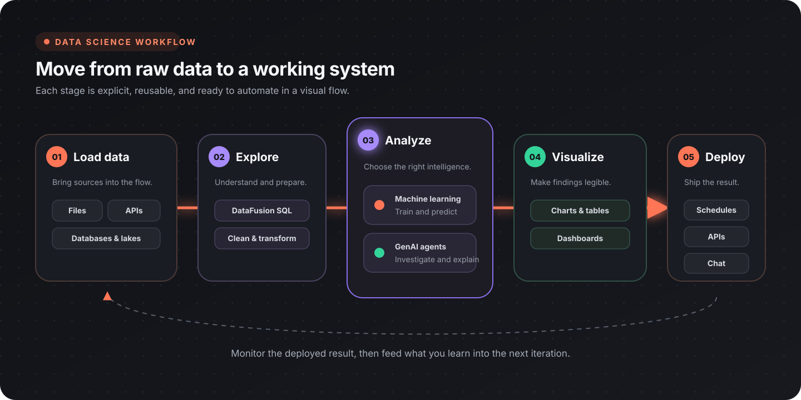

Flow-Like combines data access, SQL, machine-learning nodes, model inference, and A2UI visualization in one workflow environment. Use Flows to make the analysis steps and operational handoff inspectable.

:::tip[For data practitioners]
This section assumes familiarity with SQL, machine learning, and visualization. The guides focus on how those concepts map to Flow-Like nodes and apps.
:::

## What you can build

| Application | Flow-Like role |
|-------------|----------------|
| Data exploration | Register sources, inspect schemas, and query with SQL |
| Repeatable analysis | Turn cleaning, feature preparation, and metrics into a Flow |
| Machine learning | Split datasets, scale and vectorize features, train supported models, tune them with grid search or AutoML, evaluate, inspect, save, and predict |
| Model inference | Run ONNX vision, OCR, audio, NLP, and related models |
| Interactive dashboards | Push query results into A2UI tables and charts |
| AI-assisted analysis | Combine governed data tools with configured models or agents |

## Core capabilities

### Load and register data

Flow-Like can work with local files, databases, app storage, APIs, and data-lake tables. Start with [Data loading and storage](/topics/datascience/loading/) when choosing the reader and storage boundary.

DataFusion entry points include:

- [Mount CSV](/nodes/data/datafusion/df-mount-csv/), [Mount JSON](/nodes/data/datafusion/df-mount-json/), and [Mount Parquet](/nodes/data/datafusion/df-mount-parquet/);
- database registration for [PostgreSQL](/nodes/data/datafusion/databases/df-register-postgres/), [MySQL](/nodes/data/datafusion/databases/df-register-mysql/), [SQLite](/nodes/data/datafusion/databases/df-register-sqlite/), [DuckDB](/nodes/data/datafusion/databases/df-register-duckdb/), [ClickHouse](/nodes/data/datafusion/databases/df-register-clickhouse/), and other cataloged sources;
- [Delta and Iceberg](/nodes/data/datafusion/lakes/) registration and inspection.

### Query and transform

[Create DataFusion Session](/nodes/data/datafusion/df-create-session/) provides the query context. Register the required sources, inspect them with [List Tables](/nodes/data/datafusion/tools/df-list-tables/) and [Describe Table](/nodes/data/datafusion/tools/df-describe-table/), then use [SQL Query](/nodes/data/datafusion/df-sql-query/).

See [DataFusion and SQL](/topics/datascience/datafusion/) for joins, aggregations, and federated analysis.

### Train and evaluate models

The generated node catalog currently includes:

| Task | Examples |
|------|----------|
| Dataset preparation | [Split Dataset](/nodes/ai/ml/dataset/ai-ml-dataset-split/), [Stratified Split](/nodes/ai/ml/dataset/ai-ml-dataset-stratified-split/), [K-Fold Split](/nodes/ai/ml/dataset/ai-ml-dataset-kfold/), [Shuffle Dataset](/nodes/ai/ml/dataset/ai-ml-dataset-shuffle/), [Sample Dataset](/nodes/ai/ml/dataset/ai-ml-dataset-sample/) |
| Preprocessing | [Fit Feature Scaler](/nodes/ai/ml/preprocessing/fit-feature-scaler/), [Fit TF-IDF Vectorizer](/nodes/ai/ml/preprocessing/fit-tfidf-vectorizer/), [Apply Transform](/nodes/ai/ml/preprocessing/ml-apply-transform/) |
| Classification | [Decision Tree](/nodes/ai/ml/classification/fit-decision-tree/), [Naive Bayes](/nodes/ai/ml/classification/fit-naive-bayes/), [Multinomial Naive Bayes](/nodes/ai/ml/classification/fit-multinomial-naive-bayes/), [Logistic Regression](/nodes/ai/ml/classification/fit-logistic-regression/), [SVM](/nodes/ai/ml/classification/fit-svm-multi-class/), [K-Nearest Neighbours](/nodes/ai/ml/classification/fit-knn-classifier/), [Random Forest](/nodes/ai/ml/classification/fit-random-forest/), [AdaBoost](/nodes/ai/ml/classification/fit-adaboost/), [One-Class SVM](/nodes/ai/ml/classification/fit-one-class-svm/) |
| Regression | [Linear](/nodes/ai/ml/regression/fit-linear-regression/), [Ridge/Lasso/ElasticNet](/nodes/ai/ml/regression/fit-elastic-net/), [GLM / Tweedie](/nodes/ai/ml/regression/fit-glm/), [K-Nearest Neighbours](/nodes/ai/ml/regression/fit-knn-regressor/), [SVM](/nodes/ai/ml/regression/fit-svm-regression/) |
| Ordinal regression | [Proportional Odds](/nodes/ai/ml/ordinal/fit-ordinal-logistic/), [Ridge](/nodes/ai/ml/ordinal/fit-ordinal-ridge/), [Frank &amp; Hall](/nodes/ai/ml/ordinal/fit-ordinal-frank-hall/), [Continuation Ratio](/nodes/ai/ml/ordinal/fit-ordinal-continuation-ratio/), [Adjacent Category](/nodes/ai/ml/ordinal/fit-ordinal-adjacent-category/), [Neural CORAL/CORN](/nodes/ai/ml/ordinal/fit-ordinal-neural/) |
| Clustering | [KMeans](/nodes/ai/ml/clustering/fit-kmeans/), [DBSCAN](/nodes/ai/ml/clustering/fit-dbscan/), [Gaussian Mixture](/nodes/ai/ml/clustering/fit-gaussian-mixture/) |
| Reduction | [PCA](/nodes/ai/ml/reduction/fit-pca/), [t-SNE](/nodes/ai/ml/reduction/fit-tsne/) |
| Evaluation | [Accuracy](/nodes/ai/ml/metrics/ml-eval-accuracy/), [Confusion Matrix](/nodes/ai/ml/metrics/ml-eval-confusion-matrix/), [Regression Metrics](/nodes/ai/ml/metrics/ml-eval-regression/), [ROC-AUC &amp; Log Loss](/nodes/ai/ml/metrics/ml-roc-auc/), [Silhouette Score](/nodes/ai/ml/metrics/ml-silhouette-score/), [Ordinal Metrics](/nodes/ai/ml/ordinal/ml-ordinal-metrics/) |
| Tuning and AutoML | [Grid Search](/nodes/ai/ml/tuning/ai-ml-tuning-grid-search/), [Auto Classifier](/nodes/ai/ml/tuning/ai-ml-tuning-auto-classifier/), [Ordinal Grid Search](/nodes/ai/ml/tuning/ai-ml-tuning-ordinal-grid-search/), [Auto Ordinal](/nodes/ai/ml/tuning/ai-ml-tuning-auto-ordinal/) |
| Model introspection | [Model Info](/nodes/ai/ml/model-info/ml-model-info/), [Feature Importance](/nodes/ai/ml/model-info/ml-feature-importance/), [Get Coefficients](/nodes/ai/ml/model-info/ml-get-linear-coefficients/), [Get Centroids](/nodes/ai/ml/model-info/ml-get-kmeans-centroids/) |
| Persistence and inference | [Save Model](/nodes/ai/ml/save-ml-model/), [Load Model](/nodes/ai/ml/load-ml-model/), [Save Model (Binary)](/nodes/ai/ml/save-ml-model-binary/), [Load Model (Binary)](/nodes/ai/ml/load-ml-model-binary/), [Predict](/nodes/ai/ml/ml-predict/), [Apply Transform](/nodes/ai/ml/preprocessing/ml-apply-transform/) |

Predict serves the trainers that emit a model. DBSCAN, PCA, and t-SNE return cluster counts, explained variance, or a written-back embedding column instead of a model, and fitted transformers are replayed with [Apply Transform](/nodes/ai/ml/preprocessing/ml-apply-transform/) rather than Predict.

See [Machine learning](/topics/datascience/ml/) for the end-to-end workflow, [Advanced configuration](/topics/datascience/ml-configuration/) for the knobs on each trainer, and [Auto training](/topics/datascience/ml-auto-training/) for the tuning nodes.

### Run ONNX inference

The [ONNX node catalog](/nodes/ai/ml/onnx/) includes tasks such as image classification, object detection, segmentation, OCR, face processing, pose estimation, audio preparation, voice activity detection, and named-entity recognition. Model compatibility still depends on the expected input and output tensors; inspect model metadata and validate preprocessing before relying on predictions.

### Visualize and operationalize

Use A2UI NivoChart or PlotlyChart components for interactive analysis and Table for detailed records. Workflow nodes can push query results into charts and tables.

See [Data visualization](/topics/datascience/visualization/) for chart selection and [Building internal tools](/topics/internal-tools/overview/) for page, data, and action wiring.

## Example: sales analysis

A compact sales workflow has four explicit stages:

1. mount the CSV or register the source table;
2. validate the schema and relevant time range;
3. aggregate revenue by region with SQL;
4. push the result to a bar chart and a supporting table.

The table lets a reviewer verify the values behind the chart, while the workflow preserves the query used to calculate them.

## Reproducibility checklist

- [ ] Source versions or query windows are recorded
- [ ] Schema and data-quality checks run before analysis
- [ ] Random seeds are fixed where supported
- [ ] Train, validation, and test data remain separate
- [ ] Preprocessing used for training is reused for inference — a fitted Feature Scaler replays its exact offsets and scales, while TF-IDF recomputes its document frequencies inside each Apply Transform run
- [ ] Model and metric configuration is versioned
- [ ] Results include units, filters, and known limitations
- [ ] Sensitive features and outputs follow the app's access policy

## Next steps

- [Data loading and storage](/topics/datascience/loading/)
- [DataFusion and SQL](/topics/datascience/datafusion/)
- [Machine learning](/topics/datascience/ml/)
- [Advanced configuration](/topics/datascience/ml-configuration/)
- [Auto training](/topics/datascience/ml-auto-training/)
- [Data visualization](/topics/datascience/visualization/)
- [AI-powered analysis](/topics/datascience/ai-analysis/)
