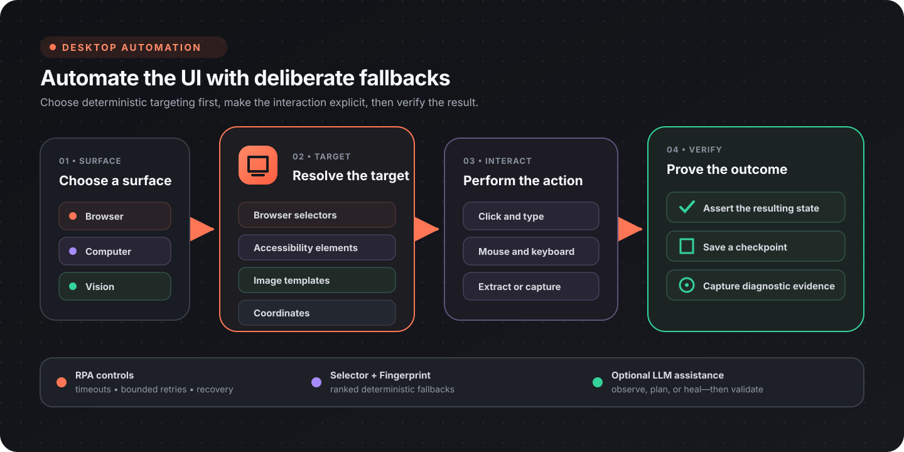

Flow-Like can automate browser pages and visible desktop applications from a Flow. The current Automation catalog includes direct browser and computer control, accessibility-based element lookup, template matching, reusable selectors, checkpoints, recovery helpers, and optional AI-assisted observation.

:::note[Run automation where the interface is available]
Browser and computer automation need a compatible local execution environment. Desktop interactions also depend on the operating system, active session, application, and permissions. Confirm those requirements on the machine that will run the Flow.
:::

## Choose the right automation surface

| Surface | Best for | How it targets elements |
|---------|----------|-------------------------|
| **[Browser](/nodes/automation/browser/)** | Web applications, forms, downloads, and page extraction | Browser selectors and page state |
| **[Computer](/nodes/automation/computer/)** | Native desktop applications and system UI | Accessibility elements, windows, coordinates, and direct input |
| **[Vision](/nodes/automation/vision/)** | Interfaces without stable selectors or accessibility metadata | Image templates, regions, and pixel colors |
| **[RPA](/nodes/automation/rpa/)** | Reliable orchestration around UI interactions | Retries, timeouts, checkpoints, assertions, and recovery |
| **[Selector](/nodes/automation/selector/)** | Reusable target definitions with multiple fallback strategies | Ranked selector sets |
| **[Fingerprint](/nodes/automation/fingerprint/)** | Matching a target across UI changes | Stored and compared element fingerprints |
| **[LLM](/nodes/automation/llm/)** | Observation, planning, and recovery when deterministic targeting is insufficient | Configured vision-capable models |

Prefer the most deterministic surface available. Browser selectors are usually better than screen coordinates for a web page; accessibility elements are usually better than image matching for a native control. Vision and LLM nodes are useful fallbacks, not substitutes for a stable target.

## Automation sessions

Use [Start Automation Session](/nodes/automation/automation-start-session/) at the beginning of a desktop automation and [Stop Automation Session](/nodes/automation/automation-stop-session/) when it finishes. Keeping the session explicit makes resource ownership and cleanup visible in the Flow.

A typical desktop recipe is:

1. Start an automation session.
2. Find or focus the target window.
3. Locate an accessibility element, template, or coordinate.
4. Perform the interaction.
5. Assert the expected result or take a checkpoint.
6. Stop the session on both success and failure paths.

## Browser automation

The Browser catalog covers the complete page lifecycle:

| Capability | Current nodes |
|------------|---------------|
| Lifecycle | **Open Browser**, **New Page**, **Close Page**, **Close Browser** |
| Navigation | **Go To URL**, **Go Back**, **Go Forward**, **Reload** |
| Interaction | **Click Element**, **Double Click Element**, **Hover Element**, **Scroll Into View** |
| Input | **Type Text**, **Press Key**, **Select Option** |
| Waiting | **Wait For Selector**, **Wait Delay**, **Wait For Network Idle** |
| Extraction | **Get Text**, **Get Attribute**, **Get HTML**, **Execute JavaScript** |
| Capture | **Take Screenshot**, **Screenshot Element** |
| Files | Uploads, download directory configuration, download triggers, and download waiting |
| State | Cookie, local-storage, and session-storage operations |
| Diagnostics | Console logs, network requests, DOM snapshots, and accessibility snapshots |

### Recipe: submit a web form reliably

1. [Open Browser](/nodes/automation/browser/browser-open/) and create a [New Page](/nodes/automation/browser/browser-new-page/).
2. Navigate with [Go To URL](/nodes/automation/browser/navigation/browser-goto/).
3. Use [Wait For Selector](/nodes/automation/browser/wait/browser-wait-for/) before interacting.
4. Enter values with [Type Text](/nodes/automation/browser/input/browser-type-text/) and submit with [Click Element](/nodes/automation/browser/interact/browser-click/).
5. Wait for either the result selector or [network idle](/nodes/automation/browser/observe/browser-wait-for-network-idle/).
6. Capture the final state with [Take Screenshot](/nodes/automation/browser/capture/browser-screenshot/).
7. Close the browser in the cleanup path.

Use selector-based browser nodes for browser content. Coordinate-based desktop input is more fragile when zoom, layout, or window position changes.

## Computer automation

Computer nodes interact with the active desktop session.

### Accessibility

[Get Accessibility Tree](/nodes/automation/computer/accessibility/computer-get-accessibility-tree/) inspects the accessible controls exposed by the current interface. [Find Accessibility Element](/nodes/automation/computer/accessibility/computer-find-accessibility-element/) locates a target from that structure.

Accessibility targeting is the preferred starting point for native controls because it can remain stable across window movement and display scaling. Some custom-rendered applications expose little or no useful accessibility metadata; use Vision or a coordinate fallback for those interfaces.

### Windows and displays

The current Window nodes can:

- list windows and inspect the active window;
- find a window by title;
- focus a window;
- capture a window;
- launch an application.

The Display nodes list displays and identify the primary display. Resolve the intended display or window before using absolute coordinates.

### Mouse, keyboard, and clipboard

The Computer catalog includes:

- **Mouse Move**, **Natural Mouse Move**, **Mouse Click**, **Mouse Double Click**, **Mouse Drag**, and **Scroll**;
- **Type Text** and **Key Press** for keyboard input;
- text and image clipboard getters and setters;
- **Wait** for deliberate pauses between interactions.

Use [Natural Mouse Move](/nodes/automation/computer/mouse/computer-natural-mouse-move/) when the path itself matters. Use [Mouse Click](/nodes/automation/computer/mouse/computer-mouse-click/) or [Click At Position](/nodes/automation/rpa/rpa-click-at-position/) only after resolving the correct coordinates for the current session.

## Screen capture and visual targeting

The current catalog separates general computer capture from Vision helpers:

| Task | Node |
|------|------|
| Capture the desktop | [Screenshot](/nodes/automation/computer/capture/computer-screenshot/) |
| Capture a rectangular region | [Screenshot Region](/nodes/automation/vision/vision-screenshot-region/) |
| Save a capture to a file | [Screenshot To File](/nodes/automation/vision/vision-screenshot-to-file/) |
| Locate one template | [Find Template](/nodes/automation/vision/vision-find-template/) |
| Locate every matching template | [Find All Templates](/nodes/automation/vision/vision-find-all-templates/) |
| Find and click a template | [Click Template](/nodes/automation/vision/vision-click-template/) |
| Wait for appearance or disappearance | **Wait For Template** / **Wait Template Disappear** |
| Inspect the display | **Get Screen Size** / **Get Pixel Color** |

### Recipe: resilient template interaction

1. Capture a current region rather than searching an unnecessarily large display.
2. Use **Wait For Template** with a deliberate timeout.
3. Locate the template and inspect its match before clicking when the action is consequential.
4. Click with **Click Template** or use the returned position with a mouse node.
5. Assert that the expected follow-up template or color exists.
6. On failure, take a snapshot and enter a recovery path.

Template images should be cropped around a distinctive, stable control. Recreate them when the target application's theme, display scaling, or visual design changes.

## Reliability and recovery

RPA helpers make failures explicit instead of hiding them inside a long chain of UI actions.

| Concern | Useful nodes |
|---------|--------------|
| Bounded execution | **With Timeout**, **Delay**, **Calculate Elapsed** |
| Retry | [Retry Loop](/nodes/automation/rpa/rpa-retry-loop/), **Wait For Template**, **Wait For Color** |
| Assertions | **Assert Template Exists**, **Assert Color At Position** |
| Checkpoints | **Save Checkpoint**, **Parse Checkpoint**, [Take Snapshot](/nodes/automation/rpa/rpa-take-snapshot/) |
| Error paths | **Try Catch**, **Error Recovery**, **Diagnose Failure** |
| Audit trail | **Log Action** |

For an important interaction:

1. Bound the operation with a timeout.
2. Wait for a deterministic readiness signal.
3. Perform the action.
4. Assert the resulting state.
5. Retry only failures that are safe to repeat.
6. Capture diagnostic evidence before recovery or exit.

Avoid retrying a destructive or externally visible action unless the target operation is idempotent or you can first verify whether it already succeeded.

## Selectors and fingerprints

Selectors let a Flow keep several ways to identify the same target. Build a selector, combine alternatives into a selector set, validate them, rank the candidates, and retrieve the best current match.

Fingerprints store descriptive target data that can be compared or updated later. They are useful when a target changes slightly between versions but retains enough stable characteristics to identify it.

Use these layers to make fallbacks deliberate:

1. stable browser or accessibility selector;
2. alternate selector or stored fingerprint;
3. template match;
4. coordinate fallback;
5. optional LLM-assisted resolution.

## Optional LLM assistance

LLM automation nodes cover three groups:

- **Vision** — observe or classify a screen, find or describe an element, extract structured information, resolve candidates, and rank matches;
- **Planning** — plan actions or suggest the next step;
- **Healing** — diagnose a failure and propose a repaired selector or template.

Use a configured model only when deterministic methods do not provide enough signal. Treat its output as a proposal: validate the selected target and add a bounded fallback before performing consequential actions.

:::caution[Review data handling]
Screen captures and extracted UI content may contain personal, confidential, or regulated information. If a Flow sends that content to a configured model or external service, the applicable provider, connection, and organizational policies govern where it is processed. Minimize the captured region and redact sensitive values when possible.
:::

## Permissions and operating-system behavior

Permission prompts and capabilities vary by operating system and execution environment. Depending on the nodes used, the runner may need access to:

- screen or window capture;
- accessibility APIs;
- mouse and keyboard control;
- launching or focusing applications;
- files selected for upload or download.

Grant only the permissions required for the automation. Run a small capture-and-input test on the target machine before building a longer Flow, and test again after operating-system, application, theme, or display changes.

## Design checklist

- Start with a stable target, not a fixed delay.
- Resolve the intended window, page, and display before interacting.
- Prefer selectors or accessibility metadata over coordinates.
- Keep retries bounded and safe to repeat.
- Assert the post-condition after important actions.
- Capture diagnostics without exposing secrets.
- Provide cleanup paths that close pages, browsers, and automation sessions.
- Test at the same display scaling and permissions used in production.

## Next steps

- Browse the complete [Automation node catalog](/nodes/automation/).
- Use [Document Processing](/topics/document-processing/overview/) for extracted documents and images.
- Use [API Integrations](/topics/api-integrations/overview/) when the target system exposes a reliable API.
- Use [Building Internal Tools](/topics/internal-tools/overview/) to create a control surface for an automation.
